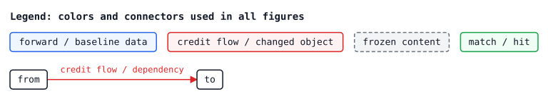
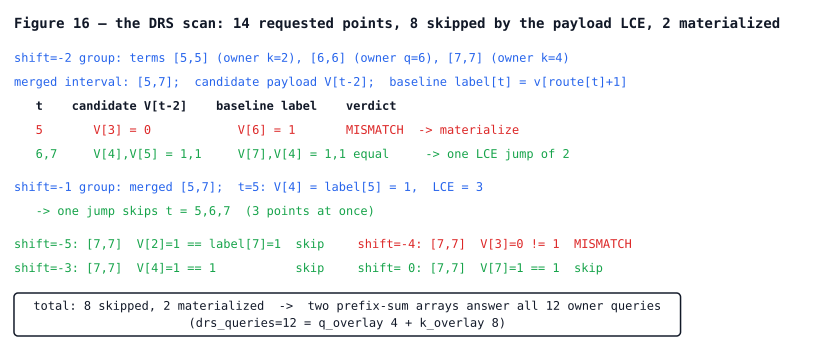

# The Exact Backward for QKV-ROSA — A Derivation-Grade Walkthrough

[中文版](ALGORITHM.zh-CN.md)

This document is the companion guide to
[`hard_qkv_rosa_explained.py`](hard_qkv_rosa_explained.py). It does not replace
that file; it walks alongside it. Every mechanism below ends with a pointer of
the form "now read Part N, `function_name`, `hard_qkv_rosa_explained.py:LINE`" —
open the file at that line and read the code while the derivation is still in
your head. When you finish this document you should be able to modify the
algorithm yourself.

Throughout, `hard_qkv_rosa_explained.py:L<n>` means line `<n>` of that file
(the file is 3054 lines long, organized into banner-delimited Parts 0–17).

## 0. What this is

Six sentences to start:

1. **Definition.** QKV-ROSA (Bo Peng / BlinkDL, RWKV-8) is a discrete retrieval
   architecture: Q/K/V are threshold-quantized into n-bit hard codes, and each
   output position `t` retrieves one payload by finding the *longest suffix
   match* of `Q[:t+1]` inside the prefix `K[:t]`, tie-broken toward the latest
   endpoint.
2. **The question.** Because every step of the forward is a discrete decision,
   the ordinary gradient is zero almost everywhere. The question this
   repository answers is: *what is the exact effect of flipping any single
   Q/K/V bit on the whole downstream output*, i.e. the single-bit
   counterfactual VJP `credit[u,j] = Σ_t grad_y[t]·(y_flip[t] − y_base[t])`.
3. **The cost.** Computing that definition directly costs `O(D·T⁴)` — one full
   forward per bit. The algorithm in this repository computes the **same
   quantity** in `O(T·log²T + Λ·log T + T·D)` per stream.
4. **The intuition in one sentence.** Instead of re-simulating the forward once
   per bit, we analyze how flipping one bit changes the longest match and
   decompose that response into finitely many *analytic surfaces*, then sum
   credit over each surface with range data structures.
5. **Relation to existing bit-flip ideas.** Community projects
   (johanwind/wind_rosa, zyaaa-ux/ROSA-Tuning's local counterfactual gradient)
   compute the same kind of counterfactual quantity by re-simulation, either
   for a truncated variant or heuristically. This repository computes the same
   counterfactual *for the full untruncated semantics, for every bit, exactly*,
   and never re-runs the forward.
6. **Agenda.** This document does eight things: (§1) pin down the forward
   semantics on one fixed running instance; (§2) define credit and argue why
   it is the right gradient object; (§3) show why the naive `O(D·T⁴)` is
   compressible at all; (§4) recap the fast forward in the vocabulary the
   backward reuses; (§5–§8) derive the four response families — Q-side
   deletion surfaces, K-side deletion oracles, shared one-bit repair bridges,
   and maximal-run square certificates; (§9) derive the numerical contraction;
   (§10–§11) the intermediate representation, the backend switch, and the
   complexity ledger; (§12–§14) how every claim is verified, a code map, and
   open problems.

A word on methodology, because it defines the whole design: the exact backward
is a **customized differencing (perturbation) method**. It does not
differentiate a relaxation of the architecture; it computes *finite*
single-bit perturbations of the hard forward, exactly, by exploiting the
specific combinatorial structure of longest-suffix matching. Every design
decision in Parts 1–15 exists to make one particular perturbation family
cheap.

### 0.1 How to read along with `hard_qkv_rosa_explained.py`

- The file is self-contained and depends only on `torch`. Run
  `python hard_qkv_rosa_explained.py` now: it executes `self_test()`
  ([`hard_qkv_rosa_explained.py:2964`](https://github.com/xiaoiecc/qkv-rosa-fast-exact-backward/blob/main/hard_qkv_rosa_explained.py#L2964)), which checks the fast forward and the
  fast backward against the brute-force definitions elementwise, then prints a
  timing demo. Everything in this document is checked by that test or by the
  short scripts reproduced in §12.
- Read Part 0 first ([L148](https://github.com/xiaoiecc/qkv-rosa-fast-exact-backward/blob/main/hard_qkv_rosa_explained.py#L148)–214). It is ~60 lines and states the complete
  semantics; the remaining ~2900 lines are an exact acceleration of those 60
  lines.
- Each section below ends with a **"Now read the code"** pointer. The reading
  order of this document (semantics → credit → Q side → K side → contraction)
  is not the file's part order; §13 has a full map.

### 0.2 Plain descriptions and code identifiers

We always describe a mechanism first in plain words; the code's name for it
appears afterwards in parentheses and in backticks, and only where we cross-
reference the source. If a name can be deleted from a sentence without losing
information, we delete it. The variables we write in prose are the file's own
identifiers, letter for letter:

| plain description | code identifier | defined at |
| --- | --- | --- |
| stream length, bit width | `T`, `D` | everywhere |
| symbol streams (packed integers) | `q`, `k` | [L154](https://github.com/xiaoiecc/qkv-rosa-fast-exact-backward/blob/main/hard_qkv_rosa_explained.py#L154) |
| payload bits | `v_bits` | [L154](https://github.com/xiaoiecc/qkv-rosa-fast-exact-backward/blob/main/hard_qkv_rosa_explained.py#L154) |
| no-match / matched payload vectors | `emb0`, `emb1` | [L154](https://github.com/xiaoiecc/qkv-rosa-fast-exact-backward/blob/main/hard_qkv_rosa_explained.py#L154) |
| match length at position `t` | `ell[t]` | [L154](https://github.com/xiaoiecc/qkv-rosa-fast-exact-backward/blob/main/hard_qkv_rosa_explained.py#L154)–178 |
| match endpoint at position `t` (`-1` = unmatched) | `route[t]` | [L154](https://github.com/xiaoiecc/qkv-rosa-fast-exact-backward/blob/main/hard_qkv_rosa_explained.py#L154)–178 |
| the pair `(ell[t], route[t])` | `Route` | [L145](https://github.com/xiaoiecc/qkv-rosa-fast-exact-backward/blob/main/hard_qkv_rosa_explained.py#L145) |
| flipped position, flipped bit index | `u`, `j` | [L206](https://github.com/xiaoiecc/qkv-rosa-fast-exact-backward/blob/main/hard_qkv_rosa_explained.py#L206)–207 |
| per-bit counterfactual credit | `credit` (`credit_q/k/v`) | [L203](https://github.com/xiaoiecc/qkv-rosa-fast-exact-backward/blob/main/hard_qkv_rosa_explained.py#L203)–214 |
| deleted K/Q position ("owner") | `s` | [L242](https://github.com/xiaoiecc/qkv-rosa-fast-exact-backward/blob/main/hard_qkv_rosa_explained.py#L242)–255 |
| affine deletion segment `L(s)=len_a·s+len_b`, `r(s)=end_a·s+end_b` | `AffineDeleteRun` | [L242](https://github.com/xiaoiecc/qkv-rosa-fast-exact-backward/blob/main/hard_qkv_rosa_explained.py#L242) |
| K-side repair threshold segment (with `strict` polarity) | `KRepairThresholdRun` | [L258](https://github.com/xiaoiecc/qkv-rosa-fast-exact-backward/blob/main/hard_qkv_rosa_explained.py#L258) |
| repair term: candidate payload `V[t+shift]` on `t∈[lo,hi]` | `RepairTrackTerm` | [L281](https://github.com/xiaoiecc/qkv-rosa-fast-exact-backward/blob/main/hard_qkv_rosa_explained.py#L281) |
| compiled intermediate representation | `RepairIR` | [L291](https://github.com/xiaoiecc/qkv-rosa-fast-exact-backward/blob/main/hard_qkv_rosa_explained.py#L291) |
| causal one-bit (q,k) pair with left/right context | `_SharedRepairBridge` | [L2290](https://github.com/xiaoiecc/qkv-rosa-fast-exact-backward/blob/main/hard_qkv_rosa_explained.py#L2290) |
| maximal-run repair certificate | `_KRunRepairCertificate` | [L2333](https://github.com/xiaoiecc/qkv-rosa-fast-exact-backward/blob/main/hard_qkv_rosa_explained.py#L2333) |
| number of causal one-bit symbol pairs | `P` (`onebit_pair_count`) | [L2234](https://github.com/xiaoiecc/qkv-rosa-fast-exact-backward/blob/main/hard_qkv_rosa_explained.py#L2234) |
| total number of compiled terms/surfaces | `Λ` (`final_surface_terms`) | [L2275](https://github.com/xiaoiecc/qkv-rosa-fast-exact-backward/blob/main/hard_qkv_rosa_explained.py#L2275) |
| alphabet size | `σ` | header [L67](https://github.com/xiaoiecc/qkv-rosa-fast-exact-backward/blob/main/hard_qkv_rosa_explained.py#L67) |

### 0.3 Legend: how to read every figure in this document

All figures are drawn on **one fixed running instance**
(defined in §1, never switched; a single T=6 instance is additionally allowed
in §8 for certificate mechanics, and is clearly marked). Structural and
geometric figures are generated SVG (regeneration: §12); each keeps its
original monospaced ASCII as a foldable fallback, and the data/trace figures
remain plain ASCII. One visual vocabulary is used throughout:

```
  digits / letters   actual data values from the running instance
  [ x ]              the element currently being acted on
  =====              an active interval (a run/segment currently in force)
  .....              frozen baseline content (does not change in this step)
   ->                direction of credit flow
```

The generated SVG figures additionally use one fixed color semantics,
declared once here (blue = forward/baseline data, red = credit flow or
changed objects, gray = frozen content, green = match/hit):



Figure 1 pins every symbol of the document to one picture:

![Figure 1 — the running instance (T = 8, D = 1): grids of q, k and v_bits per position, with ell[t], route[t] and payload source rows below; a green arrow shows that t = 7 reuses V[4] because route[7]+1 = 4.](images/fig01-running-instance.svg)

<details><summary>ASCII fallback</summary>

```
position t      0   1   2   3   4   5   6   7          (T = 8, D = 1)
              +---+---+---+---+---+---+---+---+
q[t]          | 0 | 0 | 0 | 0 | 0 | 1 | 1 | 0 |   Q hard codes (the probe)
              +---+---+---+---+---+---+---+---+
k[t]          | 0 | 0 | 0 | 0 | 1 | 1 | 1 | 0 |   K hard codes (the memory)
              +---+---+---+---+---+---+---+---+
v_bits[t]     | 1 | 0 | 1 | 0 | 1 | 1 | 1 | 1 |   payload bits
              +---+---+---+---+---+---+---+---+

ell[t]          0   1   2   3   4   5   6   1    <- match length
route[t]       -1   0   1   2   3   4   5   3    <- match endpoint (K index)
payload src     .   1   2   3   4   5   6   4    <- reads V[route[t]+1]
                   |                          ^
                   emb0 (no match)             route[7]+1 = 4: t=7 reuses V[4]

the backward asks, for every bit position u of q, k, v_bits:
   flip [u]  ->  how do ell, route, and y change?  ->  credit[u]
```

</details>

Reading the figure: the top three rows are the input data; `ell`/`route` are
the retrieval result per position; the payload row shows which `V` entry each
position reads (always `V[route[t]+1]`, never `V[route[t]]` — this off-by-one
matters everywhere below). The bottom line states the backward question. The
counterfactual response of one position `t` to one flip is never an arbitrary
new computation: it always lands on one of a finite family of precomputed
*surfaces* (§3), and the rest of the document is the construction of those
surfaces.

## 1. The forward semantics, exactly

**The problem this section solves:** Everything the backward computes is a
statement about "how the output would change", so we first need the output
pinned down with zero ambiguity — including the tie-break, which turns out to
steer the whole design.

**Definition (hard forward):** For each output position `t`, look at all K
endpoints `r ∈ [0, t)`. For each, compute the length of the common suffix of
`Q[:t+1]` and `K[:r+1]`. Take the longest; **among ties take the latest
(largest) endpoint** `r`. Call the length `ell[t]` and the endpoint `route[t]`
(`route[t] = -1` if no positive-length match exists). Then

```
route[t] >= 0:   y[t] = sign · emb1,   sign = 2·v_bits[route[t] + 1] − 1
route[t]  < 0:   y[t] = emb0
```

In other words: each position asks the past "where did my current suffix most
recently occur?", and if the past answers, the position reads the payload bit
*immediately after* that occurrence to decide its sign; if the past is silent,
the position emits a dedicated no-match vector.

The reference implementation is deliberately the plainest possible statement
of this — `forward_naive`, [`hard_qkv_rosa_explained.py:154`](https://github.com/xiaoiecc/qkv-rosa-fast-exact-backward/blob/main/hard_qkv_rosa_explained.py#L154). The tie-break
lives in one comparison, `L >= best_len` at [L176](https://github.com/xiaoiecc/qkv-rosa-fast-exact-backward/blob/main/hard_qkv_rosa_explained.py#L176): a later endpoint overwrites
an earlier one of equal length.

Figure 2 walks the running instance position by position. The last row
(`t = 7`) is the tie-break made visible:

![Figure 2 — the running instance walked position by position: q[t], ell[t], route[t], payload source and y[t] for each t, with the t = 7 tie-break shown below as a common-suffix-length strip where r = 0..3 tie and the latest wins.](images/fig02-position-trace.svg)

<details><summary>ASCII fallback</summary>

```
t   q[t]  ell[t]  route[t]  payload   y[t]        what happened
0    0      0       -1      emb0    -0.111467    K[:0] is empty: no match possible
1    0      1        0      V[1]=0  -0.120363    Q[:2]="00" matches K[:1]="0", r=0
2    0      2        1      V[2]=1  +0.120363    "00" ends at r=1
3    0      3        2      V[3]=0  -0.120363    "000" ends at r=2
4    0      4        3      V[4]=1  +0.120363    "0000" ends at r=3
5    1      5        4      V[5]=1  +0.120363    "00001" ends at r=4
6    1      6        5      V[6]=1  +0.120363    "000011" ends at r=5
7    0      1        3      V[4]=1  +0.120363    tie: see below

tie at t=7 (q[7]=0):  common-suffix length of Q[:8] with K[:r+1]:
   r=0: L=1     r=1: L=1     r=2: L=1     r=3: L=1     r=4..6: L=0
   all of r=0,1,2,3 tie at length 1  ->  latest wins  ->  route[7] = 3
   (note the match is *truncated*: it never reaches back to K[0])
```

</details>

Two positions in this figure will do heavy lifting later: `t=0` is the only
unmatched position (its flip behavior is a separate, simpler family, §8.4);
`t=7` shows that the endpoint — not the length — is what the tie-break spends.

**The payload rule and its structural zeros:** The sign at `t` comes from
`V[route[t]+1]`: the bit *after* the matched occurrence. In other words, ROSA
retrieval reads "what came next" the last time this context was seen — the
architecture's whole point — and the `+1` has three consequences we will use
repeatedly (Figure 3):

![Figure 3 — the three structural zeros of the payload rule on the running instance: q[0] never matters, K[T-1] is never an endpoint, and V[0] is never read; the dead cells are drawn frozen-gray.](images/fig03-structural-zeros.svg)

<details><summary>ASCII fallback</summary>

```
V[0]  is never read:   route[t] >= 0  =>  payload index = route[t]+1 >= 1
K[T-1] is never an endpoint:  an endpoint r must satisfy r < t <= T-1
q[0]  never matters:  it can only participate in a length-(t+1) match
                      ending at r = t, but r = t is not a legal endpoint
```

</details>

```
credit table of the running instance (all values verified in §12):

  credit_q = [0, 0.017311, 0.162175, -0.011585, 0.118990, 0, 0, 0]
  credit_k = [0.017311, 0.051904, -0.248592, 0.007062, 0.062506, 0, 0, 0]
  credit_v = [0, 0.468436, 0.168398, -0.313497, 0.007062, 0.064904, -0.059263, 0]
               ^                                                        ^
               V[0]: structurally zero            V[7]: zero here because no
                                                    route[t] equals 6 (not structural)
```

`credit_q[0]`, `credit_k[7]`, `credit_v[0]` are exactly the three structural
zeros. These are not numerical coincidences; they are theorems about the
semantics, and any correct implementation must reproduce them.

**Reproduce everything in this section** with twelve lines:

```python
import torch, sys; sys.path.insert(0, r"<repo root>")
import hard_qkv_rosa_explained as H
T, D = 8, 1
q = [0,0,0,0,0,1,1,0]; k = [0,0,0,0,1,1,1,0]
torch.manual_seed(7);  v_bits = torch.randint(0, 2, (T, D), dtype=torch.uint8)
torch.manual_seed(11); grad_y = torch.randn(T, D)
torch.manual_seed(123); emb0 = torch.randn(D); emb1 = torch.randn(D)
y, ell, route = H.forward_naive(q, k, v_bits, emb0, emb1, D)
print(ell, route)   # [0,1,2,3,4,5,6,1] [-1,0,1,2,3,4,5,3]
```

**Now read the code:** Part 0, `forward_naive`,
[`hard_qkv_rosa_explained.py:154-186`](https://github.com/xiaoiecc/qkv-rosa-fast-exact-backward/blob/main/hard_qkv_rosa_explained.py#L154). Read the `while` loop at [L173](https://github.com/xiaoiecc/qkv-rosa-fast-exact-backward/blob/main/hard_qkv_rosa_explained.py#L173) and the
tie-break comparison at [L176](https://github.com/xiaoiecc/qkv-rosa-fast-exact-backward/blob/main/hard_qkv_rosa_explained.py#L176) until you can predict `route[7]` without running
anything.

## 2. Credit: the only informative gradient object

**The problem:** The forward is a composition of a step function
(quantization) and an argmax (longest match + tie-break). Both are piecewise
constant in the continuous pre-threshold logits `z`, so the ordinary gradient
`∂y/∂z` is zero almost everywhere and undefined on a measure-zero set of
boundaries. Backpropagating through it literally gives nothing. We need an
object that (a) is nonzero, (b) is a faithful statement about the *hard*
function, and (c) is computable.

**Definition (single-bit counterfactual credit):** For every bit `(u, j)` of
Q, K, or V:

```
credit[u, j] = Σ_t  grad_y[t] · ( y_flip[t] − y_base[t] )
```

where `y_flip` is the output of the *hard* forward with only bit `(u, j)`
flipped and everything else untouched. In other words: the bit grid
`{0,1}^(T·D)` is the domain the architecture actually reads, and credit is the
exact finite difference of the loss functional `L(y) = grad_y · y` along each
axis of that grid. Since `y` is piecewise constant and `L` is linear in `y`,
this finite difference is not an approximation of anything — it *is* the exact
change of the linearized loss under the flip.

**Why this and not a surrogate:** A straight-through estimator differentiates
a *different function* (it pretends the step was identity on the backward
pass); a soft relaxation differentiates a softened architecture. Both produce
gradients that are cheap but answer a question about a model you are not
running. Credit answers the question about the model you are running: "if
this bit were the other value, the whole hard routing downstream would change
by exactly this much." The price is that credit is a combinatorial object —
one full forward per bit if computed naively (`backward_bruteforce`,
[`hard_qkv_rosa_explained.py:189`](https://github.com/xiaoiecc/qkv-rosa-fast-exact-backward/blob/main/hard_qkv_rosa_explained.py#L189), `O(D·T⁴)`). The rest of this document is
about paying that price once, not `T·D` times.

This definition is also a perturbation/finite-difference method in the
classical sense — what is non-classical is that the perturbation size is fixed
(one bit) and the response is computed *analytically* rather than by
re-simulation.

Figure 4 shows the full census of what the 24 bits of the running instance
do, with one representative flip per side worked out:

![Figure 4 — the flip census: three panels listing, for each q/k/v bit, the positions whose (ell, route) change and its credit; below, the worked examples for v[1] (pure payload flip) and q[2] (one match broken, four shortened, but only t = 2 moves y).](images/fig04-flip-census.svg)

<details><summary>ASCII fallback</summary>

```
flip census (positions whose (ell, route) change; credit):

  q[0]: {}            0.0      k[0]: {1..7}   +0.017311    v[0]: {}   0.0
  q[1]: {1..6}       +0.017    k[1]: {2..7}   +0.051904    v[1]: {}  +0.468436
  q[2]: {2..6}       +0.162175 k[2]: {3..7}   -0.248592    v[2]: {}  +0.168398
  q[3]: {3..6}       -0.011585 k[3]: {4..7}   +0.007062    v[3]: {}  -0.313497
  q[4]: {4..6}       +0.118990 k[4]: {5..7}   +0.062506    v[4]: {}  +0.007062
  q[5]: {5,6}         0.0      k[5]: {6,7}     0.0         v[5]: {}  +0.064904
  q[6]: {6,7}         0.0      k[6]: {7}       0.0         v[6]: {}  -0.059263
  q[7]: {7}           0.0      k[7]: {}        0.0         v[7]: {}   0.0

worked example, v[1]: flipping v[1] changes no ell/route; only y[1] flips sign
  credit_v[1] = grad_y[1] · ( (+emb1) − (−emb1) ) = 1.945929 × 0.240726 = 0.468436  ✓

worked example, q[2] (credit +0.162175): the flip breaks one match and shortens four
  t   ell->ell'  route->route'   y -> y'
  2    2 -> 0      1 -> -1     +0.120363 -> -0.111467    output becomes emb0
  3    3 -> 1      2 ->  2     -0.120363 -> -0.120363    route changed, y did NOT
  4    4 -> 2      3 ->  3      unchanged                 (payload V[3] is the same)
  5    5 -> 3      4 ->  4      unchanged
  6    6 -> 4      5 ->  5      unchanged
```

</details>

Read Figure 4 bottom-up once: the `q[2]` flip moves five positions' routes,
yet only `t=2` contributes to credit, because at `t=3..6` the old and new
endpoints read the *same payload bit*. **Route change ≠ credit.** The extreme
case is `q[7]`: flipping it turns `ell[7]` from 1 into 7 and moves the
endpoint from 3 to 6 — a routing earthquake — and `y` does not move at all
(both `V[4]` and `V[7]` are 1), so `credit_q[7] = 0`. Keep this example in
mind; §9 turns it into a data structure.

**From credit to logit gradients — the only mapping layer:** Credit lives on
the bit grid. To hand autograd a gradient w.r.t. the continuous logit `z`
that produced the bit, exactly one explicit map is applied at the boundary
(`_flip_credit_to_logit_grad`, [`hard_qkv_rosa_explained.py:2220`](https://github.com/xiaoiecc/qkv-rosa-fast-exact-backward/blob/main/hard_qkv_rosa_explained.py#L2220)):

```
orient = 1 − 2·bit            (bit=0 -> +1 "flipping raises z across the threshold";
                               bit=1 -> −1 "flipping lowers z")
identity :  grad_z = orient · credit
bernoulli:  grad_z = σ(z/τ)·(1−σ(z/τ))/τ · orient · credit
```

In other words: credit says "flipping this bit changes the loss by `credit`";
`orient` converts "flip" into "the direction in `z` that would cause the
flip"; the Bernoulli factor is the derivative of the sampling probability
`p = σ(z/τ)` and prices the flip by how close `z` is to the threshold. The
sign convention is the one place where an off-by-sign error is easy to make:
`credit` is the *change under the flip*, not `∂L/∂z`. Figure 5 fixes the
geometry with measured numbers (D=2 demo, `z` from seed 23, `τ=0.5`; full
setup in §12):


<details><summary>ASCII fallback</summary>

```
bit = 0  ->  orient = +1  (the flip direction in z-space is upward
                           across the threshold)
bit = 1  ->  orient = −1  (downward)

position 1, bit-plane 1:  credit = +0.049447, bit = 0 -> orient = +1
   z = 0.7507, tau = 0.5:  sigma(z/tau) = 0.8178
   identity : grad = +1 × 0.049447                    = +0.049447
   bernoulli: grad = 0.8178 × 0.1822 / 0.5 × 0.049447 = +0.014737
```

</details>

**Now read the code:** `backward_bruteforce`,
[`hard_qkv_rosa_explained.py:189-214`](https://github.com/xiaoiecc/qkv-rosa-fast-exact-backward/blob/main/hard_qkv_rosa_explained.py#L189) — 25 lines, and the definition is the
algorithm. Then `_flip_credit_to_logit_grad`, [L2220-2229](https://github.com/xiaoiecc/qkv-rosa-fast-exact-backward/blob/main/hard_qkv_rosa_explained.py#L2220). Note what is *not*
in Part 0: any mention of surfaces, bridges, or certificates. Those exist only
to compute these 25 lines fast.

## 3. Why the naive `O(D·T⁴)` is compressible at all

**The problem:** `backward_bruteforce` runs `3·T·D` full forwards. Almost all
of that work is redundant, and this section locates the redundancy precisely:
it is not that the flipped forwards are similar to the baseline (they are
not), but that their *differences* from the baseline take only a handful of
shapes.

**The key observation: flip = delete + repair:** Take any matched window that
uses bit `(u, j)`. Flipping the bit has exactly two effects:

1. **Deletion.** Every baseline match whose window contains position `u`
   breaks at `u`. The position must re-route using only the remaining bits —
   as if `u` were *deleted* from its stream.
2. **Repair.** The flipped bit now holds the *other* symbol, so it may form
   *new* matches that did not exist before — matches that differ from some
   existing Q/K context in exactly that one bit.

The flipped forward's route at each position is the better of the deletion
route and the best repair route (under the same longest-then-latest rule).
Both halves are highly structured:

- Deletion responses, as a function of the deleted position `s`, are
  **piecewise affine**: along the owner axis, the post-deletion route is
  `(L(s), r(s)) = (len_a·s + len_b, end_a·s + end_b)` on contiguous intervals
  of `s` (the code stores each interval as an `AffineDeleteRun`, [L242](https://github.com/xiaoiecc/qkv-rosa-fast-exact-backward/blob/main/hard_qkv_rosa_explained.py#L242)).
- Repair candidates come from **one-bit neighborhoods**: a flipped bit can
  only create matches whose pattern differs from an existing one in that
  single position, and the number of such causal one-bit Q/K symbol pairs `P`
  is typically `~D·T·log σ` for random streams — far below the `D·T²/2` worst
  case.

In other words: the response of the whole system to one flip, viewed on the
(position × hypothetical match length) plane, is piecewise analytic — a finite
union of lines, plateaus, and thresholds. You may read a cell `(s, t)` of this
plane as: "the route that position `t` would settle on if bit `s` were
deleted", and a repair term as: "an interval of `t` where one specific flipped
pair beats the deletion route". The word **surface** in this document (and in
the code's comments) always means one of these analytic pieces — never a
learned object.

Figure 6 is the required side-by-side: what the naive method recomputes, and
what the algorithm merges into surfaces. Same running instance, same 24 bits.


<details><summary>ASCII fallback</summary>

```
NAIVE (backward_bruteforce)                    THIS ALGORITHM
24 bit flips × full forward O(T^3)             one baseline forward (fast, Part 2)
each forward re-derives ALL of:                     +
  - every suffix comparison                  Q-side deletion surfaces:
  - every tie-break                            12 affine runs cover all 22
  - every payload read                         owner-output deletion events
                                                    +
                                             K-side deletion surfaces:
                                             12 affine runs cover all 22
                                             owner-output deletion events
                                                    +
                                             11 one-bit (q,k) pairs become
                                             12 repair terms on t-intervals
                                                    +
                                             closed-form V credit (7 adds)

  total: 24 × 8^3 ≈ 12k suffix steps           total: a few dozen segments,
  and the 24 outputs differ from               each carrying a grad_y-weighted
  baseline in only 51 (t, flip) cells          range sum
```

</details>

The middle column of Figure 6 is the whole algorithm: 24 deletion segments +
12 repair terms + 7 payload adds reproduce all 24 flipped forwards exactly
(max abs error `3.0e-8`, float32 summation-order noise; §12). The counts are
not illustrative — they are the `RepairStats` counters of this exact instance
(`q_delete_runs=12`, `k_delete_runs=12`, `final_surface_terms=36`; §10).

Figure 7 is the pipeline every following section hangs on:


<details><summary>ASCII fallback</summary>

```
q, k  (symbol streams)
 |
 |  Part 2   fast forward: suffix array + LCE + static certificates
 v
ell[t], route[t]  ---------------------------baseline-------------.
 |                                                                |
 |  Part 4   rebuild workbench: bidirectional suffix indexes       |
 v                                                                |
CausalCutSuffixIndex                                              |
 |                                                                |
 |-- Part 6    Q-side deletion surfaces (latest-occurrence heads)  |
 |-- Part 5    K-side deletion oracles A/H  ->  max(A,H) surfaces  |
 |-- Part 12/14  shared one-bit repair bridges  (sparse/diagonal)  |
 |-- Part 10/13  surface-conditioned repair compiler               |
 |               (maximal-run square certificates)                 |
 v                                                                |
RepairIR:  q_terms, k_terms, q_delete_runs, k_delete_runs, zeros  |
 |                                                                |
 |  Part 8   numerical contraction (no string queries left)        |
 v                                                                v
credit_q, credit_k, credit_v  <------------------------------- grad_y
 |
 |  Part 11  orient = 1 − 2·bit
 v
grad_z  (identity / bernoulli)
```

</details>

Costs, stated where they occur and collected in §11: the fast forward is
`O(T·log²T)`; the workbench rebuild is `O(T·log²T)`; each surface family is
compiled in `O(· log T)` per piece; contraction is `O(log T)` per piece plus
`O(T·D)` for V. Nothing in Figure 7 is allowed to cost `O(T²)` or more per
bit — that is the invariant the whole design maintains.

**Now read the code:** the header reading map,
[`hard_qkv_rosa_explained.py:41-61`](https://github.com/xiaoiecc/qkv-rosa-fast-exact-backward/blob/main/hard_qkv_rosa_explained.py#L41), then skim the Part 1 data structures
[L217-365](https://github.com/xiaoiecc/qkv-rosa-fast-exact-backward/blob/main/hard_qkv_rosa_explained.py#L217) — every structure there is one line or plateau of Figure 6's middle
column. Do not read Part 2 yet; §4 gives you the vocabulary first.

## 4. The fast forward, in the vocabulary the backward reuses

**The problem:** The backward constantly asks two questions — "how long is the
common suffix of `Q[:t+1]` and `K[:r+1]`?" and "what is the latest endpoint at
which a given suffix of `Q` occurs in `K` before position `t`?" — and needs
each answered in `O(log T)`-ish, not by scanning. The fast forward
(`rosa_qk_matching_stats_static_certificates_symbols`, [L582](https://github.com/xiaoiecc/qkv-rosa-fast-exact-backward/blob/main/hard_qkv_rosa_explained.py#L582)) is where these
primitives are built; the backward reuses the same index, so we recap exactly
the pieces that reappear.

**Construction:** Reverse both streams and concatenate them with sentinels:
`text = reverse(Q) + [0] + reverse(K) + [1]`. Build one suffix array over
`text`, with Kasai LCP and a sparse table for range-minimum queries — this is
`_SuffixArrayLCE` ([L503](https://github.com/xiaoiecc/qkv-rosa-fast-exact-backward/blob/main/hard_qkv_rosa_explained.py#L503)), giving longest-common-prefix of any two positions in
`O(1)`, hence longest-common-*suffix* of any `Q[:t+1]`, `K[:r+1]` pair in
`O(1)` (reversal turns suffixes into prefixes). Then, per output position
`t`, the longest match is found by a two-sided query in a 2D space —
(suffix-array rank × reversed position) — where the causality constraint
`r < t` becomes a *value* constraint `p > x` on reversed positions
(`x = T−1−t`, `p = T−1−r`). Two static structures answer "latest position with
value > x in a rank interval": `_StaticMaxPByRank` ([L374](https://github.com/xiaoiecc/qkv-rosa-fast-exact-backward/blob/main/hard_qkv_rosa_explained.py#L374)) and
`_StaticRangeSuccessorP` ([L444](https://github.com/xiaoiecc/qkv-rosa-fast-exact-backward/blob/main/hard_qkv_rosa_explained.py#L444)). Queries for different `t` are independent —
this is what the header calls the *static certificate* version of the forward.

In other words: suffix arrays turn string questions into interval questions on
the rank axis; the two static trees turn "latest endpoint before `t`" into a
range query; and because nothing is maintained dynamically across `t`, every
position is an independent `O(log²T)` query.

Figure 8 shows the real query for `t=6` of the running instance (symbols
remapped: 0→2, 1→3; sentinels 0 and 1):

![Figure 8 — the packed text array with the reverse(Q) and reverse(K) regions enclosed, then the two static queries for t = 6: the neighbor-rank step finding length 6 at rank 15, and the winner-endpoint step picking p* = 2 inside the rank interval [15, 17], yielding ell[6] = 6, route[6] = 5.](images/fig08-forward-query.svg)

<details><summary>ASCII fallback</summary>

```
text   = [2,3,3,2,2,2,2,2, 0, 2,3,3,3,2,2,2,2, 1]     (len 18)
           \_________/      \_____________/
          reverse(Q)       reverse(K)

t = 6:   x = T-1-t = 1     qpos = 1    rank[qpos] = 16

step 1 (two-sided neighbor ranks, value constraint p > 1):
   find_last (rank < 16):  rank 15 -> p = 2,  LCP(qpos, sa[15]) = 6
   find_first(rank > 16):  none
   best length so far: 6

step 2 (winner endpoint inside the rank interval of length-6 matches):
   rank interval for L = 6: [15, 17]
   smallest p > 1 in that interval: p* = 2   ->   endpoint e* = T-1-p* = 5

=>  ell[6] = 6, route[6] = 5      (matches Figure 2)
```

</details>

Read Figure 8 as: the entire forward for one position is two static queries
plus an `O(1)` LCP. The backward reuses this index — and adds its mirror image
on both streams in both directions, the bidirectional workbench
(`BiPositionSuffixIndex`, [L946](https://github.com/xiaoiecc/qkv-rosa-fast-exact-backward/blob/main/hard_qkv_rosa_explained.py#L946), extended with causal-cut primitives as
`CausalCutSuffixIndex`, [L1134](https://github.com/xiaoiecc/qkv-rosa-fast-exact-backward/blob/main/hard_qkv_rosa_explained.py#L1134)). The primitives §5–§8 call by name —
`lcs_end` ([L1137](https://github.com/xiaoiecc/qkv-rosa-fast-exact-backward/blob/main/hard_qkv_rosa_explained.py#L1137), common suffix length of `Q[:t+1]`, `K[:e+1]`),
`latest_endpoint_for_suffix` ([L1144](https://github.com/xiaoiecc/qkv-rosa-fast-exact-backward/blob/main/hard_qkv_rosa_explained.py#L1144)), `next_endpoint_at_least` ([L1153](https://github.com/xiaoiecc/qkv-rosa-fast-exact-backward/blob/main/hard_qkv_rosa_explained.py#L1153)),
`one_bit_occurrences_filtered` ([L1060](https://github.com/xiaoiecc/qkv-rosa-fast-exact-backward/blob/main/hard_qkv_rosa_explained.py#L1060), two-phase seed-then-verify enumeration
of one-bit-mismatch occurrences) — are all `O(log T)`-class wrappers over the
same suffix arrays.

One honest caveat: the `log²T` factor of the forward comes from these static
2D queries, and it is not obviously optimal (§14).

**Now read the code:** `rosa_qk_matching_stats_static_certificates_symbols`,
[`hard_qkv_rosa_explained.py:582-629`](https://github.com/xiaoiecc/qkv-rosa-fast-exact-backward/blob/main/hard_qkv_rosa_explained.py#L582) — match Figure 8's steps to [L611-628](https://github.com/xiaoiecc/qkv-rosa-fast-exact-backward/blob/main/hard_qkv_rosa_explained.py#L611).
Then the `CausalCutSuffixIndex` method bodies at [L1137-1185](https://github.com/xiaoiecc/qkv-rosa-fast-exact-backward/blob/main/hard_qkv_rosa_explained.py#L1137); each is a few
lines over the workbench.

## 5. The Q side: latest-occurrence heads become affine deletion runs

**The problem:** Consider flipping Q bit `q[u]`. By §3, effect one is
deletion: every baseline match whose window contains `u` breaks there. The
post-deletion route of position `t` is "the longest suffix of `Q[:t+1]` that
avoids position `u`, matched at its latest endpoint". Computing that from
scratch per `(t, u)` pair is `O(T)` work each, `O(T³)` total. We need the
whole family at once.

**The ladder, first rung (insufficient):** The most direct approach: for each
`t`, for each `u` in the matched window `[t−ell[t]+1, t]`, compute the new
route. On the running instance that is `1+2+3+4+5+6+1 = 22` owner-output
pairs (the counter `q_delete_pair_equiv=22` counts exactly these). The
observation that kills this: cutting the match at position `u` leaves the
suffix `Q[u+1..t]` intact, and *its* latest endpoint is a string property that
does not depend on `u` beyond the cut length `L = t − u`.

**The structure actually used:** Walk down the hypothetical match lengths
`L = 1 .. ell[t]−1`. For each `L`, ask the index: *latest endpoint of the
length-`L` suffix of `Q[:t+1]` in `K` before `t`* (`latest_endpoint_for_suffix`,
[L1144](https://github.com/xiaoiecc/qkv-rosa-fast-exact-backward/blob/main/hard_qkv_rosa_explained.py#L1144)). As `L` grows, the answer is constant on intervals `[L_lo, L_hi]` — the
lifetime of one "latest occurrence" — then jumps. You may read the head table
cell `(t, L)` as: "if the match at `t` is cut down to length `L`, this
endpoint takes over". The code records each maximal constant interval as one
`LatestOccurrenceHead(output_t, L_lo, L_hi, endpoint)` ([L221](https://github.com/xiaoiecc/qkv-rosa-fast-exact-backward/blob/main/hard_qkv_rosa_explained.py#L221)), compiled by
`_compile_q_latest_heads` ([L1494](https://github.com/xiaoiecc/qkv-rosa-fast-exact-backward/blob/main/hard_qkv_rosa_explained.py#L1494)). Each head then converts into one owner-axis
affine segment with `L(s) = t − s`, `r(s) = endpoint` on `s ∈ [t−L_hi, t−L_lo]`
(`_build_q_delete_from_latest_heads`, [L1517](https://github.com/xiaoiecc/qkv-rosa-fast-exact-backward/blob/main/hard_qkv_rosa_explained.py#L1517)), plus one segment for cutting
the last bit itself (`s = t` → unmatched). Cost: each head is one `O(log T)`
index query, and heads tile `1..ell[t]−1` without overlap, so position `t`
costs `O(heads_t · log T)`; the whole Q side is `O(Σ_t heads_t · log T)`.

Figure 9 shows the real heads of the running instance and their conversion
for `t = 6`:

![Figure 9 — the single latest-occurrence head of t = 6: cutting the match to any length L in 1..5 leaves endpoint 5 in charge, so five owner positions collapse into one affine run AffineDeleteRun(t=6, s in [1,5], len_a=-1, len_b=6, end_a=0, end_b=5), plus the unmatched last-bit segment at s = 6.](images/fig09-q-latest-heads.svg)

<details><summary>ASCII fallback</summary>

```
heads for t = 6 (ell[6] = 6):   one head covers L_lo=1 .. L_hi=5, endpoint=5

   hypothetical length L:   1   2   3   4   5
   latest endpoint:         5   5   5   5   5     <- constant: ONE head

conversion to owner axis (s = deleted Q position, L(s) = t - s):

   owner s:      [1]  [2]  [3]  [4]  [5]   s=6
                 ==== ==== ==== ==== ====   ..
   L(s):          5    4    3    2    1     0     len_a=-1, len_b=6
   r(s):          5    5    5    5    5    -1     end_a= 0, end_b= 5

   => AffineDeleteRun(t=6, s in [1,5], len_a=-1, len_b=6, end_a=0, end_b=5)
      AffineDeleteRun(t=6, s in [6,6], 0, 0, 0, -1)      (unmatched)
```

</details>

Read Figure 9 as two views of one fact: in this instance, cutting the `t=6`
match anywhere above the last bit leaves a shorter match *at the same endpoint
5* (because every suffix of `"000011"` occurs latest at the same place), so 5
owner positions collapse into a single segment. The full instance compiles to
12 such segments covering all 22 deletion pairs — Figure 6's "12 affine runs".

**Cross-check against a real flip:** Figure 4's `q[2]` flip: at `t=6`, owner
`s=2` lies in the `[1,5]` segment, so the deletion surface predicts
`L = 6−2 = 4`, `r = 5`. The brute-force flip measured exactly `ell: 6→4`,
`route: 5→5` (§2 census). At `t=2`, owner `s=2` is the last-bit segment →
unmatched, and indeed `ell[2]: 2→0` in the flip. The deletion surface *is* the
flipped baseline wherever the flipped bit creates no new match; where it does,
a repair term (§7) overrides — e.g. `q[5]` and `q[6]` own repair terms
(`q_terms[5]`, `q_terms[6]` in the IR), which is why their flips change routes
at all.

Cost honesty: the worst case for this family is a stream where the latest
endpoint changes at every `L` — any `q = k` stream whose length-`L` suffixes
all have distinct latest occurrences (long self-similar matches over a rich
alphabet) — giving `heads_t ≈ ell[t]`, i.e. up to `O(T)` heads for one
position and `O(T²)` heads total. In that regime `Λ` is genuinely `O(T²)` and
the backend switch of §10 is what keeps the constants sane; the README's
complexity table states `Λ` explicitly instead of hiding it.

**Now read the code:** `_compile_q_latest_heads`,
[`hard_qkv_rosa_explained.py:1494-1513`](https://github.com/xiaoiecc/qkv-rosa-fast-exact-backward/blob/main/hard_qkv_rosa_explained.py#L1494) (the `while L <= maxL` loop *is* the
lifetime walk — `H = min(maxL, index.lcs_end(t, e))` at [L1504](https://github.com/xiaoiecc/qkv-rosa-fast-exact-backward/blob/main/hard_qkv_rosa_explained.py#L1504) is where the
lifetime ends), then `_build_q_delete_from_latest_heads`, [L1517-1531](https://github.com/xiaoiecc/qkv-rosa-fast-exact-backward/blob/main/hard_qkv_rosa_explained.py#L1517). Compare
the printed `AffineDeleteRun` tuples with Figure 9.

## 6. The K side I: deletion as re-indexing, and the A/H oracles

**The problem:** Flipping a K bit is subtler than flipping a Q bit. Deleting
`Q[u]` shortens matches but leaves positions in place; deleting `K[s]` removes
a position *from the memory itself* — every matched window that crossed `s`
breaks, and every position to the right of `s` effectively shifts one step
left for the purposes of matching. "Delete one K bit" therefore means
**re-index and re-match**: the post-deletion route of position `t` is the
longest match of `Q[:t+1]` in the stream `K` *with position `s` removed*,
reported back in original coordinates. This section builds that oracle; §7
handles what the flipped bit's new value creates.

**The ladder, first rung (insufficient):** For each `(t, s)`, remove `K[s]`
and re-run the match: `O(T)` per pair, `O(T³)` per stream. The redundancy:
once the hole at `s` is fixed, only matches whose window contains `s` change,
and the replacement match is always one of two shapes.

**The two shapes:** A post-deletion match cannot use position `s`, so its
window lies entirely left of `s` or entirely right of `s`:

- **Left of the hole** (the code's `MostRecentSuffixMatchOracle`, "A", [L1194](https://github.com/xiaoiecc/qkv-rosa-fast-exact-backward/blob/main/hard_qkv_rosa_explained.py#L1194)):
  the latest suffix match whose endpoint is `< s`. As the hole walks right,
  more endpoints become available, so this endpoint typically walks right with
  `s` — in this instance `r(s) = s−1`, an affine segment of slope 1 (the
  counter `a_affine_runs=10` for the instance).
- **Right of the hole** (the code's `TruncatedRightMatchOracle`, "H", [L1257](https://github.com/xiaoiecc/qkv-rosa-fast-exact-backward/blob/main/hard_qkv_rosa_explained.py#L1257)):
  matches whose whole window lies in `[s+1, r]` for a fixed endpoint `r`. As
  the hole `s` walks right toward `r`, the surviving window `[s+1, r]` gets
  *shorter by one per step*: `L(s) = r − s`. This is the **ramp** (slope
  `len_a = −1`); where the window would extend past `t`'s reach the length
  saturates, giving a **plateau**. Ramp/plateau is the signature shape — the
  instance has `h_ramp_runs=6`, `h_plateau_runs=1`.

The two families are merged by taking the route-wise max under the same
longest-then-latest rule (`_merge_A_H_surface_runs`, [L1355](https://github.com/xiaoiecc/qkv-rosa-fast-exact-backward/blob/main/hard_qkv_rosa_explained.py#L1355)), and the merged
surface is exactly `KDeleteCutOracle.runs` ([L1422](https://github.com/xiaoiecc/qkv-rosa-fast-exact-backward/blob/main/hard_qkv_rosa_explained.py#L1422)): `route(t, s)` answers
"the baseline route at `t` after deleting `K[s]`" in `O(log)` per query
([L1477-1482](https://github.com/xiaoiecc/qkv-rosa-fast-exact-backward/blob/main/hard_qkv_rosa_explained.py#L1477)) after `O(Σ_t (a_t + h_t) · log T)` compilation.

Figure 10 makes "re-index and re-match" concrete — deleting `K[2]` and
re-answering `t=3`:

![Figure 10 — deleting K[2] and re-answering t = 3: the baseline window [0,2] contains the hole and breaks; in the re-indexed stream the legal windows [0,1] (L = 2, endpoint r = 1) and [3,3] (L = 1, r = 3) compete, and the post-delete route is (2, 1).](images/fig10-k-delete-reindex.svg)

<details><summary>ASCII fallback</summary>

```
BEFORE (baseline):                        AFTER (K[2] treated as deleted):
index:   0  1  2  3  4  5  6  7           no match window may contain position 2;
k:       0  0 [0] 0  1  1  1  0           positions right of 2 sit one step closer
               ^ hole                     for matching: K' = [0,0,0,1,1,1,0]
Q[:4] = [0,0,0,0]
baseline route(3) = (3, 2)                legal windows avoid position 2, and an
window [0,2] contains s=2 -> broken       endpoint is legal iff its re-indexed
                                          position r' < t:  r in {0, 1, 3}
                                          window [0,1]: L=2, endpoint r=1 <- wins
                                          window [3,3]: L=1, endpoint r=3
                                          post-delete route(3, s=2) = (2, 1)
```

</details>

The merged owner-axis surface for `t=3` (exact `AffineDeleteRun` tuples from
the oracle):

```
t=3:  s in [0,1]:  L(s) = 2 - s,  r(s) = 2     <- H ramp: window right of hole,
      ===== =====                                endpoint fixed, length r - s
      s in [2,2]:  L(s) = s,      r(s) = s-1   <- A side: latest match left of
      =====                                      the hole, endpoint s-1
```

Check against the real flip of `k[2]` (§2): brute force measured
`t=3: ell 3→2, route 2→1` — exactly `route(3, 2) = (2, 1)` from the surface.
The full merged surfaces of the instance (`k_delete_runs=12` segments covering
`k_delete_pair_equiv=22` pairs):

```
t=1: [s in 0..0]  unmatched
t=2: [s=0: L=1-s, r=1] [s=1: L=s, r=s-1]
t=3: [s in 0..1: L=2-s, r=2] [s=2: L=s, r=s-1]
t=4: [s in 0..1: L=3-s, r=3] [s in 2..3: L=s, r=s-1]
t=5: [s in 0..3: L=4-s, r=4] [s=4: unmatched]
t=6: [s in 0..4: L=5-s, r=5] [s=5: L=1, r=4]
t=7: [s=3: L=1, r=2]                          <- only deleting the current
                                                 endpoint itself moves t=7
```

**Repair thresholds and polarity:** Deleting is only half the story: the
flipped bit's *new* symbol may create a repair match (§7), and to know whether
a repair wins we must compare it against the post-deletion route — under the
tie-break, which now cuts both ways. For each `t` the oracle also emits
**threshold segments** (`KRepairThresholdRun`, [L258](https://github.com/xiaoiecc/qkv-rosa-fast-exact-backward/blob/main/hard_qkv_rosa_explained.py#L258)): on each owner interval,
the length a repair must reach. The polarity is where the tie-break of §1
re-enters:

- owner **left** of the baseline window: an equal-length repaired occurrence
  ends before `route[t]`, so it *loses* the tie → repair must be strictly
  longer (`strict=True`);
- owner **right** of `route[t]`: an equal-length repaired occurrence ends
  later → it *wins* the tie → length `>=` suffices (`strict=False`).

This is implemented in `KDeleteCutOracle.__init__` (the comment at
[`hard_qkv_rosa_explained.py:1452-1455`](https://github.com/xiaoiecc/qkv-rosa-fast-exact-backward/blob/main/hard_qkv_rosa_explained.py#L1452) states it verbatim) and the polarity is
preserved through the A/H merge (`_merge_A_H_surface_runs` docstring,
[L1363-1367](https://github.com/xiaoiecc/qkv-rosa-fast-exact-backward/blob/main/hard_qkv_rosa_explained.py#L1363)). Figure 11 shows the threshold surface at `t=7`, where the
baseline window is the single position `[3,3]` and both polarities appear:

![Figure 11 — repair threshold surface at t = 7 (window [3,3]): left of the window a repair must be strictly longer (len >= 2, red), while at or right of route = 3 an equal length already wins the tie (len >= 1 inclusive, green).](images/fig11-repair-thresholds.svg)

<details><summary>ASCII fallback</summary>

```
t = 7, baseline: ell=1, route=3, window = [3,3]

owner s:      0      1      2    |   3      4      5      6
              ====== ====== ======|================================
threshold:  len >= 2 (strict)     | len >= 1 (inclusive)
                                  ^
            left of window: equal-length repair   window position itself + right:
            ends before r0=3, LOSES the tie       equal-length repair ends at or
                                                  after r0, WINS the tie
```

</details>

In other words: the threshold surface is a one-dimensional array of
"how good must a repair be to win here", and the tie-break makes it a
two-valued polarity rather than a single number. The `t=7` row is the exact
`repair_runs` output: `[(s∈[0,2], L=1, strict), (s∈[3,6], L=1, inclusive)]`.

**Now read the code:** `MostRecentSuffixMatchOracle.compile` ([L1209](https://github.com/xiaoiecc/qkv-rosa-fast-exact-backward/blob/main/hard_qkv_rosa_explained.py#L1209)) and
`TruncatedRightMatchOracle.compile` ([L1272](https://github.com/xiaoiecc/qkv-rosa-fast-exact-backward/blob/main/hard_qkv_rosa_explained.py#L1272)) — watch where the ramp slope
`−1` is written; then `_merge_A_H_surface_runs` ([L1355](https://github.com/xiaoiecc/qkv-rosa-fast-exact-backward/blob/main/hard_qkv_rosa_explained.py#L1355)) for the polarity-
preserving merge, and `KDeleteCutOracle.__init__` ([L1425-1475](https://github.com/xiaoiecc/qkv-rosa-fast-exact-backward/blob/main/hard_qkv_rosa_explained.py#L1425)). The
`AssertionError` at [L1466-1470](https://github.com/xiaoiecc/qkv-rosa-fast-exact-backward/blob/main/hard_qkv_rosa_explained.py#L1466) is an invariant worth stealing: the threshold
segments must tile `[0, t−1]` with no gaps.

## 7. The K side II: shared one-bit repair bridges

**The problem:** §6 tells us the post-deletion baseline. But flipping `K[s]`
also *writes a new symbol* at `s`, and that new symbol may create matches that
beat the deletion baseline — e.g. flipping `k[2]` from 0 to 1 creates the
match `Q[3..5] = [0,0,1] = K'[0..2]` at `t=5`, which the deletion surface
knows nothing about. We must enumerate every match a one-bit flip can create,
decide where each one wins, and hand the winners to contraction — without
enumerating `(q_pos, k_pos)` pairs quadratically.

**The ladder, first rung (insufficient):** Enumerate all causal pairs
`(q_pos, k_pos)` whose symbols differ in exactly one bit — there are `P` of
them (`P=11` in the instance) — and for each, for each `t`, simulate whether
the new match wins. That is `O(P·T)` work at least. The redundancy: a flipped
pair creates a usable match only while its *context* aligns, and context
equality is again a suffix/LCP fact, hence compressible.

**The structure actually used:** For a pair `(q_pos, k_pos)` differing in
exactly bit `j`, let `left` = length of the common context immediately before
both positions, `right` = length of the common context immediately after. If
we flip the bit, the two positions become equal, so the flipped streams agree
on the window `[q_pos−left, q_pos+right]` ↔ `[k_pos−left, k_pos+right]`: the
flip *creates a match of length `left+1+right` ending at `k_pos+right`*
whenever `t = q_pos + d` for `d ∈ [0, right]`, with route

```
route_at(t) = (left + 1 + d,  k_pos + d),        d = t − q_pos
```

—the endpoint slides diagonally with `t`. The code packs these five numbers
into one immutable record, `_SharedRepairBridge(q_pos, k_pos, bit, left,
right)` ([L2290](https://github.com/xiaoiecc/qkv-rosa-fast-exact-backward/blob/main/hard_qkv_rosa_explained.py#L2290); `route_at` at [L2313](https://github.com/xiaoiecc/qkv-rosa-fast-exact-backward/blob/main/hard_qkv_rosa_explained.py#L2313), and `shift = k_pos − q_pos + 1` at [L2310](https://github.com/xiaoiecc/qkv-rosa-fast-exact-backward/blob/main/hard_qkv_rosa_explained.py#L2310)
is the payload offset: the created match at `t` reads `V[t + shift]`). Both
sides share the same bridge: flipping the Q side or the K side of the pair
creates the *same* window — hence "shared".

Figure 12 shows the real bridge behind the `k[2]` flip of §2:

![Figure 12 — the shared bridge of pair (q_pos=5, k_pos=2, bit=0): two equal context bits on the left (green), the differing bit to flip (red), empty right context (gray); the flip creates the match q[3..5] == k'[0..2] with route_at(5) = (3, 2) and payload shift -2.](images/fig12-shared-bridge.svg)

<details><summary>ASCII fallback</summary>

```
pair (q_pos=5, k_pos=2, bit=0):  q[5]=1, k[2]=0, differ in bit 0 only

context:    position:      3   4   5   6   7        position:     0   1   2   3   4
                  q:  ..   0   0 [1]   1   0  ..    k:          ..   0   0 [0]   0   1  ..
                         |______|  ^   |_|
                           left=2  |   right=0 (q[6]=1 vs k[3]=0 differ)
                               flip me
(the two rows are offset by 3 columns: each column pairs q[i] with k[i-3],
 the positions the flip would make equal — q[3..4] with k[0..1], q[5] with k[2])

after flipping k[2] to 1:  window q[3..5] == k'[0..2] == [0,0,1]
   d = t - 5;  lifetime t in [5, 5+right] = [5,5]
   route_at(5) = (left+1+0, k_pos+0) = (3, 2)
   shift = 2 - 5 + 1 = -2   ->  candidate payload V[t-2] = V[3]
```

</details>

Compare with the brute-force flip in §2: `t=5: ell 5→3, route 4→2`, payload
`V[5]→V[3]`, output flips sign. The bridge predicted all of it. The whole
instance has 11 such bridges (`shared_bridges=11`, one per one-bit pair), and
they are enumerated in `O(P·log T)` by the sparse materialization
(`_build_shared_bridges_sparse`, [L2530](https://github.com/xiaoiecc/qkv-rosa-fast-exact-backward/blob/main/hard_qkv_rosa_explained.py#L2530)) or in `O(T²)` time / `O(T+P)` space by
the diagonal one (`_build_shared_bridges_diagonal`, [L2556](https://github.com/xiaoiecc/qkv-rosa-fast-exact-backward/blob/main/hard_qkv_rosa_explained.py#L2556)) — same bridges,
different loop order; §10 gives the cost model and the switch.

**Where does a bridge win?** A bridge competes with the post-deletion
baseline of §6. On the K side, for owner `s` and bridge `b`, define
`wins(t) = (b.route_at(t) > KDeleteCutOracle.route(t, s))` under the
longest-then-latest order. The predicate is *binary-searchable*: the
post-deletion normalized route is nonincreasing in `t` while the bridge's
normalized priority is constant, so `wins` is `false*true*` and the first
winning `t` is found in `O(log²T)` (`_first_win_shared_bridge`, [L2620](https://github.com/xiaoiecc/qkv-rosa-fast-exact-backward/blob/main/hard_qkv_rosa_explained.py#L2620) — the
docstring at [L2621-2624](https://github.com/xiaoiecc/qkv-rosa-fast-exact-backward/blob/main/hard_qkv_rosa_explained.py#L2621) states the monotonicity argument). This is the subtle
part of the section: the monotonicity is a theorem about the deletion
surfaces, and the code simply bets a binary search on it. The instance issues
`k_shared_first_win_queries=11` with 19 probes and 3 immediate prunes
(bridge never wins → skipped).

**Many bridges per owner: the envelope:** One owner `(s, j)` may own several
bridges whose lifetimes overlap. At each `t` only the best one matters, so the
overlapping lifetime intervals are swept with a max-priority heap into
maximal constant-winner segments (`_bridge_envelope_segments`, [L2648](https://github.com/xiaoiecc/qkv-rosa-fast-exact-backward/blob/main/hard_qkv_rosa_explained.py#L2648); the
instance produces `k_shared_envelope_segments=8`). Each output segment becomes
one repair term `RepairTrackTerm(shift, lo, hi)` per owner and bit
(`_k_shared_terms`, [L2697](https://github.com/xiaoiecc/qkv-rosa-fast-exact-backward/blob/main/hard_qkv_rosa_explained.py#L2697)). Figure 13 shows the real terms of owner `s=2`:

![Figure 13 — owner s=2, bit 0 owns two bridges on the t axis: bridge A (lifetime [5,5]) wins at t = 5, bridge B (lifetime [6,7]) loses at t = 6 but wins at t = 7, giving k_terms[2][0] = [(shift=-2, [5,5]), (shift=-3, [7,7])].](images/fig13-bridge-envelope.svg)

<details><summary>ASCII fallback</summary>

```
owner s=2, bit 0 owns two bridges:
   bridge A: (q_pos=5, k_pos=2, left=2, right=0)  lifetime t in [5,5]  shift=-2
   bridge B: (q_pos=6, k_pos=2, left=0, right=1)  lifetime t in [6,7]  shift=-3

first-win against the deletion baseline:
   A at t=5: bridge (3,2) vs delete route (2,4) -> 3 > 2, WINS  -> term [5,5]
   B at t=6: bridge (1,2) vs delete route (3,4) -> loses, pruned
   B at t=7: bridge (2,3) vs baseline   (1,3) -> 2 > 1, WINS   -> term [7,7]

k_terms[2][0] = [RepairTrackTerm(shift=-2, lo=5, hi=5),
                 RepairTrackTerm(shift=-3, lo=7, hi=7)]
```

</details>

Read the two surviving terms against the §2 census: the `[5,5]` term is the
payload flip `V[5]→V[3]` (the `−0.248592` credit's `t=5` part); the `[7,7]`
term's candidate payload `V[4]` equals the baseline payload `V[4]`, so it will
be *skipped by the contraction* (§9) — route change, no credit, exactly the
`q[7]` lesson of §2 now arriving in data-structure form. The Q side of the
same bridges goes through a skyline over `q_priority` instead
(`_q_shared_terms`, [L2591](https://github.com/xiaoiecc/qkv-rosa-fast-exact-backward/blob/main/hard_qkv_rosa_explained.py#L2591); 4 segments here), same idea, one dimension
simpler.

**Now read the code:** `_SharedRepairBridge`,
[`hard_qkv_rosa_explained.py:2290-2315`](https://github.com/xiaoiecc/qkv-rosa-fast-exact-backward/blob/main/hard_qkv_rosa_explained.py#L2290) (13 lines, all semantics); then
`_first_win_shared_bridge` [L2620-2644](https://github.com/xiaoiecc/qkv-rosa-fast-exact-backward/blob/main/hard_qkv_rosa_explained.py#L2620) and `_bridge_envelope_segments`
[L2648-2693](https://github.com/xiaoiecc/qkv-rosa-fast-exact-backward/blob/main/hard_qkv_rosa_explained.py#L2648); finally `_k_shared_terms` [L2697-2710](https://github.com/xiaoiecc/qkv-rosa-fast-exact-backward/blob/main/hard_qkv_rosa_explained.py#L2697) to see terms being born.

## 8. The K side III: square certificates (the equality-shadow argument)

*This section uses the only second instance in the document:* `T=6, D=1`,
`q = [0,0,0,0,1,0]`, `k = [0,0,1,0,0,0]`, `v_bits = [1,0,1,1,0,1]`,
`emb0 = −0.4`, `emb1 = 0.9`, `grad_y = randn(seed=5)`. Everything below was
produced by driving the surface compiler directly (script in §12.3); note that
`exact_stream_bit_credits` on inputs this small always selects the shared-
sparse backend of §7 — the certificate machinery exists for large, repetitive
streams, so we call it by hand here. This is the subtlest section of the
document; take it slowly.

**The problem:** The bridges of §7 are *physical*: one record per one-bit
symbol pair. On highly repetitive streams — think `k = 01010101…` — the number
of one-bit pairs explodes toward `D·T²/2`, because almost every position pair
differs in one bit. Materializing `Θ(T²)` bridges is exactly the cost we
refuse to pay. We need an *implicit* representation of the repair terms in the
regime where K is made of repeats.

**The observation:** Look at where the H-side ramps of §6 come from on a
repetitive stream. If `K` contains a long run of period `p` (a "square"
region: the string reads the same one period to the left), then flipping the
single bit one period before the run's right edge — owner `s = hi − p + 1` —
makes that position equal to the bit that breaks the run at `hi+1`, and the
flipped stream now contains a square alignment two periods wide. Any baseline
match whose endpoint `M` sits at the run's right edge and whose length shrinks
along the H-ramp `L(s) = M − s` can be *repaired by the shadow of itself,
shifted left by one period*: the flipped owner creates a match ending at
`M − p`. The run structure *guarantees the equality of the two windows* — no
per-pair check needed. The code calls the record of one such guaranteed
repair a `_KRunRepairCertificate` ([L2333](https://github.com/xiaoiecc/qkv-rosa-fast-exact-backward/blob/main/hard_qkv_rosa_explained.py#L2333)); the stage as a whole is named
Equality-Shadow in the Part banners ([L2084](https://github.com/xiaoiecc/qkv-rosa-fast-exact-backward/blob/main/hard_qkv_rosa_explained.py#L2084), [L2330](https://github.com/xiaoiecc/qkv-rosa-fast-exact-backward/blob/main/hard_qkv_rosa_explained.py#L2330)).

In other words: on repetitive streams, repairs are not pairwise accidents but
shadows cast by periodicity — one certificate replaces a whole interval of
physical bridges.

**The construction, in four steps:**

1. **Enumerate maximal runs** of `K`: intervals `[lo, hi]` with minimal period
   `p_min`, length `≥ 2·p_min`, that cannot be extended. This is the classical
   "runs" theorem machinery done with the suffix array we already have: two
   Lyndon orientations via next-smaller/next-greater suffix ranks (one
   monotone stack each, `_next_suffix_rank_index`, [L2349](https://github.com/xiaoiecc/qkv-rosa-fast-exact-backward/blob/main/hard_qkv_rosa_explained.py#L2349)), then one LCS and
   one LCP extension per candidate (`_enumerate_k_runs_from_existing_lce`,
   [L2369](https://github.com/xiaoiecc/qkv-rosa-fast-exact-backward/blob/main/hard_qkv_rosa_explained.py#L2369)). Total `O(T)`; the number of runs in any string is `O(T)`, which is
   why this scales where pairs do not. Our instance has exactly two runs:
   `(0,1,1)` and `(3,5,1)` — the two `00` blocks.

2. **Certificates from run edges.** A run `[lo, hi]` with minimal period
   `p_min` contributes periods `p = m·p_min` with `2p ≤ run length`. If the
   run *breaks* at position `hi+1` — i.e. `K[hi+1]` differs from the run's
   continuation in **exactly one trainable bit** (`_onebit_index`, [L2319](https://github.com/xiaoiecc/qkv-rosa-fast-exact-backward/blob/main/hard_qkv_rosa_explained.py#L2319);
   more than one bit of difference is not repairable by a single flip) — then
   owner `s = hi − p + 1` can repair every current-endpoint H-ramp anchor `M`
   in a computable interval `[m_lo, m_hi]`, selecting endpoint `M − p`
   ([L2428-2447](https://github.com/xiaoiecc/qkv-rosa-fast-exact-backward/blob/main/hard_qkv_rosa_explained.py#L2428)). If the run reaches the end of the stream (`hi+1 >= T`) there
   is no breaking bit and no certificate (the `continue` at [L2431-2434](https://github.com/xiaoiecc/qkv-rosa-fast-exact-backward/blob/main/hard_qkv_rosa_explained.py#L2431)).

3. **A static index over certificates.** Certificates are interval-decomposed
   along the anchor axis `M` into a segment tree; each node holds its
   certificates sorted by owner. A query "all certificates with `M = M*`,
   owner in `[s_lo, s_hi]`" is one root-to-leaf path plus owner-sorted bucket
   scans: `O(log²T + output)` (`_KRunRepairCertificateIndex`, [L2414](https://github.com/xiaoiecc/qkv-rosa-fast-exact-backward/blob/main/hard_qkv_rosa_explained.py#L2414); query at
   [L2488](https://github.com/xiaoiecc/qkv-rosa-fast-exact-backward/blob/main/hard_qkv_rosa_explained.py#L2488)).

4. **Conditioned compilation.** The K-side repair compiler
   (`_compile_k_surface_conditioned`, [L2088](https://github.com/xiaoiecc/qkv-rosa-fast-exact-backward/blob/main/hard_qkv_rosa_explained.py#L2088)) walks the threshold surfaces of
   §6 region by region. Constant-threshold regions are answered by one
   position-restricted one-bit query each (`one_bit_occurrences_filtered`,
   [L1060](https://github.com/xiaoiecc/qkv-rosa-fast-exact-backward/blob/main/hard_qkv_rosa_explained.py#L1060)). Affine regions are essentially all H-ramps (`strict`, slope `−1`,
   `L(s) = M − s`), and they split by where the anchor `M` sits:
   - `M > route[t]`: the equality-shadow argument proves only the `p = 0`
     boundary owner can repair — one boundary query (`k_h_ramp_boundary_*`
     counters);
   - `M == route[t]` (current endpoint): exactly the certificate case — query
     the index of step 3 (`k_run_certificate_*` counters);
   - everything else: per-owner fallback queries
     (`k_h_ramp_fallback_owner_queries`), correct but slower — this fallback
     is why the backend is still exact on adversarial inputs.

Figure 14 walks our T=6 instance through all four steps:

![Figure 14 — the T = 6 certificate instance k = [0,0,1,0,0,0]: two maximal runs [0,1] and [3,5] of period 1; run [0,1] is broken at position 2 by exactly one bit, yielding the certificate (owner=1, period=1, bit=0, M in [2,2]); run [3,5] reaches the end of the stream and yields none.](images/fig14-run-certificates.svg)

<details><summary>ASCII fallback</summary>

```
k = [0, 0, 1, 0, 0, 0]         ell = [0,1,2,2,3,4]   route = [-1,0,1,1,2,3]

step 1:  maximal runs = [(0,1,p=1), (3,5,p=1)]     (the two "00" blocks)

step 2:  run [0,1], p=1:  breaks at hi+1=2  (k[1]=0 vs k[2]=1, xor = 1 = 2^0
         -> exactly bit 0).  owner s = hi-p+1 = 1,  anchor interval M in [2,2]
         => _KRunRepairCertificate(owner=1, period=1, bit=0, m_lo=2, m_hi=2)
         run [3,5]: hi+1 = 6 = T -> reaches the end -> NO certificate

step 3:  index stats: runs=2, period_candidates=2, certs=1, tree entries=1

step 4:  t=4 has baseline route (3, 2): anchor M = 2 == route[4], owner
         interval of the H-ramp hits s=1 -> certificate query HITS
         (k_run_certificate_queries=4, hits=1; boundary queries=1, hits=1;
         fallback owner queries=2)
```

</details>

Figure 15 shows the repair itself, end to end, on `t=4`:

![Figure 15 — the certificate repair on t = 4 end to end: flipping k[1] makes Q[3..4] equal to K'[0..1] — the baseline match Q[2..4] == K[0..2] casts its shadow one period left; the repair route (2, 1) beats the deletion route (1, 2), but the payload V[2] equals the baseline V[3], so y[4] is unchanged and the term is later skipped by the payload LCE.](images/fig15-shadow-repair.svg)

<details><summary>ASCII fallback</summary>

```
baseline t=4:  Q[:5] = [0,0,0,0,1]  matches K[0..2] = [0,0,1]   (ell=3, r=2)

flip k[1]: 0 -> 1   (the certificate's owner, bit 0)

BEFORE:                       AFTER:
k:  0  [0]  1  0  0  0        k': 0  [1]  1  0  0  0
        ^                        ^
        owner s=1                now equals the breaker symbol

shadow, one period left:  why the new window is guaranteed to match:
   Q[3] = K[1] = K[0]      (baseline match at M=2, then run period p=1)
   Q[4] = K[2] = K'[1]     (baseline match, then the flip)
   => Q[3..4] == K'[0..1]:  the flipped owner casts the current match's
      shadow exactly one period to the left  ->  new match, length 2,
      endpoint M-p = 1
compare:   deletion baseline route(4, s=1) = (1, 2)   (H-ramp: L = M - s = 1)
           repair route                  = (2, 1)   -> 2 > 1, repair WINS
payload:   candidate V[M-p+1] = V[2] = 1;  baseline payload V[3] = 1
           -> same sign, y[4] unchanged   (this term is later skipped by the
                                           payload LCE of section 9)

compiled term:  owner 1, bit 0: RepairTrackTerm(shift=-2, lo=4, hi=4)
                (shift -2: candidate payload is V[t-2] = V[2])
```

</details>

The full certificate path on this instance produces
`k_terms: owner1: [shift −2, t∈[4,4]]; owner2: [shift 0, t∈[3,3]]; owner3:
[shift 0, t∈[5,5]]`, and the contracted credits match the brute-force
definition with max abs error `5.96e-08`
(`credit_k = [−0.301911, −0.196970, 3.753650, 3.497010, 0, 0]`).

**The boundary case that proves the rule:** Take `q = k = [0,1,0,1,0,1]`
(perfect alternation). K is one maximal run `(0,5,2)` — and the certificate
count is **zero**, because the run reaches the end of the array: there is no
breaking bit, hence nothing a single flip could repair *through* periodicity.
The compiler falls back (`k_run_certificate_queries=3, hits=0`), and the
result still matches brute force (`err = 2.98e-08`). Certificates are a
compression of repairs that provably exist, not an assumption that they do.

**Why this is the hard section:** The claim "on a current-endpoint H-ramp,
*all* non-trivial repairs are square shadows" is a small theorem about
periodicity and the tie-break, and its proof lives in the code as structure,
not prose: the certificate fields (`owner = hi−p+1`, endpoint `M−p`, anchor
interval `[m_lo, m_hi]` with its right-extension term `rho` at [L2444-2447](https://github.com/xiaoiecc/qkv-rosa-fast-exact-backward/blob/main/hard_qkv_rosa_explained.py#L2444))
are exactly the theorem's quantifiers. If you intend to modify this part,
read the fallback path first (`k_h_ramp_fallback_owner_queries`): it defines
the semantics the fast paths must reproduce, and the exhaustive check of
§12.3 (the 2048-stream T=6 enumeration, surface backend vs brute force, zero
failures) is the safety net you should re-run after any change.

**Now read the code:** `_KRunRepairCertificate` and its docstring,
[`hard_qkv_rosa_explained.py:2333-2344`](https://github.com/xiaoiecc/qkv-rosa-fast-exact-backward/blob/main/hard_qkv_rosa_explained.py#L2333); `_enumerate_k_runs_from_existing_lce`
[L2369-2409](https://github.com/xiaoiecc/qkv-rosa-fast-exact-backward/blob/main/hard_qkv_rosa_explained.py#L2369); `_KRunRepairCertificateIndex.__init__` [L2421-2470](https://github.com/xiaoiecc/qkv-rosa-fast-exact-backward/blob/main/hard_qkv_rosa_explained.py#L2421) (the `m_lo/m_hi`
computation); then `_compile_k_surface_conditioned` [L2088-2210](https://github.com/xiaoiecc/qkv-rosa-fast-exact-backward/blob/main/hard_qkv_rosa_explained.py#L2088) with Figure 14
in hand.

### 8.4 The zero-baseline family (a short addendum)

Positions with `ell[t] = 0` (only `t=0` in the running instance) have no
baseline match to delete, so a K flip can only *create* a match. If owner `s`
holds symbol `c` and flipping bit `j` turns it into `c'`, then for every
unmatched `t > s` with `Q[t] == c'` the repaired winner ends at `s` and reads
`V[s+1]`. That is a triangular owner-output family, and it is contracted
*indexed, never materialized*: one `ZeroBaselineSurface(bit, k_symbol,
target_symbol)` record ([L228](https://github.com/xiaoiecc/qkv-rosa-fast-exact-backward/blob/main/hard_qkv_rosa_explained.py#L228)) per distinct triple, summed by suffix
accumulation over `t` (`_zero_baseline_surfaces` compiles them, [L2038](https://github.com/xiaoiecc/qkv-rosa-fast-exact-backward/blob/main/hard_qkv_rosa_explained.py#L2038);
`_contract_zero_surfaces` contracts, [L1765](https://github.com/xiaoiecc/qkv-rosa-fast-exact-backward/blob/main/hard_qkv_rosa_explained.py#L1765)). The running instance has exactly
one: `(bit=0, k_symbol=1, target_symbol=0)` — because `q[0] = 0` is unmatched,
any K position holding symbol `1` can be flipped to `0` to serve `t=0`. Note a
backend subtlety: under the shared backends of §7 this same repair is
materialized as ordinary bridges instead, and `RepairIR.k_zero_surfaces` is
left empty; the zero-surface form is used by the surface backend
(`RepairIR` at [L291-297](https://github.com/xiaoiecc/qkv-rosa-fast-exact-backward/blob/main/hard_qkv_rosa_explained.py#L291)). Both are exact; §10 says who chooses.

## 9. Numerical contraction: summing credit without touching a string

**The problem:** §5–§8 compile the flip response into a `RepairIR`: per owner
and bit, a handful of repair terms, plus the owner-axis deletion runs, plus
zero-baseline surfaces. What remains is pure arithmetic: for each bit `(u,j)`,

```
credit[u,j] = Σ_t grad_y[t]·(y_flip[t] − y_base[t])
            = (deletion contribution over all t)
            + Σ_terms ( repair effect on [lo,hi] − deletion effect on [lo,hi] )
```

(the overlay correction subtracts the deletion effect on each term's interval,
because on `[lo,hi]` the flip follows the *repair* route, not the deletion
route — see `SurfaceVJP.contract`, [`hard_qkv_rosa_explained.py:2000-2017`](https://github.com/xiaoiecc/qkv-rosa-fast-exact-backward/blob/main/hard_qkv_rosa_explained.py#L2000)).
Everything in this stage is numbers; the docstring of `SurfaceVJP` ([L1973](https://github.com/xiaoiecc/qkv-rosa-fast-exact-backward/blob/main/hard_qkv_rosa_explained.py#L1973))
states the invariant: no suffix/string/cut-envelope query is reachable from
here. Three pieces do the work.

**Piece 1: the difference-range structure (DRS):** All repair terms
(`q_terms` and `k_terms` flattened, `_flatten_terms` [L1798](https://github.com/xiaoiecc/qkv-rosa-fast-exact-backward/blob/main/hard_qkv_rosa_explained.py#L1798)) are grouped by
`shift` — the candidate payload offset (`_DifferenceRS`, [L1675](https://github.com/xiaoiecc/qkv-rosa-fast-exact-backward/blob/main/hard_qkv_rosa_explained.py#L1675)). Within one
shift group, intervals are merged, and the merged range is scanned once:

- where the candidate payload symbol *equals* the baseline payload label at
  `t`, the point contributes exactly zero — and such points come in runs,
  because both sides are symbol streams: the longest-common-extension of the
  baseline-label stream and the V-symbol stream (`_PayloadLCE`, [L1651](https://github.com/xiaoiecc/qkv-rosa-fast-exact-backward/blob/main/hard_qkv_rosa_explained.py#L1651)) tells
  us how far the equality continues, so the scan jumps `z = min(lce, …)`
  points at once ([L1717-1721](https://github.com/xiaoiecc/qkv-rosa-fast-exact-backward/blob/main/hard_qkv_rosa_explained.py#L1717));
- only genuine sign mismatches are materialized, weighted
  `grad_y[t]·(cand − base)`, and prefix-summed, so each owner query
  `query(shift, lo, hi)` is two binary searches and a subtraction ([L1752-1761](https://github.com/xiaoiecc/qkv-rosa-fast-exact-backward/blob/main/hard_qkv_rosa_explained.py#L1752)).

This is the data-structure incarnation of §2's lesson *route change ≠ credit*:
on the running instance, 12 raw terms expand to 14 requested points, the
payload LCE skips 8 of them in 5 jumps, and only **2 points** are materialized
(`drs_requested_points=14`, `drs_semantic_equal_skips=8`,
`drs_materialized_mismatches=2`). Figure 16 shows the scan:



<details><summary>ASCII fallback</summary>

```
shift=-2 group: terms [5,5] (owner k=2), [6,6] (owner q=6), [7,7] (owner k=4)
merged interval: [5,7];  candidate payload V[t-2];  baseline label[t] = v[route[t]+1]

   t    candidate V[t-2]    baseline label    verdict
   5       V[3] = 0            V[6] = 1       MISMATCH  -> materialize
   6,7     V[4],V[5] = 1,1     V[7],V[4] = 1,1 equal     -> one LCE jump of 2

shift=-1 group: merged [5,7];  t=5: V[4] = label[5] = 1,  LCE = 3
   -> one jump skips t = 5,6,7  (3 points at once)

shift=-5: [7,7]  V[2]=1 == label[7]=1  skip    shift=-4: [7,7]  V[3]=0 != 1  MISMATCH
shift=-3: [7,7]  V[4]=1 == 1           skip    shift= 0: [7,7]  V[7]=1 == 1  skip

total: 8 skipped, 2 materialized  ->  two prefix-sum arrays answer all 12
owner queries (drs_queries=12 = q_overlay 4 + k_overlay 8)
```

</details>

The skipped points are exactly the zero-credit flips of the §2 census (`q[5]`,
`q[6]`, `q[7]`): their routes move, their payloads do not, and the contraction
never even prices them.

**Piece 2: deletion contributions by sweep line:** Each side's deletion runs
are owner-axis intervals carrying a `grad_y`-weighted score difference
(post-deletion payload vs baseline payload, `_route_score` [L1806](https://github.com/xiaoiecc/qkv-rosa-fast-exact-backward/blob/main/hard_qkv_rosa_explained.py#L1806)). As the
owner `s` advances `0 .. T−1`, each interval switches on at `s_lo` and off at
`s_hi`, so a scanline maintains the running total per owner:

- Q side: deletion events are generated per owner (`_delete_affine_events`,
  [L1952](https://github.com/xiaoiecc/qkv-rosa-fast-exact-backward/blob/main/hard_qkv_rosa_explained.py#L1952)) and accumulated in a Fenwick tree (`_Fenwick`, [L1845](https://github.com/xiaoiecc/qkv-rosa-fast-exact-backward/blob/main/hard_qkv_rosa_explained.py#L1845)) — total effect
  plus range subtraction for the overlay;
- K side: the same idea one dimension up, `_KDeleteSurfaceSweep` ([L1874](https://github.com/xiaoiecc/qkv-rosa-fast-exact-backward/blob/main/hard_qkv_rosa_explained.py#L1874)),
  whose `advance(s)` ([L1916](https://github.com/xiaoiecc/qkv-rosa-fast-exact-backward/blob/main/hard_qkv_rosa_explained.py#L1916)) applies all run boundaries at owner `s`.

Each owner then costs `O(log T)` per overlay query; Figure 17 sketches the K
sweep on the real `t=3` runs of §6:

![Figure 17 — the K-side sweep at owner s = 2: the three deletion runs touching it, only t = 3 moving the total to −0.3135, the overlay adding +0.0649, and the final check credit_k[2] = −0.2486 against the brute-force table.](images/fig17-k-sweep.svg)

<details><summary>ASCII fallback</summary>

```
deletion runs touching owner s=2 (from section 6):
   t=3: [s in 2..2]  route (2,1):  payload V[2]=1 vs baseline V[3]=0
         -> score delta = grad_y[3] · (+emb1 − (−emb1)) = −1.302297 × 0.240726
   t=4: [s in 2..3]  route (2,1):  payload V[2]=1 vs baseline V[4]=1 -> 0
   t=5: [s in 0..3]  route (2,4):  payload V[5]=1 vs baseline V[5]=1 -> 0

sweep at owner 2: total = −0.3135  (only t=3 moves)
overlay: + DRS term [5,5] shift=-2: +0.0649 − sweep.range_sum(5,5)=0
         + DRS term [7,7] shift=-3:  0 (skipped: equal sign)
credit_k[2] = −0.3135 + 0.0649 = −0.2486   ✓ (matches the brute-force table)
```

</details>

**Piece 3: V credit is closed form:** Flipping `v_bits[u, j]` never changes
`ell` or `route`; it flips the sign of `y[t]` exactly when `route[t]+1 == u`.
So `credit_v[route[t]+1] += grad_y[t]·(−2·sign·emb1)` per matched `t`
([L2021-2028](https://github.com/xiaoiecc/qkv-rosa-fast-exact-backward/blob/main/hard_qkv_rosa_explained.py#L2021)) — `O(T·D)`, no structure at all. The instance's `credit_v` of
Figure 3 is produced by exactly 7 such adds (V[4] collects two: `t=4` and
`t=7`).

**A note on the C++ port:** The production implementation in
`conv_rosa_transformer/csrc/contract.cpp` reproduces this contraction
operation-for-operation — including using `double` prefix sums in the same
accumulation order as the Python reference (its comment says "prefix sums
(double, like Python floats)") — because the validation target is *bitwise*
agreement, not approximate equality (§12). When you modify Part 8, modify the
summation order with the same care you would give the math: `self_test`
tolerates `1e-5`, the C++ cross-check tolerates nothing.

**Now read the code:** `_DifferenceRS`,
[`hard_qkv_rosa_explained.py:1675-1761`](https://github.com/xiaoiecc/qkv-rosa-fast-exact-backward/blob/main/hard_qkv_rosa_explained.py#L1675) (the scan at [L1711-1724](https://github.com/xiaoiecc/qkv-rosa-fast-exact-backward/blob/main/hard_qkv_rosa_explained.py#L1711) *is* Figure
16); `_KDeleteSurfaceSweep` [L1874-1950](https://github.com/xiaoiecc/qkv-rosa-fast-exact-backward/blob/main/hard_qkv_rosa_explained.py#L1874); `SurfaceVJP.contract` [L1972-2029](https://github.com/xiaoiecc/qkv-rosa-fast-exact-backward/blob/main/hard_qkv_rosa_explained.py#L1972) —
read the owner loop at [L2009-2017](https://github.com/xiaoiecc/qkv-rosa-fast-exact-backward/blob/main/hard_qkv_rosa_explained.py#L2009) next to Figure 17.

## 10. The IR, the statistics, and the adaptive backend switch

**The problem:** §5–§8 describe two ways to produce K-side repair terms —
physical bridges (§7) and surface-conditioned certificates (§8) — plus a
degenerate all-unmatched case (§8.4). Which one should a given stream use?
The answer is: any of them — they compute identical credits — so the choice
is a *performance heuristic*, and the code treats it as exactly that.

**The intermediate representation:** Everything the compilers produce is
funnelled into one value type, `RepairIR`
([`hard_qkv_rosa_explained.py:291-297`](https://github.com/xiaoiecc/qkv-rosa-fast-exact-backward/blob/main/hard_qkv_rosa_explained.py#L291)):

```
q_terms[u][j], k_terms[u][j]   repair terms  RepairTrackTerm(shift, lo, hi)
q_delete_runs_by_t, k_delete_runs_by_t   deletion surfaces (AffineDeleteRun)
k_zero_surfaces                zero-baseline surfaces (surface backend only)
```

Contraction (§9) consumes *only* this IR. That is the modularity contract:
if you invent a cheaper compiler for some regime, you may emit the same IR
and inherit contraction, validation, and the autograd wrapper for free.

**The counters:** `RepairStats` ([L2232](https://github.com/xiaoiecc/qkv-rosa-fast-exact-backward/blob/main/hard_qkv_rosa_explained.py#L2232)) is a flat dataclass of ~50 counters
that every stage increments. It exists so that complexity claims are
*measurable on real inputs* rather than only provable on paper — every count
quoted in this document (`q_delete_runs=12`, `drs_semantic_equal_skips=8`,
…) is a `RepairStats` field read off a real run. When you profile a new
regime, read these counters first; §11 shows how.

**The switch:** `_select_repair_backend` ([L2719](https://github.com/xiaoiecc/qkv-rosa-fast-exact-backward/blob/main/hard_qkv_rosa_explained.py#L2719)) picks one of four regimes
from three cheap signals — `T`, `P` (the one-bit pair count), and
`max(ell)`:

```
P == 0                                    -> none
max(ell) == 0  (nothing matched at all)   -> surface_run_certified
                                              (zero surfaces absorb the
                                               dense repair triangle)
T >= 96 and max(ell) >= max(32, T//4)     -> surface_run_certified
                                              (long matches signal the
                                               repetitive regime of section 8)
P <= max(1024, (6 or 8)·T·log2 T)         -> shared_sparse       (section 7)
T < 352 (D<=2) / 448 (D>2)                -> shared_diagonal
otherwise                                 -> surface_run_certified
```

The code's own comment is the honest framing ([L2742-2745](https://github.com/xiaoiecc/qkv-rosa-fast-exact-backward/blob/main/hard_qkv_rosa_explained.py#L2742)): "These cutoffs are
performance heuristics only; all backends are exact and interchangeable." The
running instance takes `shared_sparse` (its `P=11` is far under the limit
1024) — which is why §8 had to drive the certificate compiler by hand.
Measured regime movement, random streams with `σ=64`, `D=4`:

```
 T      backend          P (pairs)   Λ (final terms)   λ = Λ/T   max(ell)
 64     shared_sparse        132           246           3.8        1
 128    shared_sparse        503           789           6.2        2
 256    shared_sparse       2066          1956           7.6        2
```

Read the table as: `P` grows roughly linearly in `T` here (`P/T` = 2.1, 3.9,
8.1 — the per-position constant creeps up slowly with `T`), and `Λ` tracks a
small multiple of `T` — on random streams the "surfaces" stay sparse, and the
whole backward stays near-linear. Dense small-alphabet streams push `λ` to
≈11–17, periodic long-match streams to ≈7–21 and growing with `T` (header,
[L95-96](https://github.com/xiaoiecc/qkv-rosa-fast-exact-backward/blob/main/hard_qkv_rosa_explained.py#L95)) — which is where the certificate backend earns its keep.

**Now read the code:** `_select_repair_backend`,
[`hard_qkv_rosa_explained.py:2719-2749`](https://github.com/xiaoiecc/qkv-rosa-fast-exact-backward/blob/main/hard_qkv_rosa_explained.py#L2719); `_compile_repair_ir` ([L2753](https://github.com/xiaoiecc/qkv-rosa-fast-exact-backward/blob/main/hard_qkv_rosa_explained.py#L2753)) for how
the IR is assembled and `final_surface_terms` counted; and the single-stream
entry `exact_stream_bit_credits` ([L2806](https://github.com/xiaoiecc/qkv-rosa-fast-exact-backward/blob/main/hard_qkv_rosa_explained.py#L2806)) — 60 lines that wire together every
section of this document.

## 11. The complexity ledger

§3–§9 stated costs where they occurred; this section adds them up. Per single
Q/K/V stream of length `T`, bit width `D`, with `P` = number of causal
one-bit symbol pairs (≤ `D·T²/2`, ≈ `D·T·log σ` on random streams) and
`Λ` = total compiled terms/surfaces:

| stage | time | where derived |
| --- | --- | --- |
| fast forward (suffix array + static certificates) | `O(T·log²T)` | §4: one 2D static query per `t` |
| backward workbench rebuild (4 suffix arrays + oracles) | `O(T·log²T)` | §4, Part 4 |
| A/H oracles + K deletion surfaces | `O(Σ_t (a_t+h_t)·log T)` ≈ `O(T log T)` | §6: one index query per affine record |
| repair compilation, `shared_sparse` | `O(P·log T)` | §7: per bridge a constant number of LCE/first-win queries |
| repair compilation, `shared_diagonal` | `O(T²)` time, `O(T+P)` space | §7: dense diagonal scan |
| repair compilation, `surface_run_certified` | `O(T log T + R_runs·log T + hits·log T)` | §8: `O(T)` runs, `O(log²T)`-ish indexed queries |
| numerical contraction | `O(Λ·log T + T·D)` | §9: `O(log T)` per term overlay + closed-form V |
| **backward total** | **`O(T·log²T + Λ·log T + T·D)`** | |

Space: `O(T·log T + Λ)`. The worst-case instance for each term is visible in
the figures of the corresponding section: the `log²T` forward factor comes
from the static 2D queries of Figure 8; `Λ` blows up precisely on streams
whose Figure 9/10 surfaces refuse to merge (dense periodic input — §5's
caveat), which the §10 switch detects via `max(ell)`; `P` reaches `Θ(T²)` on
streams like `D=1`, `q = 000…`, `k = 1010…`, where every causal `(q,k)` symbol
pair differs in exactly one bit — precisely the regime where physical bridge
materialization is abandoned for certificates.

**Measured, not just derived:** Two sets of numbers, and they must not be
mixed:

- *C++ reference implementation* (the header table, [L100-110](https://github.com/xiaoiecc/qkv-rosa-fast-exact-backward/blob/main/hard_qkv_rosa_explained.py#L100), and the
  README): backward/forward ratio `R` around 38–57 on random streams, ~100 on
  dense ones, up to ~270 on long periodic ones at `T=4096`, with a visible
  step where the backend switches (`*` in that table).
- *Pure-Python reference* (this file): same trend, much smaller ratios —
  measured `15.6×` at `T=256` and `22.1×` at `T=1024` (`D=4`, random,
  `measure_backward_forward_ratio`, [L3003](https://github.com/xiaoiecc/qkv-rosa-fast-exact-backward/blob/main/hard_qkv_rosa_explained.py#L3003) — reproduce with
  `H.measure_backward_forward_ratio(1024, 4, reps=3)`; single-run numbers,
  expect run-to-run noise at the ±10% level; the function's own docstring
  warns that pure-Python constants inflate the forward and deflate the
  ratio). The C++ port exists precisely because the reference's constants are
  large; the asymptotic claims above are implementation-independent.

**Honest limitations:** The `log²T` factor and the `Λ`-dependent term are
both unproven as lower bounds; nothing in this document shows either is
necessary. The README's "Limitations and future work" section carries the
stronger statement, and we repeat it rather than improve on it: the author
(Xiaoiec) holds a different algorithm with worst-case `O(T·log³T)` total
complexity, deliberately unpublished because its constants and memory make it
slower in practice than what is in this repository; it is mentioned only as
evidence that the complexity frontier for this problem has not settled.

## 12. How every claim in this document is verified

The repository's trust model is: the *definition* is 60 lines you can read
(Part 0), and everything else must agree with it. Four independent layers:

1. **Built-in self-test.** `python hard_qkv_rosa_explained.py` runs
   `self_test()` ([L2964](https://github.com/xiaoiecc/qkv-rosa-fast-exact-backward/blob/main/hard_qkv_rosa_explained.py#L2964)): on randomized cases it checks the fast forward
   against `forward_naive` *elementwise*, and the fast backward against
   `backward_bruteforce` to `atol=1e-5` (float32 summation order; the
   algorithm is exact, the accumulator is not).

2. **The running instance, end to end.** Every number in §1–§3, §5–§7, §9
   comes from this script (extends the §1 snippet):

   ```python
   bq, bk, bv = H.backward_bruteforce(q, k, v_bits, grad_y, emb0, emb1, D)
   fq, fk, fv, stats, ell2, route2, ir = H.exact_stream_bit_credits(
       q, k, v_bits, grad_y, emb0, emb1, D)
   print((bq-fq).abs().max(), (bk-fk).abs().max(), (bv-fv).abs().max())
   # tensor(3.7253e-09) tensor(2.9802e-08) tensor(0.)
   print(stats.repair_backend, stats.onebit_pair_count,
         stats.drs_requested_points, stats.drs_semantic_equal_skips,
         stats.drs_materialized_mismatches)
   # shared_sparse 11 14 8 2
   ```

   The intermediate structures are inspectable one call at a time:
   `H._compile_q_latest_heads(H.CausalCutSuffixIndex(q, k), ell)` (Figure 9),
   `H.KDeleteCutOracle(index, ell, route).runs` (§6's table),
   `H._build_shared_bridges_sparse(q, k, D, index, H.RepairStats())`
   (Figure 12's bridges).

3. **Exhaustive small-stream check of the certificate path.** The §8 demo
   script (§12.3 below) additionally asserts, for the **2048 binary `(q,k)`
   streams it enumerates at `T=6`** with fixed `v_bits/grad_y/emb`, that the
   surface backend's contraction equals `backward_bruteforce` (`< 1e-5`). Zero
   failures. If you modify Part 10/13, re-run this first.

   ```python
   # 12.3 — drive the surface compiler directly (bypasses the backend switch)
   index = H.CausalCutSuffixIndex(q, k)
   y, ell, route = H.forward_naive(q, k, v_bits, emb0, emb1, D)
   st = H.RepairStats()
   certs = H._KRunRepairCertificateIndex(index, D, st)
   kdel  = H.KDeleteCutOracle(index, ell, route)
   st2   = H.RepairStats()
   kterms = H._compile_k_surface_conditioned(D, index, kdel, ell, st2)
   qterms = H._q_repair_terms_suffix_range(q, k, D, index)
   zero   = H._zero_baseline_surfaces(q, k, ell, D)
   ir = H.RepairIR(qterms, kterms,
                   H._build_q_delete_from_latest_heads(
                       ell, H._compile_q_latest_heads(index, ell)),
                   kdel.runs, zero)
   stats = H.RepairStats()
   fq, fk, fv = H.SurfaceVJP.contract(ir, q, k, ell, route, v_bits,
                                      grad_y, emb0, emb1, D, stats)
   # compare against H.backward_bruteforce(...) — max err 5.96e-08 on the
   # section-8 instance; assert < 1e-5 for all 2048 streams in a loop.
   ```

4. **Bitwise C++ agreement.** The port in `conv_rosa_transformer/csrc/`
   agrees with this Python reference *bit-for-bit* on 25 streams × all
   backends (header, [L130-131](https://github.com/xiaoiecc/qkv-rosa-fast-exact-backward/blob/main/hard_qkv_rosa_explained.py#L130)). That is only possible because the port
   replicates the reference's operation order (§9, "note on the C++ port").
   Run the C++ self-test via `conv_rosa_transformer/self_test.py`.

The D=2 packing example of §2's Figure 5 is reproducible with
`H._pack_group_bits_to_python_ints` ([L1540](https://github.com/xiaoiecc/qkv-rosa-fast-exact-backward/blob/main/hard_qkv_rosa_explained.py#L1540); symbol `= Σ_j bit_j·2^j`) on
`torch.manual_seed(21)` bit planes — symbols `q=[3,0,0,2,0,3,0,2]`,
`k=[2,3,1,0,0,0,1,1]`, fast vs brute max err `2.38e-07`.

**Figure regeneration:** Every SVG figure referenced above is generated by
[`images/generate_figures.py`](images/generate_figures.py), which imports
`hard_qkv_rosa_explained.py` and recomputes both the running instance and the
T=6 certificate instance on the spot — no number in any figure is transcribed
by hand, and every figure carries a machine-checked layout (the generator's
validator aborts on any connector crossing an unrelated box, any enclosure
that does not strictly contain its children, or any overlap between cells and
labels). After changing code or figures, regenerate with
`python images/generate_figures.py` (`--lang en|zh` selects one language; the
Chinese strings live in the `STRINGS` table in the same script).

## 13. Code map

Three columns: the concept as this document describes it → its home in
`hard_qkv_rosa_explained.py` → its home in the C++ port
(`conv_rosa_transformer/csrc/`).

| concept | Python reference | C++ port |
| --- | --- | --- |
| canonical forward definition | Part 0, `forward_naive`, [L154](https://github.com/xiaoiecc/qkv-rosa-fast-exact-backward/blob/main/hard_qkv_rosa_explained.py#L154) | — (the plain definition exists only in the reference file) |
| brute-force credit definition | Part 0, `backward_bruteforce`, [L189](https://github.com/xiaoiecc/qkv-rosa-fast-exact-backward/blob/main/hard_qkv_rosa_explained.py#L189) | — (validation only, same file) |
| surface data structures | Part 1, [L217](https://github.com/xiaoiecc/qkv-rosa-fast-exact-backward/blob/main/hard_qkv_rosa_explained.py#L217)–365 (`AffineDeleteRun` [L242](https://github.com/xiaoiecc/qkv-rosa-fast-exact-backward/blob/main/hard_qkv_rosa_explained.py#L242), `KRepairThresholdRun` [L258](https://github.com/xiaoiecc/qkv-rosa-fast-exact-backward/blob/main/hard_qkv_rosa_explained.py#L258), `RepairTrackTerm` [L281](https://github.com/xiaoiecc/qkv-rosa-fast-exact-backward/blob/main/hard_qkv_rosa_explained.py#L281), `RepairIR` [L291](https://github.com/xiaoiecc/qkv-rosa-fast-exact-backward/blob/main/hard_qkv_rosa_explained.py#L291)) | shared headers |
| fast forward (suffix array + static certs) | Part 2, [L582](https://github.com/xiaoiecc/qkv-rosa-fast-exact-backward/blob/main/hard_qkv_rosa_explained.py#L582) (`_SuffixArrayLCE` [L503](https://github.com/xiaoiecc/qkv-rosa-fast-exact-backward/blob/main/hard_qkv_rosa_explained.py#L503), `_StaticMaxPByRank` [L374](https://github.com/xiaoiecc/qkv-rosa-fast-exact-backward/blob/main/hard_qkv_rosa_explained.py#L374), `_StaticRangeSuccessorP` [L444](https://github.com/xiaoiecc/qkv-rosa-fast-exact-backward/blob/main/hard_qkv_rosa_explained.py#L444)) | `suffix.cpp` / `suffix.h` |
| range-query toolbox | Part 3, [L633](https://github.com/xiaoiecc/qkv-rosa-fast-exact-backward/blob/main/hard_qkv_rosa_explained.py#L633)–938 (`_RangePositionIndex` [L645](https://github.com/xiaoiecc/qkv-rosa-fast-exact-backward/blob/main/hard_qkv_rosa_explained.py#L645), `_SymbolOrthogonalOracle` [L864](https://github.com/xiaoiecc/qkv-rosa-fast-exact-backward/blob/main/hard_qkv_rosa_explained.py#L864)) | `ortho.cpp` / `ortho.h` |
| backward workbench (bidirectional index) | Part 4, `BiPositionSuffixIndex` [L946](https://github.com/xiaoiecc/qkv-rosa-fast-exact-backward/blob/main/hard_qkv_rosa_explained.py#L946), `CausalCutSuffixIndex` [L1134](https://github.com/xiaoiecc/qkv-rosa-fast-exact-backward/blob/main/hard_qkv_rosa_explained.py#L1134), `one_bit_occurrences_filtered` [L1060](https://github.com/xiaoiecc/qkv-rosa-fast-exact-backward/blob/main/hard_qkv_rosa_explained.py#L1060) | `index.cpp` / `index.h` |
| K-side deletion oracles A/H + merge | Part 5, `MostRecentSuffixMatchOracle` [L1194](https://github.com/xiaoiecc/qkv-rosa-fast-exact-backward/blob/main/hard_qkv_rosa_explained.py#L1194), `TruncatedRightMatchOracle` [L1257](https://github.com/xiaoiecc/qkv-rosa-fast-exact-backward/blob/main/hard_qkv_rosa_explained.py#L1257), `_merge_A_H_surface_runs` [L1355](https://github.com/xiaoiecc/qkv-rosa-fast-exact-backward/blob/main/hard_qkv_rosa_explained.py#L1355), `KDeleteCutOracle` [L1422](https://github.com/xiaoiecc/qkv-rosa-fast-exact-backward/blob/main/hard_qkv_rosa_explained.py#L1422) | `oracles.cpp` / `oracles.h` |
| Q-side deletion surfaces | Part 6, `_compile_q_latest_heads` [L1494](https://github.com/xiaoiecc/qkv-rosa-fast-exact-backward/blob/main/hard_qkv_rosa_explained.py#L1494), `_build_q_delete_from_latest_heads` [L1517](https://github.com/xiaoiecc/qkv-rosa-fast-exact-backward/blob/main/hard_qkv_rosa_explained.py#L1517) | `qrepair.cpp` / `qrepair.h` |
| packing + payload LCE | Part 7, `_pack_group_bits_to_python_ints` [L1540](https://github.com/xiaoiecc/qkv-rosa-fast-exact-backward/blob/main/hard_qkv_rosa_explained.py#L1540), `_PayloadLCE` [L1651](https://github.com/xiaoiecc/qkv-rosa-fast-exact-backward/blob/main/hard_qkv_rosa_explained.py#L1651) | `contract.cpp` (PayloadLCE) |
| numerical contraction | Part 8, `_DifferenceRS` [L1675](https://github.com/xiaoiecc/qkv-rosa-fast-exact-backward/blob/main/hard_qkv_rosa_explained.py#L1675), `_KDeleteSurfaceSweep` [L1874](https://github.com/xiaoiecc/qkv-rosa-fast-exact-backward/blob/main/hard_qkv_rosa_explained.py#L1874), `SurfaceVJP.contract` [L1972](https://github.com/xiaoiecc/qkv-rosa-fast-exact-backward/blob/main/hard_qkv_rosa_explained.py#L1972) | `contract.cpp` / `contract.h` |
| zero-baseline + direct Q repair | Part 9, `_zero_baseline_surfaces` [L2038](https://github.com/xiaoiecc/qkv-rosa-fast-exact-backward/blob/main/hard_qkv_rosa_explained.py#L2038), `_q_repair_terms_suffix_range` [L2051](https://github.com/xiaoiecc/qkv-rosa-fast-exact-backward/blob/main/hard_qkv_rosa_explained.py#L2051) | `qrepair.cpp` |
| K-side surface-conditioned compiler | Part 10, `_compile_k_surface_conditioned` [L2088](https://github.com/xiaoiecc/qkv-rosa-fast-exact-backward/blob/main/hard_qkv_rosa_explained.py#L2088) | `krepair.cpp` / `krepair.h` |
| credit → logit map + counters | Part 11, `_flip_credit_to_logit_grad` [L2220](https://github.com/xiaoiecc/qkv-rosa-fast-exact-backward/blob/main/hard_qkv_rosa_explained.py#L2220), `RepairStats` [L2232](https://github.com/xiaoiecc/qkv-rosa-fast-exact-backward/blob/main/hard_qkv_rosa_explained.py#L2232) | `pipeline.cpp` |
| shared one-bit repair bridge | Part 12, `_SharedRepairBridge` [L2290](https://github.com/xiaoiecc/qkv-rosa-fast-exact-backward/blob/main/hard_qkv_rosa_explained.py#L2290), `_onebit_index` [L2319](https://github.com/xiaoiecc/qkv-rosa-fast-exact-backward/blob/main/hard_qkv_rosa_explained.py#L2319) | `bridges.cpp` / `bridges.h` |
| maximal-run square certificates | Part 13, `_KRunRepairCertificate` [L2333](https://github.com/xiaoiecc/qkv-rosa-fast-exact-backward/blob/main/hard_qkv_rosa_explained.py#L2333), `_enumerate_k_runs_from_existing_lce` [L2369](https://github.com/xiaoiecc/qkv-rosa-fast-exact-backward/blob/main/hard_qkv_rosa_explained.py#L2369), `_KRunRepairCertificateIndex` [L2414](https://github.com/xiaoiecc/qkv-rosa-fast-exact-backward/blob/main/hard_qkv_rosa_explained.py#L2414) | `certificates.cpp` / `certificates.h` |
| first-win + envelope | Part 14, `_first_win_shared_bridge` [L2620](https://github.com/xiaoiecc/qkv-rosa-fast-exact-backward/blob/main/hard_qkv_rosa_explained.py#L2620), `_bridge_envelope_segments` [L2648](https://github.com/xiaoiecc/qkv-rosa-fast-exact-backward/blob/main/hard_qkv_rosa_explained.py#L2648) | `bridges.cpp` |
| backend switch + entry | Part 15, `_select_repair_backend` [L2719](https://github.com/xiaoiecc/qkv-rosa-fast-exact-backward/blob/main/hard_qkv_rosa_explained.py#L2719), `_compile_repair_ir` [L2753](https://github.com/xiaoiecc/qkv-rosa-fast-exact-backward/blob/main/hard_qkv_rosa_explained.py#L2753), `exact_stream_bit_credits` [L2806](https://github.com/xiaoiecc/qkv-rosa-fast-exact-backward/blob/main/hard_qkv_rosa_explained.py#L2806) | `pipeline.cpp` / `pipeline.h` |
| autograd glue | Part 16, `_HardQKVRosaFn` [L2832](https://github.com/xiaoiecc/qkv-rosa-fast-exact-backward/blob/main/hard_qkv_rosa_explained.py#L2832), `NBitQKVRosa` [L2929](https://github.com/xiaoiecc/qkv-rosa-fast-exact-backward/blob/main/hard_qkv_rosa_explained.py#L2929) | `binding.cpp`, `rosa_layer.py` |
| self-test + timing probe | Part 17, `self_test` [L2964](https://github.com/xiaoiecc/qkv-rosa-fast-exact-backward/blob/main/hard_qkv_rosa_explained.py#L2964), `measure_backward_forward_ratio` [L3003](https://github.com/xiaoiecc/qkv-rosa-fast-exact-backward/blob/main/hard_qkv_rosa_explained.py#L3003) | `self_test.py` |

## 14. Open problems

Each item names the concrete hotspot where the improvement would land. The
README's "Limitations and future work" is the canonical statement; this
section only localizes the pain.

- **The forward `log²T` factor.** Both the forward (Figure 8's two static 2D
  queries per `t`, `_StaticRangeSuccessorP`, [L444](https://github.com/xiaoiecc/qkv-rosa-fast-exact-backward/blob/main/hard_qkv_rosa_explained.py#L444)) and the workbench rebuild
  (Part 4) pay it. A range-successor structure with `O(log T)` or better
  query time — or a different decomposition of causality than "value
  constraint `p > x`" — would improve forward *and* backward at once.
- **`Λ` in the dense/periodic regime.** `λ = Λ/T` grows with `T` on periodic
  streams (README ratio table, periodic column). The per-owner fallback in
  the surface compiler (`k_h_ramp_fallback_owner_queries`, §8 step 4) is the
  exact-but-slow path that dominates there; characterizing which affine
  surfaces still escape the boundary/certificate cases is the concrete
  question.
- **Memory.** `O(T·log T + Λ)` per stream is dominated by the sparse tables
  and merge-sort trees of Parts 2–4. Succinct variants of `_SuffixArrayLCE`
  ([L503](https://github.com/xiaoiecc/qkv-rosa-fast-exact-backward/blob/main/hard_qkv_rosa_explained.py#L503)) and `_RangePositionIndex` ([L645](https://github.com/xiaoiecc/qkv-rosa-fast-exact-backward/blob/main/hard_qkv_rosa_explained.py#L645)) would cut constants without
  touching any math in this document.
- **GPU affinity.** The algorithm is pointer-chasing and segment-tree heavy;
  contraction (Part 8) is the only GEMM-friendly stage. The per-`t`
  independence of the static-certificate forward (§4) is the most
  parallelizable property currently on the table; a GPU-shaped repair
  compiler is open.
- **Batched streams.** `_HardQKVRosaFn` ([L2832](https://github.com/xiaoiecc/qkv-rosa-fast-exact-backward/blob/main/hard_qkv_rosa_explained.py#L2832)) loops over groups and batch
  elements sequentially. Cross-stream sharing of index construction (same `k`
  across a batch head?) is unexplored.
- **Second-order information.** Credit is a first-order counterfactual.
  Whether two-bit interactions (`credit` of the flip conditioned on another
  flip) admit a similar surface decomposition is unknown; the deletion
  oracles of §6 are the natural starting point.
- **Randomized approximation.** If exactness is relaxed, sampling repair
  terms with a principled error bound (rather than materializing all `Λ`) is
  plausible — the DRS of §9 already isolates where mass concentrates
  (`drs_materialized_mismatches` vs `drs_requested_points`).

If you make progress on any of these — exact or with a principled error
bound — that is a genuinely valuable contribution to the ROSA ecosystem;
issues and pull requests are welcome.

---

*Attribution: the QKV-ROSA forward architecture is due to Bo Peng (BlinkDL)
for RWKV-8; this document describes the exact backward algorithm implemented
in this repository. See README.md for the community comparison and license.*
