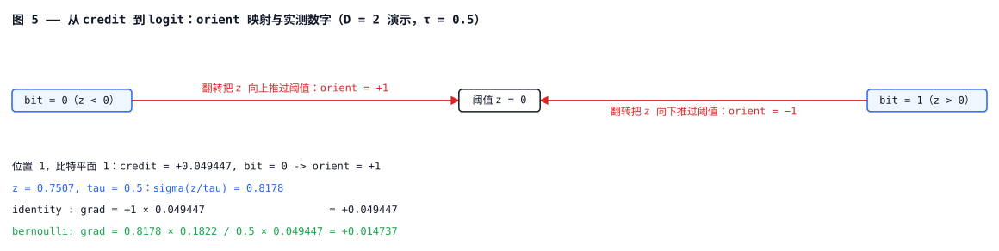
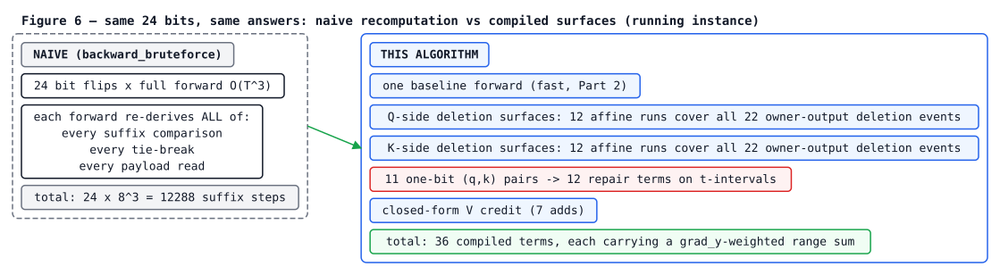
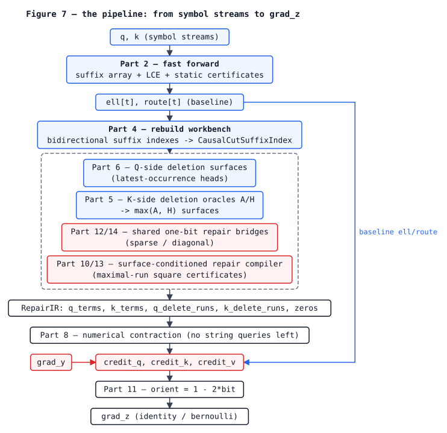
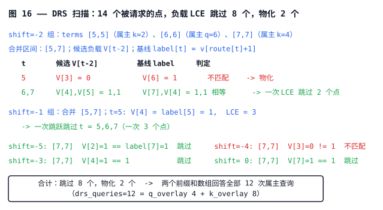

# QKV-ROSA 的精确反向传播——推导级全程讲解

[English version](ALGORITHM.md)

本文档是 [`hard_qkv_rosa_explained.py`](hard_qkv_rosa_explained.py) 的配套导读。它不替代那个文件，而是与之并肩而行。下面讲解的每个机制，末尾都会给出"现在读 Part N、`function_name`、`hard_qkv_rosa_explained.py:LINE`"这样的指引——翻到那一行，趁推导还在脑子里的时候读代码。读完本文档，你应该有能力自己动手修改这个算法。

全文中，`hard_qkv_rosa_explained.py:L<n>` 指该文件的第 `<n>` 行（文件共 3054 行，用横幅注释划分为 Part 0–17）。

## 0. 这是什么

先用六句话说明：

1. **定义。** QKV-ROSA（Bo Peng / BlinkDL，RWKV-8）是一种离散检索架构：Q/K/V 被阈值量化为 n 比特硬编码，每个输出位置 `t` 通过在前缀 `K[:t]` 内寻找 `Q[:t+1]` 的*最长后缀匹配*来检索一条负载（payload），平局时偏向最晚的端点。
2. **问题。** 前向的每一步都是离散决策，常规梯度几乎处处为零。本仓库回答的问题是：*翻转任意一个 Q/K/V 比特，对整个下游输出的精确影响是什么*，即单比特反事实（counterfactual）VJP `credit[u,j] = Σ_t grad_y[t]·(y_flip[t] − y_base[t])`。
3. **代价。** 直接按定义计算要花 `O(D·T⁴)`——每个比特一次完整前向。本仓库的算法以每流 `O(T·log²T + Λ·log T + T·D)` 算出**同一个量**。
4. **一句话直觉。** 我们不逐比特重新模拟前向，而是分析翻转一个比特如何改变最长匹配，把这一响应分解为有限多张*解析曲面*（surface），再用区间数据结构在每张曲面上对 credit 求和。
5. **与已有比特翻转思路的关系。** 社区项目（johanwind/wind_rosa、zyaaa-ux/ROSA-Tuning 的局部反事实梯度）用重新模拟计算同类反事实量，要么针对截断变体，要么用启发式。本仓库对*完整未截断语义、对每个比特、精确地*计算同一个反事实量，且从不重跑前向。
6. **议程。** 本文档做八件事：（§1）在一个固定的贯穿实例（running instance）上钉死前向语义；（§2）定义 credit 并论证为什么它是正确的梯度对象；（§3）说明朴素的 `O(D·T⁴)` 为什么居然可压缩；（§4）用反向复用的词汇回顾快速前向；（§5–§8）推导四个响应族——Q 侧删除曲面、K 侧删除预言机（oracle）、共享单比特修复桥（repair bridge）、极大 run 平方证书（certificate）；（§9）推导数值收缩（contraction）；（§10–§11）中间表示、后端（backend）开关与复杂度账本；（§12–§14）每条论断如何被验证、代码地图、开放问题。

先说方法论，因为它定义了整个设计：精确反向是一种**定制差分（扰动）方法**。它不微分架构的某种松弛，而是利用最长后缀匹配的特定组合结构，精确地计算硬前向的*有限*单比特扰动。Part 1–15 里的每一个设计决策，都是为了让某一族特定的扰动变得便宜。

### 0.1 如何对照 `hard_qkv_rosa_explained.py` 阅读

- 该文件自包含，只依赖 `torch`。现在就运行 `python hard_qkv_rosa_explained.py`：它会执行 `self_test()`（[`hard_qkv_rosa_explained.py:2964`](https://github.com/xiaoiecc/qkv-rosa-fast-exact-backward/blob/main/hard_qkv_rosa_explained.py#L2964)），把快速前向和快速反向与暴力定义逐元素对拍，然后打印一个计时演示。本文档的一切内容都由那个测试、或由 §12 复现的短脚本检验。
- 先读 Part 0（[L148](https://github.com/xiaoiecc/qkv-rosa-fast-exact-backward/blob/main/hard_qkv_rosa_explained.py#L148)–214）。它约 60 行，陈述了完整语义；剩下约 2900 行只是对这 60 行的精确加速。
- 下面每一节末尾都有**"现在读代码"**指引。本文档的阅读顺序（语义 → credit → Q 侧 → K 侧 → 收缩）并不是文件的 Part 顺序；§13 有完整地图。

### 0.2 平实描述与代码标识符

我们总是先用平实的语言描述一个机制；代码里对它的称呼随后出现在括号和反引号里，且只在与源码交叉引用的地方出现。如果一个名字从句子里删掉而不损失信息，我们就删掉它。正文中写出的变量逐字母采用文件自己的标识符：

| 平实描述 | 代码标识符 | 定义位置 |
| --- | --- | --- |
| 流长度、比特宽度 | `T`, `D` | 到处 |
| 符号流（打包整数） | `q`, `k` | [L154](https://github.com/xiaoiecc/qkv-rosa-fast-exact-backward/blob/main/hard_qkv_rosa_explained.py#L154) |
| 负载比特 | `v_bits` | [L154](https://github.com/xiaoiecc/qkv-rosa-fast-exact-backward/blob/main/hard_qkv_rosa_explained.py#L154) |
| 无匹配 / 匹配的负载向量 | `emb0`, `emb1` | [L154](https://github.com/xiaoiecc/qkv-rosa-fast-exact-backward/blob/main/hard_qkv_rosa_explained.py#L154) |
| 位置 `t` 的匹配长度 | `ell[t]` | [L154](https://github.com/xiaoiecc/qkv-rosa-fast-exact-backward/blob/main/hard_qkv_rosa_explained.py#L154)–178 |
| 位置 `t` 的匹配端点（`-1` = 未匹配） | `route[t]` | [L154](https://github.com/xiaoiecc/qkv-rosa-fast-exact-backward/blob/main/hard_qkv_rosa_explained.py#L154)–178 |
| `(ell[t], route[t])` 这一对 | `Route` | [L145](https://github.com/xiaoiecc/qkv-rosa-fast-exact-backward/blob/main/hard_qkv_rosa_explained.py#L145) |
| 被翻转的位置、被翻转的比特下标 | `u`, `j` | [L206](https://github.com/xiaoiecc/qkv-rosa-fast-exact-backward/blob/main/hard_qkv_rosa_explained.py#L206)–207 |
| 逐比特反事实 credit | `credit`（`credit_q/k/v`） | [L203](https://github.com/xiaoiecc/qkv-rosa-fast-exact-backward/blob/main/hard_qkv_rosa_explained.py#L203)–214 |
| 被删除的 K/Q 位置（"属主"） | `s` | [L242](https://github.com/xiaoiecc/qkv-rosa-fast-exact-backward/blob/main/hard_qkv_rosa_explained.py#L242)–255 |
| 仿射删除段 `L(s)=len_a·s+len_b`、`r(s)=end_a·s+end_b` | `AffineDeleteRun` | [L242](https://github.com/xiaoiecc/qkv-rosa-fast-exact-backward/blob/main/hard_qkv_rosa_explained.py#L242) |
| K 侧修复阈值段（带 `strict` 极性） | `KRepairThresholdRun` | [L258](https://github.com/xiaoiecc/qkv-rosa-fast-exact-backward/blob/main/hard_qkv_rosa_explained.py#L258) |
| 修复项：`t∈[lo,hi]` 上的候选负载 `V[t+shift]` | `RepairTrackTerm` | [L281](https://github.com/xiaoiecc/qkv-rosa-fast-exact-backward/blob/main/hard_qkv_rosa_explained.py#L281) |
| 编译出的中间表示 | `RepairIR` | [L291](https://github.com/xiaoiecc/qkv-rosa-fast-exact-backward/blob/main/hard_qkv_rosa_explained.py#L291) |
| 带左右上下文的因果单比特 (q,k) 对 | `_SharedRepairBridge` | [L2290](https://github.com/xiaoiecc/qkv-rosa-fast-exact-backward/blob/main/hard_qkv_rosa_explained.py#L2290) |
| 极大 run 修复证书 | `_KRunRepairCertificate` | [L2333](https://github.com/xiaoiecc/qkv-rosa-fast-exact-backward/blob/main/hard_qkv_rosa_explained.py#L2333) |
| 因果单比特符号对的数量 | `P`（`onebit_pair_count`） | [L2234](https://github.com/xiaoiecc/qkv-rosa-fast-exact-backward/blob/main/hard_qkv_rosa_explained.py#L2234) |
| 编译出的项/曲面总数 | `Λ`（`final_surface_terms`） | [L2275](https://github.com/xiaoiecc/qkv-rosa-fast-exact-backward/blob/main/hard_qkv_rosa_explained.py#L2275) |
| 字母表大小 | `σ` | 文件头 [L67](https://github.com/xiaoiecc/qkv-rosa-fast-exact-backward/blob/main/hard_qkv_rosa_explained.py#L67) |

### 0.3 图例：如何阅读本文档的每一张图

所有图都画在**同一个固定的贯穿实例**上（在 §1 定义，从不更换；§8 额外允许一个 T=6 实例用于讲解证书机制，并有明确标注）。结构与几何图是程序生成的 SVG（重新生成方法见 §12）；每张都保留原始等宽 ASCII 作为可折叠的备份，而数据/轨迹图保持纯 ASCII。全文使用同一套视觉词汇：

```
  数字 / 字母        贯穿实例的真实数据值
  [ x ]              当前正被操作的元素
  =====              生效中的区间（当前起作用的 run/段）
  .....              冻结的基线内容（本步骤中不变）
   ->                credit 流向
```

生成的 SVG 图还使用一套固定的颜色语义，在此声明一次（蓝 = 前向/基线数据，红 = credit 流或被改变的对象，灰 = 冻结内容，绿 = 匹配/命中）：


图 1 把文档的每个符号钉在一张图上：

![图 1 —— 贯穿实例（T = 8, D = 1）：按位置画出 q、k、v_bits 网格，下方是 ell[t]、route[t] 与负载来源行；绿色箭头表示 t = 7 复用了 V[4]，因为 route[7]+1 = 4。](images/fig01-running-instance.zh-CN.svg)

<details><summary>ASCII 备份图</summary>

```
position t      0   1   2   3   4   5   6   7          (T = 8, D = 1)
              +---+---+---+---+---+---+---+---+
q[t]          | 0 | 0 | 0 | 0 | 0 | 1 | 1 | 0 |   Q hard codes (the probe)
              +---+---+---+---+---+---+---+---+
k[t]          | 0 | 0 | 0 | 0 | 1 | 1 | 1 | 0 |   K hard codes (the memory)
              +---+---+---+---+---+---+---+---+
v_bits[t]     | 1 | 0 | 1 | 0 | 1 | 1 | 1 | 1 |   payload bits
              +---+---+---+---+---+---+---+---+

ell[t]          0   1   2   3   4   5   6   1    <- match length
route[t]       -1   0   1   2   3   4   5   3    <- match endpoint (K index)
payload src     .   1   2   3   4   5   6   4    <- reads V[route[t]+1]
                   |                          ^
                   emb0 (no match)             route[7]+1 = 4: t=7 reuses V[4]

the backward asks, for every bit position u of q, k, v_bits:
   flip [u]  ->  how do ell, route, and y change?  ->  credit[u]
```

</details>

读图方法：最上面三行是输入数据；`ell`/`route` 是每个位置的检索结果；负载行显示每个位置读哪条 `V`（永远是 `V[route[t]+1]`，绝不是 `V[route[t]]`——这个差一在下文处处重要）。最底一行陈述了反向问题。一个位置 `t` 对一次翻转的反事实响应，绝不是什么任意的新计算：它总落在有限一族预先算好的*曲面*（§3）之一上，而本文档剩下的部分就是这些曲面的构造。

## 1. 前向语义，精确地

**本节解决的问题：** 反向计算的每个量都是关于"输出会如何变化"的陈述，所以首先要把输出零歧义地钉死——包括平局决胜（tie-break），后来证明它左右了整个设计。

**定义（硬前向）：** 对每个输出位置 `t`，考察所有 K 端点（endpoint）`r ∈ [0, t)`。对每个端点，计算 `Q[:t+1]` 与 `K[:r+1]` 的公共后缀长度。取最长；**平局时取最晚（最大）的端点** `r`。长度记为 `ell[t]`，端点记为 `route[t]`（若不存在正长度匹配则 `route[t] = -1`）。然后

```
route[t] >= 0:   y[t] = sign · emb1,   sign = 2·v_bits[route[t] + 1] − 1
route[t]  < 0:   y[t] = emb0
```

换句话说：每个位置向过去发问"我当前的后缀最近一次出现在哪里？"；如果过去有回答，该位置就读取那次出现*紧接着的下一位*的负载比特来决定自己的符号；如果过去沉默，该位置就发出一个专用的无匹配向量。

参考实现刻意采用这个定义最朴素的陈述——`forward_naive`，[`hard_qkv_rosa_explained.py:154`](https://github.com/xiaoiecc/qkv-rosa-fast-exact-backward/blob/main/hard_qkv_rosa_explained.py#L154)。平局决胜只存在于一次比较里：[L176](https://github.com/xiaoiecc/qkv-rosa-fast-exact-backward/blob/main/hard_qkv_rosa_explained.py#L176) 的 `L >= best_len`——更晚的端点会覆盖等长的更早端点。

图 2 逐位置走一遍贯穿实例。最后一行（`t = 7`）是可视化了的平局决胜：

![图 2 —— 逐位置走一遍贯穿实例：每个 t 的 q[t]、ell[t]、route[t]、负载来源与 y[t]；下方用公共后缀长度长条展示 t = 7 的平局，r = 0..3 平局、最晚者胜。](images/fig02-position-trace.zh-CN.svg)

<details><summary>ASCII 备份图</summary>

```
t   q[t]  ell[t]  route[t]  payload   y[t]       发生了什么
0    0      0       -1      emb0    -0.111467    K[:0] 为空：不可能有匹配
1    0      1        0      V[1]=0  -0.120363    Q[:2]="00" 匹配 K[:1]="0"，r=0
2    0      2        1      V[2]=1  +0.120363    "00" 结束于 r=1
3    0      3        2      V[3]=0  -0.120363    "000" 结束于 r=2
4    0      4        3      V[4]=1  +0.120363    "0000" 结束于 r=3
5    1      5        4      V[5]=1  +0.120363    "00001" 结束于 r=4
6    1      6        5      V[6]=1  +0.120363    "000011" 结束于 r=5
7    0      1        3      V[4]=1  +0.120363    平局：见下

t=7 处的平局（q[7]=0）：Q[:8] 与 K[:r+1] 的公共后缀长度：
   r=0: L=1     r=1: L=1     r=2: L=1     r=3: L=1     r=4..6: L=0
   r=0,1,2,3 全部以长度 1 平局  ->  最晚者胜  ->  route[7] = 3
   （注意该匹配是*截断*的：它不会一路回溯到 K[0]）
```

</details>

图中两个位置在后面要挑大梁：`t=0` 是唯一未匹配的位置（它的翻转行为是另一个更简单的族，§8.4）；`t=7` 表明平局决胜花掉的是端点——而不是长度。

**负载规则及其结构性零：** `t` 处的符号来自 `V[route[t]+1]`：匹配出现位置*之后*的那个比特。换句话说，ROSA 检索读到的是"上次见到这个上下文时，接下来发生了什么"——这正是该架构的全部意义——而这个 `+1` 带来三个会被反复用到的后果（图 3）：

![图 3 —— 贯穿实例上负载规则的三个结构性零：q[0] 从不重要、K[T-1] 从不充当端点、V[0] 从不被读取；死格子画成冻结灰。](images/fig03-structural-zeros.zh-CN.svg)

<details><summary>ASCII 备份图</summary>

```
V[0]  is never read:   route[t] >= 0  =>  payload index = route[t]+1 >= 1
K[T-1] is never an endpoint:  an endpoint r must satisfy r < t <= T-1
q[0]  never matters:  it can only participate in a length-(t+1) match
                      ending at r = t, but r = t is not a legal endpoint
```

</details>

```
credit table of the running instance (all values verified in §12):

  credit_q = [0, 0.017311, 0.162175, -0.011585, 0.118990, 0, 0, 0]
  credit_k = [0.017311, 0.051904, -0.248592, 0.007062, 0.062506, 0, 0, 0]
  credit_v = [0, 0.468436, 0.168398, -0.313497, 0.007062, 0.064904, -0.059263, 0]
               ^                                                        ^
               V[0]: structurally zero            V[7]: zero here because no
                                                    route[t] equals 6 (not structural)
```

`credit_q[0]`、`credit_k[7]`、`credit_v[0]` 恰好就是这三个结构性零。它们不是数值巧合，而是关于语义的定理，任何正确的实现都必须复现它们。

**用十二行复现本节的一切：**

```python
import torch, sys; sys.path.insert(0, r"<repo root>")
import hard_qkv_rosa_explained as H
T, D = 8, 1
q = [0,0,0,0,0,1,1,0]; k = [0,0,0,0,1,1,1,0]
torch.manual_seed(7);  v_bits = torch.randint(0, 2, (T, D), dtype=torch.uint8)
torch.manual_seed(11); grad_y = torch.randn(T, D)
torch.manual_seed(123); emb0 = torch.randn(D); emb1 = torch.randn(D)
y, ell, route = H.forward_naive(q, k, v_bits, emb0, emb1, D)
print(ell, route)   # [0,1,2,3,4,5,6,1] [-1,0,1,2,3,4,5,3]
```

**现在读代码：** Part 0，`forward_naive`，[`hard_qkv_rosa_explained.py:154-186`](https://github.com/xiaoiecc/qkv-rosa-fast-exact-backward/blob/main/hard_qkv_rosa_explained.py#L154)。读 [L173](https://github.com/xiaoiecc/qkv-rosa-fast-exact-backward/blob/main/hard_qkv_rosa_explained.py#L173) 的 `while` 循环和 [L176](https://github.com/xiaoiecc/qkv-rosa-fast-exact-backward/blob/main/hard_qkv_rosa_explained.py#L176) 的平局决胜比较，直到你不运行任何东西也能预言 `route[7]`。

## 2. Credit：唯一有信息量的梯度对象

**问题：** 前向是阶跃函数（量化）与 argmax（最长匹配 + 平局决胜）的复合。两者关于连续的预阈值 logit `z` 都分段恒定，所以常规梯度 `∂y/∂z` 几乎处处为零，且在一个零测的边界集合上无定义。照字面做反向传播什么也得不到。我们需要一个对象：(a) 非零；(b) 是对*硬*函数的忠实陈述；(c) 可计算。

**定义（单比特反事实 credit）：** 对 Q、K、V 的每个比特 `(u, j)`：

```
credit[u, j] = Σ_t  grad_y[t] · ( y_flip[t] − y_base[t] )
```

其中 `y_flip` 是*硬*前向在仅翻转比特 `(u, j)`、其余一切不动时的输出。换句话说：比特网格 `{0,1}^(T·D)` 才是架构真正读取的定义域，而 credit 是损失泛函 `L(y) = grad_y · y` 沿该网格每个坐标轴的精确有限差分。由于 `y` 分段恒定且 `L` 关于 `y` 线性，这个有限差分不是任何东西的近似——它*就是*线性化损失在翻转下的精确变化量。

**为什么是它而不是代理梯度：** 直通估计器（straight-through estimator）微分的是*另一个函数*（它在反向时假装阶跃是恒等映射）；软松弛微分的是一个软化后的架构。两者给出的梯度都很便宜，但回答的是关于一个你并没有在运行的模型的问题。Credit 回答的是关于你正在运行的模型的问题："如果这个比特取另一个值，下游整个硬路由会恰好改变这么多。"代价是 credit 是个组合对象——朴素计算要每个比特一次完整前向（`backward_bruteforce`，[`hard_qkv_rosa_explained.py:189`](https://github.com/xiaoiecc/qkv-rosa-fast-exact-backward/blob/main/hard_qkv_rosa_explained.py#L189)，`O(D·T⁴)`）。本文档剩下的内容就是关于如何只付一次这个代价，而不是 `T·D` 次。

这个定义在经典意义上也是一种扰动/有限差分方法——不经典的地方在于扰动大小是固定的（一个比特），且响应是*解析地*算出来的，而不是靠重新模拟。

图 4 给出贯穿实例 24 个比特的完整普查，每侧各演算一个代表性翻转：

![图 4 —— 翻转普查：三个面板分别列出每个 q/k/v 比特使哪些位置的 (ell, route) 发生变化及其 credit；下方是 v[1]（纯负载翻转）与 q[2]（打断 1 个匹配、缩短 4 个，但只有 t = 2 移动了 y）的演算。](images/fig04-flip-census.zh-CN.svg)

<details><summary>ASCII 备份图</summary>

```
翻转普查（(ell, route) 发生变化的位置；credit）：

  q[0]: {}            0.0      k[0]: {1..7}   +0.017311    v[0]: {}   0.0
  q[1]: {1..6}       +0.017    k[1]: {2..7}   +0.051904    v[1]: {}  +0.468436
  q[2]: {2..6}       +0.162175 k[2]: {3..7}   -0.248592    v[2]: {}  +0.168398
  q[3]: {3..6}       -0.011585 k[3]: {4..7}   +0.007062    v[3]: {}  -0.313497
  q[4]: {4..6}       +0.118990 k[4]: {5..7}   +0.062506    v[4]: {}  +0.007062
  q[5]: {5,6}         0.0      k[5]: {6,7}     0.0         v[5]: {}  +0.064904
  q[6]: {6,7}         0.0      k[6]: {7}       0.0         v[6]: {}  -0.059263
  q[7]: {7}           0.0      k[7]: {}        0.0         v[7]: {}   0.0

演算示例 v[1]：翻转 v[1] 不改变任何 ell/route；只有 y[1] 变号
  credit_v[1] = grad_y[1] · ( (+emb1) − (−emb1) ) = 1.945929 × 0.240726 = 0.468436  ✓

演算示例 q[2]（credit +0.162175）：这次翻转打断 1 个匹配、缩短 4 个匹配
  t   ell->ell'  route->route'   y -> y'
  2    2 -> 0      1 -> -1     +0.120363 -> -0.111467    输出变为 emb0
  3    3 -> 1      2 ->  2     -0.120363 -> -0.120363    route 变了，y 没有
  4    4 -> 2      3 ->  3      不变                     （负载 V[3] 相同）
  5    5 -> 3      4 ->  4      不变
  6    6 -> 4      5 ->  5      不变
```

</details>

把图 4 自下而上读一遍：`q[2]` 的翻转移动了五个位置的 route，却只有 `t=2` 贡献 credit，因为在 `t=3..6` 新旧端点读到的是*同一个负载比特*。**route 变化 ≠ credit。** 极端情形是 `q[7]`：翻转它会把 `ell[7]` 从 1 变成 7，把端点从 3 挪到 6——一场路由地震——而 `y` 纹丝不动（`V[4]` 和 `V[7]` 都是 1），所以 `credit_q[7] = 0`。记住这个例子；§9 会把它变成一个数据结构。

**从 credit 到 logit 梯度——唯一的映射层：** Credit 活在比特网格上。要交给 autograd 一个关于产生该比特的连续 logit `z` 的梯度，在边界上恰好施加一个显式映射（`_flip_credit_to_logit_grad`，[`hard_qkv_rosa_explained.py:2220`](https://github.com/xiaoiecc/qkv-rosa-fast-exact-backward/blob/main/hard_qkv_rosa_explained.py#L2220)）：

```
orient = 1 − 2·bit            (bit=0 -> +1 "flipping raises z across the threshold";
                               bit=1 -> −1 "flipping lowers z")
identity :  grad_z = orient · credit
bernoulli:  grad_z = σ(z/τ)·(1−σ(z/τ))/τ · orient · credit
```

换句话说：credit 说"翻转这个比特会让损失改变 `credit`"；`orient` 把"翻转"翻译成"`z` 空间中会导致这次翻转的方向"；Bernoulli 因子是采样概率 `p = σ(z/τ)` 的导数，按 `z` 离阈值有多近给翻转定价。符号约定是最容易犯差一符号错误的地方：`credit` 是*翻转下的变化量*，不是 `∂L/∂z`。图 5 用实测数字固定下这个几何图像（D=2 演示，`z` 取自 seed 23，`τ=0.5`；完整设置见 §12）：



<details><summary>ASCII 备份图</summary>

```
bit = 0  ->  orient = +1  （该翻转在 z 空间中的方向是向上
                           越过阈值）
bit = 1  ->  orient = −1  （向下）

位置 1，比特平面 1：credit = +0.049447, bit = 0 -> orient = +1
   z = 0.7507, tau = 0.5：sigma(z/tau) = 0.8178
   identity : grad = +1 × 0.049447                    = +0.049447
   bernoulli: grad = 0.8178 × 0.1822 / 0.5 × 0.049447 = +0.014737
```

</details>

**现在读代码：** `backward_bruteforce`，[`hard_qkv_rosa_explained.py:189-214`](https://github.com/xiaoiecc/qkv-rosa-fast-exact-backward/blob/main/hard_qkv_rosa_explained.py#L189)——25 行，定义即算法。然后是 `_flip_credit_to_logit_grad`，[L2220-2229](https://github.com/xiaoiecc/qkv-rosa-fast-exact-backward/blob/main/hard_qkv_rosa_explained.py#L2220)。注意 Part 0 里*没有*什么：任何关于曲面、桥或证书的提及。那些东西只为快速算出这 25 行而存在。

## 3. 朴素的 `O(D·T⁴)` 为什么居然可压缩

**问题：** `backward_bruteforce` 要跑 `3·T·D` 次完整前向。其中几乎所有工作都是冗余的，本节精确定位冗余在哪：不在于翻转后的前向与基线相似（它们并不相似），而在于它们与基线的*差异*只有寥寥几种形状。

**关键观察：翻转 = 删除 + 修复：** 任取一个用到比特 `(u, j)` 的匹配窗口。翻转该比特恰好有两个效果：

1. **删除。** 每个窗口包含位置 `u` 的基线匹配都在 `u` 处断开。该位置必须只用剩下的比特重新路由——就像 `u` 被从流中*删除*了一样。
2. **修复。** 翻转后的比特现在持有*另一个*符号，所以它可能形成此前不存在的*新*匹配——与某个现存 Q/K 上下文恰好只差这一个比特的匹配。

翻转后的前向在每个位置的 route，是删除 route 与最佳修复 route 之间的较优者（按同样的"最长再最晚"规则）。两半都高度结构化：

- 删除响应作为被删除位置 `s` 的函数是**分段仿射**的：沿属主轴，删除后的 route 在 `s` 的连续区间上是 `(L(s), r(s)) = (len_a·s + len_b, end_a·s + end_b)`（代码把每个区间存为一条 `AffineDeleteRun`，[L242](https://github.com/xiaoiecc/qkv-rosa-fast-exact-backward/blob/main/hard_qkv_rosa_explained.py#L242)）。
- 修复候选来自**单比特邻域**：翻转的比特只能创造与现存模式恰好差一个位置的匹配，而这种因果单比特 Q/K 符号对的数量 `P` 在随机流上通常约 `~D·T·log σ`——远低于 `D·T²/2` 的最坏情形。

换句话说：整个系统对一次翻转的响应，画在（位置 × 假想匹配长度）平面上是分段解析的——有限多条直线、平台与阈值的并。你可以把这个平面上的格子 `(s, t)` 读作："如果比特 `s` 被删除，位置 `t` 会落在哪个 route 上"；把一个修复项读作："一段 `t` 的区间，在其上某个特定的翻转对击败删除 route"。本文档（以及代码注释）里的**曲面**一词，永远指这些解析片段之一——绝不是什么学出来的对象。

图 6 是规定动作的并排对比：朴素方法重算了什么，本算法把什么合并成了曲面。同一个贯穿实例，同样的 24 个比特。



<details><summary>ASCII 备份图</summary>

```
NAIVE (backward_bruteforce)                    THIS ALGORITHM
24 bit flips × full forward O(T^3)             one baseline forward (fast, Part 2)
each forward re-derives ALL of:                     +
  - every suffix comparison                  Q-side deletion surfaces:
  - every tie-break                            12 affine runs cover all 22
  - every payload read                         owner-output deletion events
                                                    +
                                             K-side deletion surfaces:
                                             12 affine runs cover all 22
                                             owner-output deletion events
                                                    +
                                             11 one-bit (q,k) pairs become
                                             12 repair terms on t-intervals
                                                    +
                                             closed-form V credit (7 adds)

  total: 24 × 8^3 ≈ 12k suffix steps           total: a few dozen segments,
  and the 24 outputs differ from               each carrying a grad_y-weighted
  baseline in only 51 (t, flip) cells          range sum
```

</details>

图 6 的中栏就是整个算法：24 条删除段 + 12 个修复项 + 7 次负载累加，精确复现全部 24 个翻转前向（最大绝对误差 `3.0e-8`，float32 求和顺序噪声；§12）。这些计数不是示意——它们就是这个实例的 `RepairStats` 计数器读数（`q_delete_runs=12`、`k_delete_runs=12`、`final_surface_terms=36`；§10）。

图 7 是后面每一节都要挂上去的流水线：



<details><summary>ASCII 备份图</summary>

```
q, k  (symbol streams)
 |
 |  Part 2   fast forward: suffix array + LCE + static certificates
 v
ell[t], route[t]  ---------------------------baseline-------------.
 |                                                                |
 |  Part 4   rebuild workbench: bidirectional suffix indexes       |
 v                                                                |
CausalCutSuffixIndex                                              |
 |                                                                |
 |-- Part 6    Q-side deletion surfaces (latest-occurrence heads)  |
 |-- Part 5    K-side deletion oracles A/H  ->  max(A,H) surfaces  |
 |-- Part 12/14  shared one-bit repair bridges  (sparse/diagonal)  |
 |-- Part 10/13  surface-conditioned repair compiler               |
 |               (maximal-run square certificates)                 |
 v                                                                |
RepairIR:  q_terms, k_terms, q_delete_runs, k_delete_runs, zeros  |
 |                                                                |
 |  Part 8   numerical contraction (no string queries left)        |
 v                                                                v
credit_q, credit_k, credit_v  <------------------------------- grad_y
 |
 |  Part 11  orient = 1 − 2·bit
 v
grad_z  (identity / bernoulli)
```

</details>

各处成本在出现处注明，汇总于 §11：快速前向 `O(T·log²T)`；工作台重建 `O(T·log²T)`；每族曲面按每片 `O(· log T)` 编译；收缩每片 `O(log T)`，外加 V 的 `O(T·D)`。图 7 里没有任何东西允许每比特花 `O(T²)` 或更多——这是整个设计维护的不变量。

**现在读代码：** 文件头的阅读地图，[`hard_qkv_rosa_explained.py:41-61`](https://github.com/xiaoiecc/qkv-rosa-fast-exact-backward/blob/main/hard_qkv_rosa_explained.py#L41)，然后浏览 Part 1 的数据结构 [L217-365](https://github.com/xiaoiecc/qkv-rosa-fast-exact-backward/blob/main/hard_qkv_rosa_explained.py#L217)——那里每个结构都是图 6 中栏的一条线或一个平台。先别读 Part 2；§4 会先给你词汇。

## 4. 快速前向，用反向复用的词汇回顾

**问题：** 反向不断问两个问题——"`Q[:t+1]` 与 `K[:r+1]` 的公共后缀有多长？"和"`Q` 的某个给定后缀在位置 `t` 之前最后一次出现在 `K` 的哪个端点？"——并且需要每个都在 `O(log T)` 级别内回答，而不是靠扫描。快速前向（`rosa_qk_matching_stats_static_certificates_symbols`，[L582](https://github.com/xiaoiecc/qkv-rosa-fast-exact-backward/blob/main/hard_qkv_rosa_explained.py#L582)）正是建造这些原语的地方；反向复用同一套索引，所以我们只回顾会再次出现的部分。

**构造：** 把两条流各自反转并用哨兵拼接：`text = reverse(Q) + [0] + reverse(K) + [1]`。在 `text` 上建一个后缀数组，配 Kasai LCP 和用于区间最小值查询的稀疏表——这就是 `_SuffixArrayLCE`（[L503](https://github.com/xiaoiecc/qkv-rosa-fast-exact-backward/blob/main/hard_qkv_rosa_explained.py#L503)），它为任意两个位置提供 `O(1)` 的最长公共前缀查询，因而为任意 `Q[:t+1]`、`K[:r+1]` 对提供 `O(1)` 的最长公共*后缀*查询（反转把后缀变成了前缀）。然后，对每个输出位置 `t`，最长匹配通过在二维空间——（后缀数组 rank × 反转后位置）——里做一次双侧查询找到，其中因果约束 `r < t` 变成对反转后位置的*取值*约束 `p > x`（`x = T−1−t`，`p = T−1−r`）。两个静态结构回答"rank 区间内取值 > x 的最晚位置"：`_StaticMaxPByRank`（[L374](https://github.com/xiaoiecc/qkv-rosa-fast-exact-backward/blob/main/hard_qkv_rosa_explained.py#L374)）与 `_StaticRangeSuccessorP`（[L444](https://github.com/xiaoiecc/qkv-rosa-fast-exact-backward/blob/main/hard_qkv_rosa_explained.py#L444)）。不同 `t` 的查询相互独立——这就是文件头所称的前向的*静态证书*版本。

换句话说：后缀数组把字符串问题变成 rank 轴上的区间问题；两棵静态树把"`t` 之前的最晚端点"变成区间查询；又因为没有任何东西跨 `t` 动态维护，每个位置都是一次独立的 `O(log²T)` 查询。

图 8 展示贯穿实例 `t=6` 的真实查询（符号重映射：0→2、1→3；哨兵 0 和 1）：

![图 8 —— 打包后的 text 数组，reverse(Q) 与 reverse(K) 两个区域用框圈出；下方是 t = 6 的两次静态查询：邻居 rank 步在 rank 15 处找到长度 6，胜出端点步在 rank 区间 [15, 17] 内选出 p* = 2，得到 ell[6] = 6、route[6] = 5。](images/fig08-forward-query.zh-CN.svg)

<details><summary>ASCII 备份图</summary>

```
text   = [2,3,3,2,2,2,2,2, 0, 2,3,3,3,2,2,2,2, 1]     （长度 18）
           \_________/      \_____________/
          reverse(Q)       reverse(K)

t = 6:   x = T-1-t = 1     qpos = 1    rank[qpos] = 16

第 1 步（双侧邻居 rank，取值约束 p > 1）：
   find_last (rank < 16):  rank 15 -> p = 2,  LCP(qpos, sa[15]) = 6
   find_first(rank > 16):  无
   目前最优长度：6

第 2 步（在长度-6 匹配的 rank 区间内找胜出的端点）：
   L = 6 的 rank 区间：[15, 17]
   该区间内满足 p > 1 的最小 p：p* = 2   ->   端点 e* = T-1-p* = 5

=>  ell[6] = 6, route[6] = 5      （与图 2 一致）
```

</details>

图 8 要这样读：一个位置的整个前向 = 两次静态查询加一次 `O(1)` LCP。反向复用这套索引——并在两条流的两个方向上各加一份镜像，即双向工作台（`BiPositionSuffixIndex`，[L946](https://github.com/xiaoiecc/qkv-rosa-fast-exact-backward/blob/main/hard_qkv_rosa_explained.py#L946)，扩展因果切割原语后为 `CausalCutSuffixIndex`，[L1134](https://github.com/xiaoiecc/qkv-rosa-fast-exact-backward/blob/main/hard_qkv_rosa_explained.py#L1134)）。§5–§8 点名调用的原语——`lcs_end`（[L1137](https://github.com/xiaoiecc/qkv-rosa-fast-exact-backward/blob/main/hard_qkv_rosa_explained.py#L1137)，`Q[:t+1]` 与 `K[:e+1]` 的公共后缀长度）、`latest_endpoint_for_suffix`（[L1144](https://github.com/xiaoiecc/qkv-rosa-fast-exact-backward/blob/main/hard_qkv_rosa_explained.py#L1144)）、`next_endpoint_at_least`（[L1153](https://github.com/xiaoiecc/qkv-rosa-fast-exact-backward/blob/main/hard_qkv_rosa_explained.py#L1153)）、`one_bit_occurrences_filtered`（[L1060](https://github.com/xiaoiecc/qkv-rosa-fast-exact-backward/blob/main/hard_qkv_rosa_explained.py#L1060)，单比特失配出现的"先播种后验证"两阶段枚举）——全都是同一批后缀数组上的 `O(log T)` 级包装。

一句诚实的告诫：前向的 `log²T` 因子来自这些静态二维查询，它并不明显是最优的（§14）。

**现在读代码：** `rosa_qk_matching_stats_static_certificates_symbols`，[`hard_qkv_rosa_explained.py:582-629`](https://github.com/xiaoiecc/qkv-rosa-fast-exact-backward/blob/main/hard_qkv_rosa_explained.py#L582)——把图 8 的步骤对应到 [L611-628](https://github.com/xiaoiecc/qkv-rosa-fast-exact-backward/blob/main/hard_qkv_rosa_explained.py#L611)。然后是 [L1137-1185](https://github.com/xiaoiecc/qkv-rosa-fast-exact-backward/blob/main/hard_qkv_rosa_explained.py#L1137) 的 `CausalCutSuffixIndex` 方法体；每个都是工作台上的几行代码。

## 5. Q 侧：最新出现头部变成仿射删除 run

**问题：** 考虑翻转 Q 比特 `q[u]`。按 §3，效果一是删除：每个窗口包含 `u` 的基线匹配都在那里断开。位置 `t` 删除后的 route 是"避开位置 `u` 的 `Q[:t+1]` 最长后缀，在其最新端点处匹配"。对每个 `(t, u)` 对从零算是每次 `O(T)`、总共 `O(T³)`。我们要一次拿到整族。

**梯子，第一级（不够用）：** 最直接的做法：对每个 `t`，对匹配窗口 `[t−ell[t]+1, t]` 里的每个 `u`，计算新 route。在贯穿实例上这是 `1+2+3+4+5+6+1 = 22` 个属主-输出对（计数器 `q_delete_pair_equiv=22` 数的正是它们）。杀死这个做法的观察是：在位置 `u` 处切断匹配会留下完好的后缀 `Q[u+1..t]`，而*它*的最新端点是个字符串性质，除了切断长度 `L = t − u` 之外不依赖 `u`。

**实际使用的结构：** 沿假想匹配长度 `L = 1 .. ell[t]−1` 向下走。对每个 `L`，问索引：*`Q[:t+1]` 的长度-`L` 后缀在 `t` 之前于 `K` 中的最新端点*（`latest_endpoint_for_suffix`，[L1144](https://github.com/xiaoiecc/qkv-rosa-fast-exact-backward/blob/main/hard_qkv_rosa_explained.py#L1144)）。随着 `L` 增大，答案在区间 `[L_lo, L_hi]` 上恒定——这是一次"最新出现"的存活期——然后跳变。你可以把头部表的格子 `(t, L)` 读作："如果 `t` 处的匹配被切到长度 `L`，就由这个端点接管"。代码把每个极大恒定区间记为一条 `LatestOccurrenceHead(output_t, L_lo, L_hi, endpoint)`（[L221](https://github.com/xiaoiecc/qkv-rosa-fast-exact-backward/blob/main/hard_qkv_rosa_explained.py#L221)），由 `_compile_q_latest_heads`（[L1494](https://github.com/xiaoiecc/qkv-rosa-fast-exact-backward/blob/main/hard_qkv_rosa_explained.py#L1494)）编译。然后每个头部转换成属主轴上的一条仿射段：`s ∈ [t−L_hi, t−L_lo]` 上 `L(s) = t − s`、`r(s) = endpoint`（`_build_q_delete_from_latest_heads`，[L1517](https://github.com/xiaoiecc/qkv-rosa-fast-exact-backward/blob/main/hard_qkv_rosa_explained.py#L1517)），外加一条切断最后一个比特本身的段（`s = t` → 未匹配）。成本：每个头部是一次 `O(log T)` 索引查询，且头部无重叠地铺满 `1..ell[t]−1`，所以位置 `t` 花 `O(heads_t · log T)`；整个 Q 侧是 `O(Σ_t heads_t · log T)`。

图 9 展示贯穿实例 `t = 6` 的真实头部及其转换：

![图 9 —— t = 6 的唯一最新出现头部：把匹配切到 1..5 中任意长度 L 都仍由端点 5 当家，所以五个属主位置塌缩成一条仿射 run AffineDeleteRun(t=6, s in [1,5], len_a=-1, len_b=6, end_a=0, end_b=5)，外加 s = 6 处的未匹配末比特段。](images/fig09-q-latest-heads.zh-CN.svg)

<details><summary>ASCII 备份图</summary>

```
heads for t = 6 (ell[6] = 6):   one head covers L_lo=1 .. L_hi=5, endpoint=5

   hypothetical length L:   1   2   3   4   5
   latest endpoint:         5   5   5   5   5     <- constant: ONE head

conversion to owner axis (s = deleted Q position, L(s) = t - s):

   owner s:      [1]  [2]  [3]  [4]  [5]   s=6
                 ==== ==== ==== ==== ====   ..
   L(s):          5    4    3    2    1     0     len_a=-1, len_b=6
   r(s):          5    5    5    5    5    -1     end_a= 0, end_b= 5

   => AffineDeleteRun(t=6, s in [1,5], len_a=-1, len_b=6, end_a=0, end_b=5)
      AffineDeleteRun(t=6, s in [6,6], 0, 0, 0, -1)      (unmatched)
```

</details>

图 9 要读成同一事实的两个视角：在这个实例里，把 `t=6` 的匹配在最后一个比特以上的任何位置切断，都会留下一个*在同一个端点 5* 处的更短匹配（因为 `"000011"` 的每个后缀最新出现都在同一处），所以 5 个属主位置塌缩成单独一条段。整个实例编译出 12 条这样的段，覆盖全部 22 个删除对——即图 6 的"12 条仿射 run"。

**与真实翻转交叉验证：** 图 4 的 `q[2]` 翻转：在 `t=6`，属主 `s=2` 落在 `[1,5]` 段内，所以删除曲面预言 `L = 6−2 = 4`、`r = 5`。暴力翻转实测恰好是 `ell: 6→4`、`route: 5→5`（§2 普查）。在 `t=2`，属主 `s=2` 是末比特段 → 未匹配，翻转中也确实有 `ell[2]: 2→0`。只要翻转的比特没有创造新匹配，删除曲面*就是*翻转后的基线；而在创造了新匹配的地方，一个修复项（§7）会覆盖上来——例如 `q[5]` 和 `q[6]` 就拥有修复项（IR 里的 `q_terms[5]`、`q_terms[6]`），这正是它们的翻转会改变 route 的原因。

成本上的诚实：这一族的最坏情形是"最新端点在每个 `L` 处都变化"的流——任何长度-`L` 后缀都有不同最新出现的 `q = k` 流（丰富字母表上的长自相似匹配）——给出 `heads_t ≈ ell[t]`，即单个位置多达 `O(T)` 个头部、总共 `O(T²)` 个。在这个区域 `Λ` 真的是 `O(T²)`，§10 的后端开关正是让常数保持可控的东西；README 的复杂度表把 `Λ` 显式写出，而不是藏起来。

**现在读代码：** `_compile_q_latest_heads`，[`hard_qkv_rosa_explained.py:1494-1513`](https://github.com/xiaoiecc/qkv-rosa-fast-exact-backward/blob/main/hard_qkv_rosa_explained.py#L1494)（`while L <= maxL` 循环*就是*存活期行走——[L1504](https://github.com/xiaoiecc/qkv-rosa-fast-exact-backward/blob/main/hard_qkv_rosa_explained.py#L1504) 的 `H = min(maxL, index.lcs_end(t, e))` 是存活期结束之处），然后 `_build_q_delete_from_latest_heads`，[L1517-1531](https://github.com/xiaoiecc/qkv-rosa-fast-exact-backward/blob/main/hard_qkv_rosa_explained.py#L1517)。把打印出的 `AffineDeleteRun` 元组与图 9 对照。

## 6. K 侧 I：删除即重排下标，以及 A/H 预言机

**问题：** 翻转 K 比特比翻转 Q 比特微妙。删除 `Q[u]` 缩短匹配但位置原地不动；删除 `K[s]` 则是从*记忆本身*移除一个位置——每个跨过 `s` 的匹配窗口都断开，且 `s` 右侧的每个位置在匹配意义上都左移了一步。所以"删除一个 K 比特"意味着**重排下标再匹配**：位置 `t` 删除后的 route 是 `Q[:t+1]` 在*移除位置 `s`* 后的流 `K` 中的最长匹配，并以原始坐标汇报回来。本节建造这个预言机；§7 处理翻转比特的新值所创造的东西。

**梯子，第一级（不够用）：** 对每个 `(t, s)`，移除 `K[s]` 再重跑匹配：每对 `O(T)`，每流 `O(T³)`。冗余在于：一旦 `s` 处的空洞固定，只有窗口包含 `s` 的匹配会变化，且替代匹配总是两种形状之一。

**两种形状：** 删除后的匹配不能使用位置 `s`，所以它的窗口要么整个在 `s` 左边，要么整个在 `s` 右边：

- **空洞左侧**（代码的 `MostRecentSuffixMatchOracle`，"A"，[L1194](https://github.com/xiaoiecc/qkv-rosa-fast-exact-backward/blob/main/hard_qkv_rosa_explained.py#L1194)）：端点 `< s` 的最新后缀匹配。随着空洞右移，可用的端点变多，所以这个端点通常跟着 `s` 一起右移——在本实例中 `r(s) = s−1`，一条斜率 1 的仿射段（实例计数器 `a_affine_runs=10`）。
- **空洞右侧**（代码的 `TruncatedRightMatchOracle`，"H"，[L1257](https://github.com/xiaoiecc/qkv-rosa-fast-exact-backward/blob/main/hard_qkv_rosa_explained.py#L1257)）：整个窗口落在 `[s+1, r]` 内、端点 `r` 固定的匹配。随着空洞 `s` 向右走向 `r`，幸存的窗口 `[s+1, r]` *每步变短一格*：`L(s) = r − s`。这就是**斜坡**（斜率 `len_a = −1`）；在窗口会伸出 `t` 的触及范围的地方，长度饱和，形成**平台**。斜坡/平台是标志性形状——实例有 `h_ramp_runs=6`、`h_plateau_runs=1`。

两族按同样的"最长再最晚"规则取 route 方向的 max 来合并（`_merge_A_H_surface_runs`，[L1355](https://github.com/xiaoiecc/qkv-rosa-fast-exact-backward/blob/main/hard_qkv_rosa_explained.py#L1355)），合并后的曲面恰好是 `KDeleteCutOracle.runs`（[L1422](https://github.com/xiaoiecc/qkv-rosa-fast-exact-backward/blob/main/hard_qkv_rosa_explained.py#L1422)）：`route(t, s)` 以每次查询 `O(log)` 回答"删除 `K[s]` 后 `t` 处的基线 route"（[L1477-1482](https://github.com/xiaoiecc/qkv-rosa-fast-exact-backward/blob/main/hard_qkv_rosa_explained.py#L1477)），编译成本 `O(Σ_t (a_t + h_t) · log T)`。

图 10 把"重排下标再匹配"变具体——删除 `K[2]` 并重新回答 `t=3`：

![图 10 —— 删除 K[2] 并重新回答 t = 3：基线窗口 [0,2] 包含空洞而断开；在重排下标后的流里，合法窗口 [0,1]（L = 2，端点 r = 1）与 [3,3]（L = 1，r = 3）竞争，删除后 route 是 (2, 1)。](images/fig10-k-delete-reindex.zh-CN.svg)

<details><summary>ASCII 备份图</summary>

```
BEFORE (baseline):                        AFTER (K[2] treated as deleted):
index:   0  1  2  3  4  5  6  7           no match window may contain position 2;
k:       0  0 [0] 0  1  1  1  0           positions right of 2 sit one step closer
               ^ hole                     for matching: K' = [0,0,0,1,1,1,0]
Q[:4] = [0,0,0,0]
baseline route(3) = (3, 2)                legal windows avoid position 2, and an
window [0,2] contains s=2 -> broken       endpoint is legal iff its re-indexed
                                          position r' < t:  r in {0, 1, 3}
                                          window [0,1]: L=2, endpoint r=1 <- wins
                                          window [3,3]: L=1, endpoint r=3
                                          post-delete route(3, s=2) = (2, 1)
```

</details>

`t=3` 合并后的属主轴曲面（来自预言机的精确 `AffineDeleteRun` 元组）：

```
t=3:  s in [0,1]:  L(s) = 2 - s,  r(s) = 2     <- H ramp: window right of hole,
      ===== =====                                endpoint fixed, length r - s
      s in [2,2]:  L(s) = s,      r(s) = s-1   <- A side: latest match left of
      =====                                      the hole, endpoint s-1
```

与 `k[2]` 的真实翻转核对（§2）：暴力实测 `t=3: ell 3→2, route 2→1`——正是曲面上的 `route(3, 2) = (2, 1)`。实例的完整合并曲面（`k_delete_runs=12` 条段覆盖 `k_delete_pair_equiv=22` 个对）：

```
t=1: [s in 0..0]  unmatched
t=2: [s=0: L=1-s, r=1] [s=1: L=s, r=s-1]
t=3: [s in 0..1: L=2-s, r=2] [s=2: L=s, r=s-1]
t=4: [s in 0..1: L=3-s, r=3] [s in 2..3: L=s, r=s-1]
t=5: [s in 0..3: L=4-s, r=4] [s=4: unmatched]
t=6: [s in 0..4: L=5-s, r=5] [s=5: L=1, r=4]
t=7: [s=3: L=1, r=2]                          <- only deleting the current
                                                 endpoint itself moves t=7
```

**修复阈值与极性：** 删除只是一半的故事：翻转比特的*新*符号可能创造一个修复匹配（§7），而要知道修复是否获胜，必须把它与删除后的 route 比较——在平局决胜规则下比较，而它现在两个方向都咬人。对每个 `t`，预言机还发出**阈值段**（`KRepairThresholdRun`，[L258](https://github.com/xiaoiecc/qkv-rosa-fast-exact-backward/blob/main/hard_qkv_rosa_explained.py#L258)）：在每个属主区间上，修复必须达到的长度。极性正是 §1 的平局决胜重新登场的地方：

- 属主在基线窗口**左侧**：等长的修复出现结束于 `route[t]` 之前，所以*输掉*平局 → 修复必须严格更长（`strict=True`）；
- 属主在 `route[t]` **右侧**：等长的修复出现结束得更晚 → *赢得*平局 → 长度 `>=` 即可（`strict=False`）。

这实现于 `KDeleteCutOracle.__init__`（[`hard_qkv_rosa_explained.py:1452-1455`](https://github.com/xiaoiecc/qkv-rosa-fast-exact-backward/blob/main/hard_qkv_rosa_explained.py#L1452) 的注释逐字陈述了这一点），且极性在 A/H 合并中被保留（`_merge_A_H_surface_runs` 的 docstring，[L1363-1367](https://github.com/xiaoiecc/qkv-rosa-fast-exact-backward/blob/main/hard_qkv_rosa_explained.py#L1363)）。图 11 展示 `t=7` 处的阈值曲面，那里基线窗口是单个位置 `[3,3]`，两种极性都出现：

![图 11 —— t = 7 处的修复阈值曲面（窗口 [3,3]）：窗口左侧修复必须严格更长（len >= 2，红色），而在 route = 3 处及其右侧，等长即可赢得平局（len >= 1 含等长，绿色）。](images/fig11-repair-thresholds.zh-CN.svg)

<details><summary>ASCII 备份图</summary>

```
t = 7, baseline: ell=1, route=3, window = [3,3]

owner s:      0      1      2    |   3      4      5      6
              ====== ====== ======|================================
threshold:  len >= 2 (strict)     | len >= 1 (inclusive)
                                  ^
            left of window: equal-length repair   window position itself + right:
            ends before r0=3, LOSES the tie       equal-length repair ends at or
                                                  after r0, WINS the tie
```

</details>

换句话说：阈值曲面是一个一维数组，内容是"在这里修复必须多好才能赢"，而平局决胜让它成为二值极性而不是一个数字。`t=7` 行是精确的 `repair_runs` 输出：`[(s∈[0,2], L=1, strict), (s∈[3,6], L=1, inclusive)]`。

**现在读代码：** `MostRecentSuffixMatchOracle.compile`（[L1209](https://github.com/xiaoiecc/qkv-rosa-fast-exact-backward/blob/main/hard_qkv_rosa_explained.py#L1209)）与 `TruncatedRightMatchOracle.compile`（[L1272](https://github.com/xiaoiecc/qkv-rosa-fast-exact-backward/blob/main/hard_qkv_rosa_explained.py#L1272)）——注意斜坡斜率 `−1` 写在哪里；然后 `_merge_A_H_surface_runs`（[L1355](https://github.com/xiaoiecc/qkv-rosa-fast-exact-backward/blob/main/hard_qkv_rosa_explained.py#L1355)）看保极性的合并，以及 `KDeleteCutOracle.__init__`（[L1425-1475](https://github.com/xiaoiecc/qkv-rosa-fast-exact-backward/blob/main/hard_qkv_rosa_explained.py#L1425)）。[L1466-1470](https://github.com/xiaoiecc/qkv-rosa-fast-exact-backward/blob/main/hard_qkv_rosa_explained.py#L1466) 的 `AssertionError` 是个值得偷走的不变量：阈值段必须无间隙地铺满 `[0, t−1]`。

## 7. K 侧 II：共享单比特修复桥

**问题：** §6 给出删除后的基线。但翻转 `K[s]` 还会在 `s` 处*写入一个新符号*，而新符号可能创造击败删除基线的匹配——例如把 `k[2]` 从 0 翻成 1 会在 `t=5` 处创造匹配 `Q[3..5] = [0,0,1] = K'[0..2]`，删除曲面对此一无所知。我们必须枚举单比特翻能创造的每个匹配，判定每个在何处获胜，并把胜者交给收缩——而不能二次方地枚举 `(q_pos, k_pos)` 对。

**梯子，第一级（不够用）：** 枚举所有符号恰好差一个比特的因果对 `(q_pos, k_pos)`——共 `P` 个（实例中 `P=11`）——然后对每个对、每个 `t`，模拟新匹配是否获胜。这至少是 `O(P·T)` 的工作。冗余在于：一个翻转对只有在它的*上下文*对齐时才创造可用匹配，而上下文相等又是后缀/LCP 事实，因此可压缩。

**实际使用的结构：** 对恰好只在比特 `j` 不同的对 `(q_pos, k_pos)`，令 `left` = 两个位置紧前的公共上下文长度，`right` = 紧后的公共上下文长度。翻转该比特后两个位置变得相等，所以翻转后的两条流在窗口 `[q_pos−left, q_pos+right]` ↔ `[k_pos−left, k_pos+right]` 上一致：只要 `t = q_pos + d`、`d ∈ [0, right]`，这次翻转就*创造一条长度为 `left+1+right`、结束于 `k_pos+right` 的匹配*，route 为

```
route_at(t) = (left + 1 + d,  k_pos + d),        d = t − q_pos
```

——端点随 `t` 沿对角线滑动。代码把这五个数打包成一条不可变记录 `_SharedRepairBridge(q_pos, k_pos, bit, left, right)`（[L2290](https://github.com/xiaoiecc/qkv-rosa-fast-exact-backward/blob/main/hard_qkv_rosa_explained.py#L2290)；`route_at` 在 [L2313](https://github.com/xiaoiecc/qkv-rosa-fast-exact-backward/blob/main/hard_qkv_rosa_explained.py#L2313)，[L2310](https://github.com/xiaoiecc/qkv-rosa-fast-exact-backward/blob/main/hard_qkv_rosa_explained.py#L2310) 的 `shift = k_pos − q_pos + 1` 是负载偏移：`t` 处创造的匹配读 `V[t + shift]`）。两侧共享同一座桥：翻转这对中的 Q 侧或 K 侧创造的是*同一个*窗口——故名"共享"。

图 12 展示 §2 的 `k[2]` 翻转背后的真实桥：

![图 12 —— 对 (q_pos=5, k_pos=2, bit=0) 的共享桥：左侧两个相等的上下文比特（绿色），待翻转的差异比特（红色），空的右上下文（灰色）；翻转创造匹配 q[3..5] == k'[0..2]，route_at(5) = (3, 2)，负载 shift 为 -2。](images/fig12-shared-bridge.zh-CN.svg)

<details><summary>ASCII 备份图</summary>

```
pair (q_pos=5, k_pos=2, bit=0):  q[5]=1, k[2]=0, differ in bit 0 only

context:    position:      3   4   5   6   7        position:     0   1   2   3   4
                  q:  ..   0   0 [1]   1   0  ..    k:          ..   0   0 [0]   0   1  ..
                         |______|  ^   |_|
                           left=2  |   right=0 (q[6]=1 vs k[3]=0 differ)
                               flip me
(the two rows are offset by 3 columns: each column pairs q[i] with k[i-3],
 the positions the flip would make equal — q[3..4] with k[0..1], q[5] with k[2])

after flipping k[2] to 1:  window q[3..5] == k'[0..2] == [0,0,1]
   d = t - 5;  lifetime t in [5, 5+right] = [5,5]
   route_at(5) = (left+1+0, k_pos+0) = (3, 2)
   shift = 2 - 5 + 1 = -2   ->  candidate payload V[t-2] = V[3]
```

</details>

与 §2 的暴力翻转对照：`t=5: ell 5→3, route 4→2`，负载 `V[5]→V[3]`，输出变号。桥预言了全部。整个实例有 11 座这样的桥（`shared_bridges=11`，每个单比特对一座），由稀疏物化（`_build_shared_bridges_sparse`，[L2530](https://github.com/xiaoiecc/qkv-rosa-fast-exact-backward/blob/main/hard_qkv_rosa_explained.py#L2530)）以 `O(P·log T)` 枚举，或由对角线版本（`_build_shared_bridges_diagonal`，[L2556](https://github.com/xiaoiecc/qkv-rosa-fast-exact-backward/blob/main/hard_qkv_rosa_explained.py#L2556)）以 `O(T²)` 时间 / `O(T+P)` 空间枚举——同样的桥，不同的循环顺序；§10 给出成本模型与开关。

**桥在何处获胜？** 桥与 §6 的删除后基线竞争。在 K 侧，对属主 `s` 和桥 `b`，定义 `wins(t) = (b.route_at(t) > KDeleteCutOracle.route(t, s))`，按"最长再最晚"序。这个谓词是*可二分查找*的：删除后的归一化 route 关于 `t` 非增，而桥的归一化优先级恒定，所以 `wins` 呈 `false*true*` 形状，首个获胜的 `t` 可在 `O(log²T)` 内找到（`_first_win_shared_bridge`，[L2620](https://github.com/xiaoiecc/qkv-rosa-fast-exact-backward/blob/main/hard_qkv_rosa_explained.py#L2620)——[L2621-2624](https://github.com/xiaoiecc/qkv-rosa-fast-exact-backward/blob/main/hard_qkv_rosa_explained.py#L2621) 的 docstring 陈述了单调性论证）。这是本节的微妙处：单调性是关于删除曲面的一个定理，而代码直接把一次二分查找押在它上面。实例发出 `k_shared_first_win_queries=11` 次查询，共 19 次探测、3 次立即剪枝（桥永不获胜 → 跳过）。

**一个属主多座桥：包络：** 一个属主 `(s, j)` 可能拥有存活期重叠的若干座桥。每个 `t` 只有最好的那座有意义，所以用最大优先级堆扫过重叠的存活期区间，得到极大恒定胜者段（`_bridge_envelope_segments`，[L2648](https://github.com/xiaoiecc/qkv-rosa-fast-exact-backward/blob/main/hard_qkv_rosa_explained.py#L2648)；实例产出 `k_shared_envelope_segments=8`）。每个输出段变成每个属主、每个比特的一个修复项 `RepairTrackTerm(shift, lo, hi)`（`_k_shared_terms`，[L2697](https://github.com/xiaoiecc/qkv-rosa-fast-exact-backward/blob/main/hard_qkv_rosa_explained.py#L2697)）。图 13 展示属主 `s=2` 的真实修复项：

![图 13 —— 属主 s=2、bit 0 在 t 轴上拥有两座桥：桥 A（存活期 [5,5]）在 t = 5 获胜，桥 B（存活期 [6,7]）在 t = 6 落败但在 t = 7 获胜，给出 k_terms[2][0] = [(shift=-2, [5,5]), (shift=-3, [7,7])]。](images/fig13-bridge-envelope.zh-CN.svg)

<details><summary>ASCII 备份图</summary>

```
owner s=2, bit 0 owns two bridges:
   bridge A: (q_pos=5, k_pos=2, left=2, right=0)  lifetime t in [5,5]  shift=-2
   bridge B: (q_pos=6, k_pos=2, left=0, right=1)  lifetime t in [6,7]  shift=-3

first-win against the deletion baseline:
   A at t=5: bridge (3,2) vs delete route (2,4) -> 3 > 2, WINS  -> term [5,5]
   B at t=6: bridge (1,2) vs delete route (3,4) -> loses, pruned
   B at t=7: bridge (2,3) vs baseline   (1,3) -> 2 > 1, WINS   -> term [7,7]

k_terms[2][0] = [RepairTrackTerm(shift=-2, lo=5, hi=5),
                 RepairTrackTerm(shift=-3, lo=7, hi=7)]
```

</details>

把两个幸存的项对照 §2 普查读：`[5,5]` 项就是负载翻转 `V[5]→V[3]`（`−0.248592` 这笔 credit 的 `t=5` 部分）；`[7,7]` 项的候选负载 `V[4]` 等于基线负载 `V[4]`，所以它会被*收缩跳过*（§9）——route 变了，没有 credit，正是 §2 的 `q[7]` 教训，现在以数据结构的形式到来。同一批桥的 Q 侧改走 `q_priority` 上的天际线（`_q_shared_terms`，[L2591](https://github.com/xiaoiecc/qkv-rosa-fast-exact-backward/blob/main/hard_qkv_rosa_explained.py#L2591)；这里 4 段），同样的想法，少一维。

**现在读代码：** `_SharedRepairBridge`，[`hard_qkv_rosa_explained.py:2290-2315`](https://github.com/xiaoiecc/qkv-rosa-fast-exact-backward/blob/main/hard_qkv_rosa_explained.py#L2290)（13 行，全是语义）；然后 `_first_win_shared_bridge` [L2620-2644](https://github.com/xiaoiecc/qkv-rosa-fast-exact-backward/blob/main/hard_qkv_rosa_explained.py#L2620) 与 `_bridge_envelope_segments` [L2648-2693](https://github.com/xiaoiecc/qkv-rosa-fast-exact-backward/blob/main/hard_qkv_rosa_explained.py#L2648)；最后 `_k_shared_terms` [L2697-2710](https://github.com/xiaoiecc/qkv-rosa-fast-exact-backward/blob/main/hard_qkv_rosa_explained.py#L2697)，看项的诞生。

## 8. K 侧 III：平方证书（相等影子论证）

*本节使用文档中唯一的第二个实例：* `T=6, D=1`，`q = [0,0,0,0,1,0]`，`k = [0,0,1,0,0,0]`，`v_bits = [1,0,1,1,0,1]`，`emb0 = −0.4`，`emb1 = 0.9`，`grad_y = randn(seed=5)`。下面的一切都是直接驱动曲面编译器产出的（脚本见 §12.3）；注意在这么小的输入上 `exact_stream_bit_credits` 总会选择 §7 的 shared-sparse 后端——证书机器是为大而重复的流准备的，所以这里我们手动调用它。这是全文最微妙的一节；慢慢来。

**问题：** §7 的桥是*物理的*：每个单比特符号对一条记录。在高度重复的流上——想想 `k = 01010101…`——单比特对的数量会爆向 `D·T²/2`，因为几乎每对位置都只差一个比特。物化 `Θ(T²)` 座桥正是我们拒绝支付的代价。在 K 由重复构成的区域里，我们需要修复项的*隐式*表示。

**观察：** 看看在重复的流上 §6 的 H 侧斜坡从哪里来。如果 `K` 包含一段周期为 `p` 的长 run（一个"平方"区域：串往左读一个周期还是一样），那么翻转 run 右缘前一个周期的那个比特——属主 `s = hi − p + 1`——会让该位置等于在 `hi+1` 处打断 run 的那个比特，翻转后的流于是包含一个两个周期宽的平方对齐。任何端点 `M` 坐在 run 右缘、长度沿 H 斜坡 `L(s) = M − s` 收缩的基线匹配，都可以*被它自己左移一个周期的影子修复*：翻转后的属主创造一条结束于 `M − p` 的匹配。run 结构*保证了两个窗口相等*——不需要逐对检查。代码把这样一条"有保证的修复"的记录称为 `_KRunRepairCertificate`（[L2333](https://github.com/xiaoiecc/qkv-rosa-fast-exact-backward/blob/main/hard_qkv_rosa_explained.py#L2333)）；整个阶段在 Part 横幅中名为 Equality-Shadow（[L2084](https://github.com/xiaoiecc/qkv-rosa-fast-exact-backward/blob/main/hard_qkv_rosa_explained.py#L2084)，[L2330](https://github.com/xiaoiecc/qkv-rosa-fast-exact-backward/blob/main/hard_qkv_rosa_explained.py#L2330)）。

换句话说：在重复的流上，修复不是两两的巧合，而是周期性投下的影子——一张证书换掉一整段区间的物理桥。

**构造，四步：**

1. **枚举 `K` 的极大 run**：最小周期 `p_min`、长度 `≥ 2·p_min`、不可再延长的区间 `[lo, hi]`。这是用我们已有的后缀数组完成的经典"runs"定理机器：经 next-smaller/next-greater 后缀 rank 得到两个 Lyndon 定向（各用一次单调栈，`_next_suffix_rank_index`，[L2349](https://github.com/xiaoiecc/qkv-rosa-fast-exact-backward/blob/main/hard_qkv_rosa_explained.py#L2349)），然后每个候选一次 LCS 加一次 LCP 延长（`_enumerate_k_runs_from_existing_lce`，[L2369](https://github.com/xiaoiecc/qkv-rosa-fast-exact-backward/blob/main/hard_qkv_rosa_explained.py#L2369)）。总共 `O(T)`；任何串的 run 数是 `O(T)`，这正是它能扩展而对枚举不能的原因。我们的实例恰好有两个 run：`(0,1,1)` 和 `(3,5,1)`——两个 `00` 块。

2. **从 run 边缘取证书。** 最小周期 `p_min` 的 run `[lo, hi]` 贡献满足 `2p ≤ run 长度`的周期 `p = m·p_min`。如果 run 在位置 `hi+1` 处*被打断*——即 `K[hi+1]` 与 run 的延续恰好只差**一个可训练比特**（`_onebit_index`，[L2319](https://github.com/xiaoiecc/qkv-rosa-fast-exact-backward/blob/main/hard_qkv_rosa_explained.py#L2319)；多于一个比特的差异无法由单次翻转修复）——那么属主 `s = hi − p + 1` 可以修复可计算区间 `[m_lo, m_hi]` 内的每个当前端点 H 斜坡锚点 `M`，选择端点 `M − p`（[L2428-2447](https://github.com/xiaoiecc/qkv-rosa-fast-exact-backward/blob/main/hard_qkv_rosa_explained.py#L2428)）。如果 run 一直延伸到流的末尾（`hi+1 >= T`），就没有打断比特，也没有证书（[L2431-2434](https://github.com/xiaoiecc/qkv-rosa-fast-exact-backward/blob/main/hard_qkv_rosa_explained.py#L2431) 的 `continue`）。

3. **证书上的静态索引。** 证书沿锚点轴 `M` 做区间分解进入线段树；每个节点持有按属主排序的证书。查询"所有 `M = M*`、属主在 `[s_lo, s_hi]` 内的证书"是一条根到叶路径加若干按属主排序的桶扫描：`O(log²T + output)`（`_KRunRepairCertificateIndex`，[L2414](https://github.com/xiaoiecc/qkv-rosa-fast-exact-backward/blob/main/hard_qkv_rosa_explained.py#L2414)；查询在 [L2488](https://github.com/xiaoiecc/qkv-rosa-fast-exact-backward/blob/main/hard_qkv_rosa_explained.py#L2488)）。

4. **条件化编译。** K 侧修复编译器（`_compile_k_surface_conditioned`，[L2088](https://github.com/xiaoiecc/qkv-rosa-fast-exact-backward/blob/main/hard_qkv_rosa_explained.py#L2088)）逐区域地走 §6 的阈值曲面。常数阈值区域各由一次位置受限的单比特查询回答（`one_bit_occurrences_filtered`，[L1060](https://github.com/xiaoiecc/qkv-rosa-fast-exact-backward/blob/main/hard_qkv_rosa_explained.py#L1060)）。仿射区域本质上都是 H 斜坡（`strict`，斜率 `−1`，`L(s) = M − s`），按锚点 `M` 的位置再分：
   - `M > route[t]`：相等影子论证证明只有 `p = 0` 的边界属主能修复——一次边界查询（`k_h_ramp_boundary_*` 计数器）；
   - `M == route[t]`（当前端点）：恰是证书情形——查第 3 步的索引（`k_run_certificate_*` 计数器）；
   - 其余一切：逐属主回退查询（`k_h_ramp_fallback_owner_queries`），正确但更慢——正是这个回退让后端在对抗性输入上仍然精确。

图 14 带我们的 T=6 实例走完四步：

![图 14 —— T = 6 证书实例 k = [0,0,1,0,0,0]：两个周期 1 的极大 run [0,1] 和 [3,5]；run [0,1] 在位置 2 被恰好一个比特打断，产出证书 (owner=1, period=1, bit=0, M in [2,2])；run [3,5] 到达流末尾，不产出证书。](images/fig14-run-certificates.zh-CN.svg)

<details><summary>ASCII 备份图</summary>

```
k = [0, 0, 1, 0, 0, 0]         ell = [0,1,2,2,3,4]   route = [-1,0,1,1,2,3]

step 1:  maximal runs = [(0,1,p=1), (3,5,p=1)]     (the two "00" blocks)

step 2:  run [0,1], p=1:  breaks at hi+1=2  (k[1]=0 vs k[2]=1, xor = 1 = 2^0
         -> exactly bit 0).  owner s = hi-p+1 = 1,  anchor interval M in [2,2]
         => _KRunRepairCertificate(owner=1, period=1, bit=0, m_lo=2, m_hi=2)
         run [3,5]: hi+1 = 6 = T -> reaches the end -> NO certificate

step 3:  index stats: runs=2, period_candidates=2, certs=1, tree entries=1

step 4:  t=4 has baseline route (3, 2): anchor M = 2 == route[4], owner
         interval of the H-ramp hits s=1 -> certificate query HITS
         (k_run_certificate_queries=4, hits=1; boundary queries=1, hits=1;
         fallback owner queries=2)
```

</details>

图 15 端到端展示 `t=4` 上的修复本身：

![图 15 —— t = 4 上的证书修复端到端：翻转 k[1] 使 Q[3..4] 等于 K'[0..1]——基线匹配 Q[2..4] == K[0..2] 向左一个周期投下自己的影子；修复 route (2, 1) 击败删除 route (1, 2)，但负载 V[2] 等于基线 V[3]，所以 y[4] 不变，此项随后被负载 LCE 跳过。](images/fig15-shadow-repair.zh-CN.svg)

<details><summary>ASCII 备份图</summary>

```
baseline t=4:  Q[:5] = [0,0,0,0,1]  matches K[0..2] = [0,0,1]   (ell=3, r=2)

flip k[1]: 0 -> 1   (the certificate's owner, bit 0)

BEFORE:                       AFTER:
k:  0  [0]  1  0  0  0        k': 0  [1]  1  0  0  0
        ^                        ^
        owner s=1                now equals the breaker symbol

shadow, one period left:  why the new window is guaranteed to match:
   Q[3] = K[1] = K[0]      (baseline match at M=2, then run period p=1)
   Q[4] = K[2] = K'[1]     (baseline match, then the flip)
   => Q[3..4] == K'[0..1]:  the flipped owner casts the current match's
      shadow exactly one period to the left  ->  new match, length 2,
      endpoint M-p = 1
compare:   deletion baseline route(4, s=1) = (1, 2)   (H-ramp: L = M - s = 1)
           repair route                  = (2, 1)   -> 2 > 1, repair WINS
payload:   candidate V[M-p+1] = V[2] = 1;  baseline payload V[3] = 1
           -> same sign, y[4] unchanged   (this term is later skipped by the
                                           payload LCE of section 9)

compiled term:  owner 1, bit 0: RepairTrackTerm(shift=-2, lo=4, hi=4)
                (shift -2: candidate payload is V[t-2] = V[2])
```

</details>

这个实例上完整的证书路径产出 `k_terms: owner1: [shift −2, t∈[4,4]]; owner2: [shift 0, t∈[3,3]]; owner3: [shift 0, t∈[5,5]]`，收缩出的 credit 与暴力定义的最大绝对误差为 `5.96e-08`（`credit_k = [−0.301911, −0.196970, 3.753650, 3.497010, 0, 0]`）。

**证明规则的边界情形：** 取 `q = k = [0,1,0,1,0,1]`（完美交替）。K 是一个极大 run `(0,5,2)`——而证书数量是**零**，因为 run 到达数组末尾：没有打断比特，因此没有任何单次翻转会*经由*周期性修复的东西。编译器走回退（`k_run_certificate_queries=3, hits=0`），结果仍与暴力一致（`err = 2.98e-08`）。证书是对"可证明存在的修复"的压缩，而不是"假设它们存在"。

**为什么这节最难：** "在当前端点 H 斜坡上，*所有*非平凡修复都是平方影子"这个论断是关于周期性与平局决胜的一个小定理，而它的证明以结构而非文字的形式活在代码里：证书各字段（`owner = hi−p+1`、端点 `M−p`、带右延长项 `rho` 的锚点区间 `[m_lo, m_hi]`，[L2444-2447](https://github.com/xiaoiecc/qkv-rosa-fast-exact-backward/blob/main/hard_qkv_rosa_explained.py#L2444)）恰好是定理的量词。如果你打算改这部分，先读回退路径（`k_h_ramp_fallback_owner_queries`）：它定义了快速路径必须复现的语义，而 §12.3 的穷尽检查（2048 条 T=6 流的枚举，曲面后端对暴力，零失败）是你任何改动后都应重跑的安全网。

**现在读代码：** `_KRunRepairCertificate` 及其 docstring，[`hard_qkv_rosa_explained.py:2333-2344`](https://github.com/xiaoiecc/qkv-rosa-fast-exact-backward/blob/main/hard_qkv_rosa_explained.py#L2333)；`_enumerate_k_runs_from_existing_lce` [L2369-2409](https://github.com/xiaoiecc/qkv-rosa-fast-exact-backward/blob/main/hard_qkv_rosa_explained.py#L2369)；`_KRunRepairCertificateIndex.__init__` [L2421-2470](https://github.com/xiaoiecc/qkv-rosa-fast-exact-backward/blob/main/hard_qkv_rosa_explained.py#L2421)（`m_lo/m_hi` 的计算）；然后拿着图 14 读 `_compile_k_surface_conditioned` [L2088-2210](https://github.com/xiaoiecc/qkv-rosa-fast-exact-backward/blob/main/hard_qkv_rosa_explained.py#L2088)。

### 8.4 零基线族（简短附录）

`ell[t] = 0` 的位置（贯穿实例中只有 `t=0`）没有可删除的基线匹配，所以 K 翻转只能*创造*匹配。如果属主 `s` 持有符号 `c` 而翻转比特 `j` 把它变成 `c'`，那么对每个满足 `Q[t] == c'` 的未匹配 `t > s`，修复出的胜者结束于 `s` 并读 `V[s+1]`。这是一个三角形的属主-输出族，且它的收缩是*索引化的、从不物化*：每个不同的三元组一条 `ZeroBaselineSurface(bit, k_symbol, target_symbol)` 记录（[L228](https://github.com/xiaoiecc/qkv-rosa-fast-exact-backward/blob/main/hard_qkv_rosa_explained.py#L228)），在 `t` 上做后缀累加求和（`_zero_baseline_surfaces` 编译它们，[L2038](https://github.com/xiaoiecc/qkv-rosa-fast-exact-backward/blob/main/hard_qkv_rosa_explained.py#L2038)；`_contract_zero_surfaces` 收缩，[L1765](https://github.com/xiaoiecc/qkv-rosa-fast-exact-backward/blob/main/hard_qkv_rosa_explained.py#L1765)）。贯穿实例恰好有一个：`(bit=0, k_symbol=1, target_symbol=0)`——因为 `q[0] = 0` 未匹配，任何持有符号 `1` 的 K 位置都可以翻成 `0` 来服务 `t=0`。注意一个后端细节：在 §7 的共享后端下，同一个修复会被物化为普通的桥，`RepairIR.k_zero_surfaces` 留空；零曲面形式由曲面后端使用（`RepairIR` 见 [L291-297](https://github.com/xiaoiecc/qkv-rosa-fast-exact-backward/blob/main/hard_qkv_rosa_explained.py#L291)）。两者都精确；§10 说明由谁选择。

## 9. 数值收缩：不碰字符串地求和 credit

**问题：** §5–§8 把翻转响应编译成 `RepairIR`：每个属主每个比特一把修复项，加上属主轴删除 run，加上零基线曲面。剩下的是纯算术：对每个比特 `(u,j)`，

```
credit[u,j] = Σ_t grad_y[t]·(y_flip[t] − y_base[t])
            = (deletion contribution over all t)
            + Σ_terms ( repair effect on [lo,hi] − deletion effect on [lo,hi] )
```

（覆盖修正要减去每项区间上的删除效应，因为在 `[lo,hi]` 上翻转走的是*修复* route 而不是删除 route——见 `SurfaceVJP.contract`，[`hard_qkv_rosa_explained.py:2000-2017`](https://github.com/xiaoiecc/qkv-rosa-fast-exact-backward/blob/main/hard_qkv_rosa_explained.py#L2000)）。这一阶段的一切都是数字；`SurfaceVJP` 的 docstring（[L1973](https://github.com/xiaoiecc/qkv-rosa-fast-exact-backward/blob/main/hard_qkv_rosa_explained.py#L1973)）陈述了不变量：从这里不可达任何后缀/字符串/切割包络查询。三个部件完成工作。

**部件 1：差值区间结构（DRS）：** 所有修复项（`q_terms` 与 `k_terms` 展平，`_flatten_terms` [L1798](https://github.com/xiaoiecc/qkv-rosa-fast-exact-backward/blob/main/hard_qkv_rosa_explained.py#L1798)）按 `shift`——候选负载偏移——分组（`_DifferenceRS`，[L1675](https://github.com/xiaoiecc/qkv-rosa-fast-exact-backward/blob/main/hard_qkv_rosa_explained.py#L1675)）。同一 shift 组内，区间被合并，合并后的区间被扫描一遍：

- 在候选负载符号*等于* `t` 处基线负载标签的地方，该点贡献恰为零——而这样的点成段出现，因为两侧都是符号流：基线标签流与 V 符号流的最长公共延伸（`_PayloadLCE`，[L1651](https://github.com/xiaoiecc/qkv-rosa-fast-exact-backward/blob/main/hard_qkv_rosa_explained.py#L1651)）告诉我们相等延续多远，于是扫描一次跳过 `z = min(lce, …)` 个点（[L1717-1721](https://github.com/xiaoiecc/qkv-rosa-fast-exact-backward/blob/main/hard_qkv_rosa_explained.py#L1717)）；
- 只有真正的符号失配被物化，加权 `grad_y[t]·(cand − base)` 并做前缀和，于是每个属主查询 `query(shift, lo, hi)` 只是两次二分查找加一次减法（[L1752-1761](https://github.com/xiaoiecc/qkv-rosa-fast-exact-backward/blob/main/hard_qkv_rosa_explained.py#L1752)）。

这就是 §2 教训"route 变化 ≠ credit"的数据结构化身：在贯穿实例上，12 个原始项展开成 14 个被请求的点，负载 LCE 用 5 次跳跃跳过其中 8 个，只有 **2 个点**被物化（`drs_requested_points=14`、`drs_semantic_equal_skips=8`、`drs_materialized_mismatches=2`）。图 16 展示这次扫描：



<details><summary>ASCII 备份图</summary>

```
shift=-2 组：terms [5,5] (属主 k=2)、[6,6] (属主 q=6)、[7,7] (属主 k=4)
合并区间：[5,7];  候选负载 V[t-2];  基线 label[t] = v[route[t]+1]

   t       候选 V[t-2]         基线 label     判定
   5       V[3] = 0            V[6] = 1       不匹配    -> 物化
   6,7     V[4],V[5] = 1,1     V[7],V[4] = 1,1 相等      -> 一次 LCE 跳过 2 个点

shift=-1 组：合并 [5,7];  t=5: V[4] = label[5] = 1,  LCE = 3
   -> 一次跳跃跳过 t = 5,6,7（一次 3 个点）

shift=-5: [7,7]  V[2]=1 == label[7]=1  跳过    shift=-4: [7,7]  V[3]=0 != 1  不匹配
shift=-3: [7,7]  V[4]=1 == 1           跳过    shift= 0: [7,7]  V[7]=1 == 1  跳过

合计：跳过 8 个，物化 2 个  ->  两个前缀和数组回答全部 12 次
属主查询（drs_queries=12 = q_overlay 4 + k_overlay 8）
```

</details>

被跳过的点恰好是 §2 普查里那些零 credit 翻转（`q[5]`、`q[6]`、`q[7]`）：它们的 route 动了，负载没动，收缩根本不给它们定价。

**部件 2：扫描线求删除贡献：** 每侧的删除 run 是携带 `grad_y` 加权得分差（删除后负载对基线负载，`_route_score` [L1806](https://github.com/xiaoiecc/qkv-rosa-fast-exact-backward/blob/main/hard_qkv_rosa_explained.py#L1806)）的属主轴区间。随着属主 `s` 从 `0` 推进到 `T−1`，每个区间在 `s_lo` 打开、在 `s_hi` 关闭，于是一条扫描线维护每个属主的累计值：

- Q 侧：删除事件按属主生成（`_delete_affine_events`，[L1952](https://github.com/xiaoiecc/qkv-rosa-fast-exact-backward/blob/main/hard_qkv_rosa_explained.py#L1952)）并累加进树状数组（`_Fenwick`，[L1845](https://github.com/xiaoiecc/qkv-rosa-fast-exact-backward/blob/main/hard_qkv_rosa_explained.py#L1845)）——总效应加用于覆盖的区间减；
- K 侧：同一想法高一维，`_KDeleteSurfaceSweep`（[L1874](https://github.com/xiaoiecc/qkv-rosa-fast-exact-backward/blob/main/hard_qkv_rosa_explained.py#L1874)），其 `advance(s)`（[L1916](https://github.com/xiaoiecc/qkv-rosa-fast-exact-backward/blob/main/hard_qkv_rosa_explained.py#L1916)）施加属主 `s` 处的所有 run 边界。

之后每个属主的每次覆盖查询花 `O(log T)`；图 17 在 §6 的真实 `t=3` run 上勾画 K 侧扫描：

![图 17 —— 属主 s = 2 处的 K 侧扫描线：触及它的三条删除 run，只有 t = 3 把总计推到 −0.3135，覆盖加上 +0.0649，最终核验 credit_k[2] = −0.2486 与暴力表一致。](images/fig17-k-sweep.zh-CN.svg)

<details><summary>ASCII 备份图</summary>

```
触及属主 s=2 的删除 run（来自第 6 节）：
   t=3: [s in 2..2]  route (2,1):  负载 V[2]=1 对基线 V[3]=0
         -> 得分差 = grad_y[3] · (+emb1 − (−emb1)) = −1.302297 × 0.240726
   t=4: [s in 2..3]  route (2,1):  负载 V[2]=1 对基线 V[4]=1 -> 0
   t=5: [s in 0..3]  route (2,4):  负载 V[5]=1 对基线 V[5]=1 -> 0

属主 2 处的扫描线：total = −0.3135  (仅 t=3 有变化)
覆盖: + DRS 项 [5,5] shift=-2: +0.0649 − sweep.range_sum(5,5)=0
         + DRS 项 [7,7] shift=-3:  0 (跳过: 符号相同)
credit_k[2] = −0.3135 + 0.0649 = −0.2486   ✓ (与暴力表一致)
```

</details>

**部件 3：V credit 是闭式的：** 翻转 `v_bits[u, j]` 从不改变 `ell` 或 `route`；它恰在 `route[t]+1 == u` 时翻转 `y[t]` 的符号。所以对每个匹配的 `t` 有 `credit_v[route[t]+1] += grad_y[t]·(−2·sign·emb1)`（[L2021-2028](https://github.com/xiaoiecc/qkv-rosa-fast-exact-backward/blob/main/hard_qkv_rosa_explained.py#L2021)）——`O(T·D)`，毫无结构。图 3 中实例的 `credit_v` 恰好由 7 次这样的累加产出（V[4] 收到两次：`t=4` 和 `t=7`）。

**关于 C++ 移植的说明：** `conv_rosa_transformer/csrc/contract.cpp` 中的生产实现逐操作复现这次收缩——包括按与 Python 参考相同的累加顺序使用 `double` 前缀和（它的注释写着 "prefix sums (double, like Python floats)"）——因为验证目标是*逐位*一致，而非近似相等（§12）。当你修改 Part 8 时，请用对待数学本身的谨慎对待求和顺序：`self_test` 容忍 `1e-5`，C++ 交叉检查什么也不容忍。

**现在读代码：** `_DifferenceRS`，[`hard_qkv_rosa_explained.py:1675-1761`](https://github.com/xiaoiecc/qkv-rosa-fast-exact-backward/blob/main/hard_qkv_rosa_explained.py#L1675)（[L1711-1724](https://github.com/xiaoiecc/qkv-rosa-fast-exact-backward/blob/main/hard_qkv_rosa_explained.py#L1711) 的扫描*就是*图 16）；`_KDeleteSurfaceSweep` [L1874-1950](https://github.com/xiaoiecc/qkv-rosa-fast-exact-backward/blob/main/hard_qkv_rosa_explained.py#L1874)；`SurfaceVJP.contract` [L1972-2029](https://github.com/xiaoiecc/qkv-rosa-fast-exact-backward/blob/main/hard_qkv_rosa_explained.py#L1972)——把 [L2009-2017](https://github.com/xiaoiecc/qkv-rosa-fast-exact-backward/blob/main/hard_qkv_rosa_explained.py#L2009) 的属主循环对着图 17 读。

## 10. IR、统计计数与自适应后端开关

**问题：** §5–§8 描述了两种产出 K 侧修复项的方法——物理桥（§7）与曲面条件化证书（§8）——外加一个退化的全未匹配情形（§8.4）。给定的流该用哪一个？答案是：随便哪个——它们算出的 credit 完全相同——所以这个选择是*性能启发式*，代码也正是这么对待它的。

**中间表示：** 编译器产出的一切都汇入一个值类型 `RepairIR`（[`hard_qkv_rosa_explained.py:291-297`](https://github.com/xiaoiecc/qkv-rosa-fast-exact-backward/blob/main/hard_qkv_rosa_explained.py#L291)）：

```
q_terms[u][j], k_terms[u][j]   repair terms  RepairTrackTerm(shift, lo, hi)
q_delete_runs_by_t, k_delete_runs_by_t   deletion surfaces (AffineDeleteRun)
k_zero_surfaces                zero-baseline surfaces (surface backend only)
```

收缩（§9）只消费这个 IR。这就是模块化契约：如果你为某个区域发明了更便宜的编译器，你可以发出同样的 IR，免费继承收缩、验证和 autograd 包装。

**计数器：** `RepairStats`（[L2232](https://github.com/xiaoiecc/qkv-rosa-fast-exact-backward/blob/main/hard_qkv_rosa_explained.py#L2232)）是一个约 50 个计数器的扁平 dataclass，每个阶段都往里累加。它的存在让复杂度论断*在真实输入上可测量*，而不仅是纸上可证——本文档引用的每个计数（`q_delete_runs=12`、`drs_semantic_equal_skips=8`……）都是从真实运行中读出的 `RepairStats` 字段。当你 profile 一个新区域时，先读这些计数器；§11 展示怎么读。

**开关：** `_select_repair_backend`（[L2719](https://github.com/xiaoiecc/qkv-rosa-fast-exact-backward/blob/main/hard_qkv_rosa_explained.py#L2719)）从三个廉价信号——`T`、`P`（单比特对计数）和 `max(ell)`——中选出四种区域之一：

```
P == 0                                    -> none
max(ell) == 0  (nothing matched at all)   -> surface_run_certified
                                              (zero surfaces absorb the
                                               dense repair triangle)
T >= 96 and max(ell) >= max(32, T//4)     -> surface_run_certified
                                              (long matches signal the
                                               repetitive regime of section 8)
P <= max(1024, (6 or 8)·T·log2 T)         -> shared_sparse       (section 7)
T < 352 (D<=2) / 448 (D>2)                -> shared_diagonal
otherwise                                 -> surface_run_certified
```

代码自己的注释就是诚实的框定（[L2742-2745](https://github.com/xiaoiecc/qkv-rosa-fast-exact-backward/blob/main/hard_qkv_rosa_explained.py#L2742)）："These cutoffs are performance heuristics only; all backends are exact and interchangeable."贯穿实例走 `shared_sparse`（它的 `P=11` 远低于上限 1024）——这正是 §8 不得不手动驱动证书编译器的原因。实测的区域移动，随机流，`σ=64`，`D=4`：

```
 T      backend          P (pairs)   Λ (final terms)   λ = Λ/T   max(ell)
 64     shared_sparse        132           246           3.8        1
 128    shared_sparse        503           789           6.2        2
 256    shared_sparse       2066          1956           7.6        2
```

这个表要读成：`P` 在这里大致随 `T` 线性增长（`P/T` = 2.1、3.9、8.1——每位置常数随 `T` 缓慢爬升），而 `Λ` 贴着 `T` 的一个小倍数走——在随机流上"曲面"保持稀疏，整个反向保持近线性。稠密小字母表流把 `λ` 推到 ≈11–17，周期性长匹配流推到 ≈7–21 且随 `T` 增长（文件头，[L95-96](https://github.com/xiaoiecc/qkv-rosa-fast-exact-backward/blob/main/hard_qkv_rosa_explained.py#L95)）——这正是证书后端挣回自己存在价值的地方。

**现在读代码：** `_select_repair_backend`，[`hard_qkv_rosa_explained.py:2719-2749`](https://github.com/xiaoiecc/qkv-rosa-fast-exact-backward/blob/main/hard_qkv_rosa_explained.py#L2719)；`_compile_repair_ir`（[L2753](https://github.com/xiaoiecc/qkv-rosa-fast-exact-backward/blob/main/hard_qkv_rosa_explained.py#L2753)）看 IR 如何组装、`final_surface_terms` 如何计数；以及单流入口 `exact_stream_bit_credits`（[L2806](https://github.com/xiaoiecc/qkv-rosa-fast-exact-backward/blob/main/hard_qkv_rosa_explained.py#L2806)）——60 行，把本文档的每一节接在一起。

## 11. 复杂度账本

§3–§9 在成本出现处逐一注明；本节把它们加起来。对单条长度 `T`、比特宽度 `D` 的 Q/K/V 流，记 `P` = 因果单比特符号对数（≤ `D·T²/2`，随机流上约 `D·T·log σ`），`Λ` = 编译出的项/曲面总数：

| 阶段 | 时间 | 推导出处 |
| --- | --- | --- |
| 快速前向（后缀数组 + 静态证书） | `O(T·log²T)` | §4：每个 `t` 一次二维静态查询 |
| 反向工作台重建（4 个后缀数组 + 预言机） | `O(T·log²T)` | §4，Part 4 |
| A/H 预言机 + K 删除曲面 | `O(Σ_t (a_t+h_t)·log T)` ≈ `O(T log T)` | §6：每条仿射记录一次索引查询 |
| 修复编译，`shared_sparse` | `O(P·log T)` | §7：每座桥常数次 LCE/首胜查询 |
| 修复编译，`shared_diagonal` | `O(T²)` 时间，`O(T+P)` 空间 | §7：稠密对角扫描 |
| 修复编译，`surface_run_certified` | `O(T log T + R_runs·log T + hits·log T)` | §8：`O(T)` 个 run，`O(log²T)` 级索引查询 |
| 数值收缩 | `O(Λ·log T + T·D)` | §9：每项覆盖 `O(log T)` + 闭式 V |
| **反向合计** | **`O(T·log²T + Λ·log T + T·D)`** | |

空间：`O(T·log T + Λ)`。每一项的最坏实例都能在对应节的图中看到：前向的 `log²T` 因子来自图 8 的静态二维查询；`Λ` 恰好在图 9/10 曲面拒绝合并的流上爆掉（稠密周期输入——§5 的告诫），这被 §10 开关经 `max(ell)` 侦测；`P` 在 `D=1`、`q = 000…`、`k = 1010…` 这类流上达到 `Θ(T²)`，那里每个因果 `(q,k)` 符号对都恰好差一个比特——正是放弃物理桥物化、改用证书的区域。

**实测，不只是推导：** 两组数字，绝不能混为一谈：

- *C++ 参考实现*（文件头表格，[L100-110](https://github.com/xiaoiecc/qkv-rosa-fast-exact-backward/blob/main/hard_qkv_rosa_explained.py#L100)，以及 README）：反向/前向比 `R` 在随机流上约 38–57，稠密流约 100，`T=4096` 的长周期流上达约 270，后端切换处有可见的台阶（该表中的 `*`）。
- *纯 Python 参考*（本文件）：同样的趋势，小得多的比值——实测 `T=256` 时 `15.6×`，`T=1024` 时 `22.1×`（`D=4`，随机，`measure_backward_forward_ratio`，[L3003](https://github.com/xiaoiecc/qkv-rosa-fast-exact-backward/blob/main/hard_qkv_rosa_explained.py#L3003)——用 `H.measure_backward_forward_ratio(1024, 4, reps=3)` 复现；单次运行数字，预期有 ±10% 量级的逐次噪声；函数自己的 docstring 警告纯 Python 常数会抬高前向、压低比值）。C++ 移植的存在恰恰因为参考实现的常数大；上面的渐近论断与实现无关。

**诚实的局限：** `log²T` 因子和依赖 `Λ` 的项都没有下界证明；本文档没有任何内容表明它们是必要的。README 的"Limitations and future work"一节有更强的陈述，我们原样重复而不加以改善：作者（Xiaoiec）另持有一个最坏情形总复杂度 `O(T·log³T)` 的不同算法，刻意未发表，因为其常数与内存使它在实践中比本仓库的算法更慢；提及它只是作为"该问题的复杂度前沿尚未尘埃落定"的证据。

## 12. 本文档的每条论断如何被验证

本仓库的信任模型是：*定义*是 60 行你能读的代码（Part 0），其余一切都必须与之一致。四个相互独立的层次：

1. **内置自测。** `python hard_qkv_rosa_explained.py` 运行 `self_test()`（[L2964](https://github.com/xiaoiecc/qkv-rosa-fast-exact-backward/blob/main/hard_qkv_rosa_explained.py#L2964)）：在随机化用例上把快速前向与 `forward_naive` *逐元素*对拍，把快速反向与 `backward_bruteforce` 对拍至 `atol=1e-5`（float32 求和顺序；算法是精确的，累加器不是）。

2. **贯穿实例，端到端。** §1–§3、§5–§7、§9 的每个数字都来自这个脚本（扩展 §1 的片段）：

   ```python
   bq, bk, bv = H.backward_bruteforce(q, k, v_bits, grad_y, emb0, emb1, D)
   fq, fk, fv, stats, ell2, route2, ir = H.exact_stream_bit_credits(
       q, k, v_bits, grad_y, emb0, emb1, D)
   print((bq-fq).abs().max(), (bk-fk).abs().max(), (bv-fv).abs().max())
   # tensor(3.7253e-09) tensor(2.9802e-08) tensor(0.)
   print(stats.repair_backend, stats.onebit_pair_count,
         stats.drs_requested_points, stats.drs_semantic_equal_skips,
         stats.drs_materialized_mismatches)
   # shared_sparse 11 14 8 2
   ```

   中间结构可以一次调用一个地检查：`H._compile_q_latest_heads(H.CausalCutSuffixIndex(q, k), ell)`（图 9）、`H.KDeleteCutOracle(index, ell, route).runs`（§6 的表）、`H._build_shared_bridges_sparse(q, k, D, index, H.RepairStats())`（图 12 的桥）。

3. **证书路径的穷尽小流检查。** §8 的演示脚本（下文 §12.3）还断言：对它枚举的 **2048 条 T=6 二进制 `(q,k)` 流**（固定 `v_bits/grad_y/emb`），曲面后端的收缩等于 `backward_bruteforce`（`< 1e-5`）。零失败。如果你修改 Part 10/13，先重跑这个。

   ```python
   # 12.3 — drive the surface compiler directly (bypasses the backend switch)
   index = H.CausalCutSuffixIndex(q, k)
   y, ell, route = H.forward_naive(q, k, v_bits, emb0, emb1, D)
   st = H.RepairStats()
   certs = H._KRunRepairCertificateIndex(index, D, st)
   kdel  = H.KDeleteCutOracle(index, ell, route)
   st2   = H.RepairStats()
   kterms = H._compile_k_surface_conditioned(D, index, kdel, ell, st2)
   qterms = H._q_repair_terms_suffix_range(q, k, D, index)
   zero   = H._zero_baseline_surfaces(q, k, ell, D)
   ir = H.RepairIR(qterms, kterms,
                   H._build_q_delete_from_latest_heads(
                       ell, H._compile_q_latest_heads(index, ell)),
                   kdel.runs, zero)
   stats = H.RepairStats()
   fq, fk, fv = H.SurfaceVJP.contract(ir, q, k, ell, route, v_bits,
                                      grad_y, emb0, emb1, D, stats)
   # compare against H.backward_bruteforce(...) — max err 5.96e-08 on the
   # section-8 instance; assert < 1e-5 for all 2048 streams in a loop.
   ```

4. **逐位 C++ 一致。** `conv_rosa_transformer/csrc/` 中的移植在 25 条流 × 所有后端上与本 Python 参考*逐位*一致（文件头，[L130-131](https://github.com/xiaoiecc/qkv-rosa-fast-exact-backward/blob/main/hard_qkv_rosa_explained.py#L130)）。这之所以可能，是因为移植复刻了参考的操作顺序（§9，"关于 C++ 移植的说明"）。经 `conv_rosa_transformer/self_test.py` 运行 C++ 自测。

§2 图 5 的 D=2 打包示例可用 `H._pack_group_bits_to_python_ints`（[L1540](https://github.com/xiaoiecc/qkv-rosa-fast-exact-backward/blob/main/hard_qkv_rosa_explained.py#L1540)；符号 `= Σ_j bit_j·2^j`）在 `torch.manual_seed(21)` 比特平面上复现——符号 `q=[3,0,0,2,0,3,0,2]`、`k=[2,3,1,0,0,0,1,1]`，快速对暴力最大误差 `2.38e-07`。

**图的重新生成：** 上文引用的每张 SVG 图都由 [`images/generate_figures.py`](images/generate_figures.py) 生成，它 import `hard_qkv_rosa_explained.py` 并当场重算贯穿实例和 T=6 证书实例——任何图中的任何数字都不是手工转录的，且每张图都带机器检查的布局（生成器的校验器在任何连接线穿过无关方框、任何包围框未严格包含其子元素、任何格子与标签重叠时中止运行）。改动代码或图之后，用 `python images/generate_figures.py` 重新生成（`--lang en|zh` 选择单一语言；中文字符串住在同一脚本的 `STRINGS` 表里）。

## 13. 代码地图

三列：本文档描述的概念 → 它在 `hard_qkv_rosa_explained.py` 中的家 → 它在 C++ 移植（`conv_rosa_transformer/csrc/`）中的家。

| 概念 | Python 参考 | C++ 移植 |
| --- | --- | --- |
| 前向的规范定义 | Part 0, `forward_naive`, [L154](https://github.com/xiaoiecc/qkv-rosa-fast-exact-backward/blob/main/hard_qkv_rosa_explained.py#L154) | ——（朴素定义只存在于参考文件中） |
| 暴力 credit 定义 | Part 0, `backward_bruteforce`, [L189](https://github.com/xiaoiecc/qkv-rosa-fast-exact-backward/blob/main/hard_qkv_rosa_explained.py#L189) | ——（仅用于验证，同文件） |
| 曲面数据结构 | Part 1, [L217](https://github.com/xiaoiecc/qkv-rosa-fast-exact-backward/blob/main/hard_qkv_rosa_explained.py#L217)–365（`AffineDeleteRun` [L242](https://github.com/xiaoiecc/qkv-rosa-fast-exact-backward/blob/main/hard_qkv_rosa_explained.py#L242)、`KRepairThresholdRun` [L258](https://github.com/xiaoiecc/qkv-rosa-fast-exact-backward/blob/main/hard_qkv_rosa_explained.py#L258)、`RepairTrackTerm` [L281](https://github.com/xiaoiecc/qkv-rosa-fast-exact-backward/blob/main/hard_qkv_rosa_explained.py#L281)、`RepairIR` [L291](https://github.com/xiaoiecc/qkv-rosa-fast-exact-backward/blob/main/hard_qkv_rosa_explained.py#L291)） | 共享头文件 |
| 快速前向（后缀数组 + 静态证书） | Part 2, [L582](https://github.com/xiaoiecc/qkv-rosa-fast-exact-backward/blob/main/hard_qkv_rosa_explained.py#L582)（`_SuffixArrayLCE` [L503](https://github.com/xiaoiecc/qkv-rosa-fast-exact-backward/blob/main/hard_qkv_rosa_explained.py#L503)、`_StaticMaxPByRank` [L374](https://github.com/xiaoiecc/qkv-rosa-fast-exact-backward/blob/main/hard_qkv_rosa_explained.py#L374)、`_StaticRangeSuccessorP` [L444](https://github.com/xiaoiecc/qkv-rosa-fast-exact-backward/blob/main/hard_qkv_rosa_explained.py#L444)） | `suffix.cpp` / `suffix.h` |
| 区间查询工具箱 | Part 3, [L633](https://github.com/xiaoiecc/qkv-rosa-fast-exact-backward/blob/main/hard_qkv_rosa_explained.py#L633)–938（`_RangePositionIndex` [L645](https://github.com/xiaoiecc/qkv-rosa-fast-exact-backward/blob/main/hard_qkv_rosa_explained.py#L645)、`_SymbolOrthogonalOracle` [L864](https://github.com/xiaoiecc/qkv-rosa-fast-exact-backward/blob/main/hard_qkv_rosa_explained.py#L864)） | `ortho.cpp` / `ortho.h` |
| 反向工作台（双向索引） | Part 4, `BiPositionSuffixIndex` [L946](https://github.com/xiaoiecc/qkv-rosa-fast-exact-backward/blob/main/hard_qkv_rosa_explained.py#L946)、`CausalCutSuffixIndex` [L1134](https://github.com/xiaoiecc/qkv-rosa-fast-exact-backward/blob/main/hard_qkv_rosa_explained.py#L1134)、`one_bit_occurrences_filtered` [L1060](https://github.com/xiaoiecc/qkv-rosa-fast-exact-backward/blob/main/hard_qkv_rosa_explained.py#L1060) | `index.cpp` / `index.h` |
| K 侧删除预言机 A/H + 合并 | Part 5, `MostRecentSuffixMatchOracle` [L1194](https://github.com/xiaoiecc/qkv-rosa-fast-exact-backward/blob/main/hard_qkv_rosa_explained.py#L1194)、`TruncatedRightMatchOracle` [L1257](https://github.com/xiaoiecc/qkv-rosa-fast-exact-backward/blob/main/hard_qkv_rosa_explained.py#L1257)、`_merge_A_H_surface_runs` [L1355](https://github.com/xiaoiecc/qkv-rosa-fast-exact-backward/blob/main/hard_qkv_rosa_explained.py#L1355)、`KDeleteCutOracle` [L1422](https://github.com/xiaoiecc/qkv-rosa-fast-exact-backward/blob/main/hard_qkv_rosa_explained.py#L1422) | `oracles.cpp` / `oracles.h` |
| Q 侧删除曲面 | Part 6, `_compile_q_latest_heads` [L1494](https://github.com/xiaoiecc/qkv-rosa-fast-exact-backward/blob/main/hard_qkv_rosa_explained.py#L1494)、`_build_q_delete_from_latest_heads` [L1517](https://github.com/xiaoiecc/qkv-rosa-fast-exact-backward/blob/main/hard_qkv_rosa_explained.py#L1517) | `qrepair.cpp` / `qrepair.h` |
| 打包 + 负载 LCE | Part 7, `_pack_group_bits_to_python_ints` [L1540](https://github.com/xiaoiecc/qkv-rosa-fast-exact-backward/blob/main/hard_qkv_rosa_explained.py#L1540)、`_PayloadLCE` [L1651](https://github.com/xiaoiecc/qkv-rosa-fast-exact-backward/blob/main/hard_qkv_rosa_explained.py#L1651) | `contract.cpp`（PayloadLCE） |
| 数值收缩 | Part 8, `_DifferenceRS` [L1675](https://github.com/xiaoiecc/qkv-rosa-fast-exact-backward/blob/main/hard_qkv_rosa_explained.py#L1675)、`_KDeleteSurfaceSweep` [L1874](https://github.com/xiaoiecc/qkv-rosa-fast-exact-backward/blob/main/hard_qkv_rosa_explained.py#L1874)、`SurfaceVJP.contract` [L1972](https://github.com/xiaoiecc/qkv-rosa-fast-exact-backward/blob/main/hard_qkv_rosa_explained.py#L1972) | `contract.cpp` / `contract.h` |
| 零基线 + 直接 Q 修复 | Part 9, `_zero_baseline_surfaces` [L2038](https://github.com/xiaoiecc/qkv-rosa-fast-exact-backward/blob/main/hard_qkv_rosa_explained.py#L2038)、`_q_repair_terms_suffix_range` [L2051](https://github.com/xiaoiecc/qkv-rosa-fast-exact-backward/blob/main/hard_qkv_rosa_explained.py#L2051) | `qrepair.cpp` |
| K 侧曲面条件化编译器 | Part 10, `_compile_k_surface_conditioned` [L2088](https://github.com/xiaoiecc/qkv-rosa-fast-exact-backward/blob/main/hard_qkv_rosa_explained.py#L2088) | `krepair.cpp` / `krepair.h` |
| credit → logit 映射 + 计数器 | Part 11, `_flip_credit_to_logit_grad` [L2220](https://github.com/xiaoiecc/qkv-rosa-fast-exact-backward/blob/main/hard_qkv_rosa_explained.py#L2220)、`RepairStats` [L2232](https://github.com/xiaoiecc/qkv-rosa-fast-exact-backward/blob/main/hard_qkv_rosa_explained.py#L2232) | `pipeline.cpp` |
| 共享单比特修复桥 | Part 12, `_SharedRepairBridge` [L2290](https://github.com/xiaoiecc/qkv-rosa-fast-exact-backward/blob/main/hard_qkv_rosa_explained.py#L2290)、`_onebit_index` [L2319](https://github.com/xiaoiecc/qkv-rosa-fast-exact-backward/blob/main/hard_qkv_rosa_explained.py#L2319) | `bridges.cpp` / `bridges.h` |
| 极大 run 平方证书 | Part 13, `_KRunRepairCertificate` [L2333](https://github.com/xiaoiecc/qkv-rosa-fast-exact-backward/blob/main/hard_qkv_rosa_explained.py#L2333)、`_enumerate_k_runs_from_existing_lce` [L2369](https://github.com/xiaoiecc/qkv-rosa-fast-exact-backward/blob/main/hard_qkv_rosa_explained.py#L2369)、`_KRunRepairCertificateIndex` [L2414](https://github.com/xiaoiecc/qkv-rosa-fast-exact-backward/blob/main/hard_qkv_rosa_explained.py#L2414) | `certificates.cpp` / `certificates.h` |
| 首胜 + 包络 | Part 14, `_first_win_shared_bridge` [L2620](https://github.com/xiaoiecc/qkv-rosa-fast-exact-backward/blob/main/hard_qkv_rosa_explained.py#L2620)、`_bridge_envelope_segments` [L2648](https://github.com/xiaoiecc/qkv-rosa-fast-exact-backward/blob/main/hard_qkv_rosa_explained.py#L2648) | `bridges.cpp` |
| 后端开关 + 入口 | Part 15, `_select_repair_backend` [L2719](https://github.com/xiaoiecc/qkv-rosa-fast-exact-backward/blob/main/hard_qkv_rosa_explained.py#L2719)、`_compile_repair_ir` [L2753](https://github.com/xiaoiecc/qkv-rosa-fast-exact-backward/blob/main/hard_qkv_rosa_explained.py#L2753)、`exact_stream_bit_credits` [L2806](https://github.com/xiaoiecc/qkv-rosa-fast-exact-backward/blob/main/hard_qkv_rosa_explained.py#L2806) | `pipeline.cpp` / `pipeline.h` |
| autograd 胶水 | Part 16, `_HardQKVRosaFn` [L2832](https://github.com/xiaoiecc/qkv-rosa-fast-exact-backward/blob/main/hard_qkv_rosa_explained.py#L2832)、`NBitQKVRosa` [L2929](https://github.com/xiaoiecc/qkv-rosa-fast-exact-backward/blob/main/hard_qkv_rosa_explained.py#L2929) | `binding.cpp`、`rosa_layer.py` |
| 自测 + 计时探针 | Part 17, `self_test` [L2964](https://github.com/xiaoiecc/qkv-rosa-fast-exact-backward/blob/main/hard_qkv_rosa_explained.py#L2964)、`measure_backward_forward_ratio` [L3003](https://github.com/xiaoiecc/qkv-rosa-fast-exact-backward/blob/main/hard_qkv_rosa_explained.py#L3003) | `self_test.py` |

## 14. 开放问题

每一项都点明改进会落在哪个具体热点上。README 的"Limitations and future work"是正式陈述；本节只定位痛点。

- **前向的 `log²T` 因子。** 前向（图 8 每 `t` 两次静态二维查询，`_StaticRangeSuccessorP`，[L444](https://github.com/xiaoiecc/qkv-rosa-fast-exact-backward/blob/main/hard_qkv_rosa_explained.py#L444)）和工作台重建（Part 4）都在付它。一个查询时间 `O(log T)` 或更好的 range-successor 结构——或一种不同于"取值约束 `p > x`"的因果分解——会同时改进前向*和*反向。
- **稠密/周期区域的 `Λ`。** `λ = Λ/T` 在周期流上随 `T` 增长（README 比值表，periodic 列）。曲面编译器里的逐属主回退（`k_h_ramp_fallback_owner_queries`，§8 第 4 步）是那里占主导的精确但慢的路径；刻画哪些仿射曲面仍然逃出边界/证书情形，是具体的问题。
- **内存。** 每流 `O(T·log T + Λ)` 由 Part 2–4 的稀疏表和归并排序树主导。`_SuffixArrayLCE`（[L503](https://github.com/xiaoiecc/qkv-rosa-fast-exact-backward/blob/main/hard_qkv_rosa_explained.py#L503)）和 `_RangePositionIndex`（[L645](https://github.com/xiaoiecc/qkv-rosa-fast-exact-backward/blob/main/hard_qkv_rosa_explained.py#L645)）的紧凑（succinct）变体能砍常数而不碰本文档的任何数学。
- **GPU 亲和性。** 该算法是指针追逐和线段树密集型的；收缩（Part 8）是唯一对 GEMM 友好的阶段。静态证书前向的逐 `t` 独立性（§4）是目前桌上最可并行的性质；GPU 形状的修复编译器是开放的。
- **批处理的流。** `_HardQKVRosaFn`（[L2832](https://github.com/xiaoiecc/qkv-rosa-fast-exact-backward/blob/main/hard_qkv_rosa_explained.py#L2832)）顺序地循环各组和批元素。跨流共享索引构造（同一批头里的相同 `k`？）尚未探索。
- **二阶信息。** Credit 是一阶反事实。双比特交互（以另一次翻转为条件的翻转 `credit`）是否容许类似的曲面分解是未知的；§6 的删除预言机是自然的起点。
- **随机化近似。** 如果放松精确性，带有原则性误差界地采样修复项（而不是物化全部 `Λ`）是可行的——§9 的 DRS 已经隔离出质量集中之处（`drs_materialized_mismatches` 对 `drs_requested_points`）。

如果你在其中任何一项上取得进展——精确的，或带原则性误差界的——那是对 ROSA 生态真正有价值的贡献；欢迎 issue 和 pull request。

---

*署名：QKV-ROSA 前向架构由 Bo Peng（BlinkDL）为 RWKV-8 提出；本文档描述的是本仓库实现的精确反向算法。社区对比与许可证见 README.md。*
